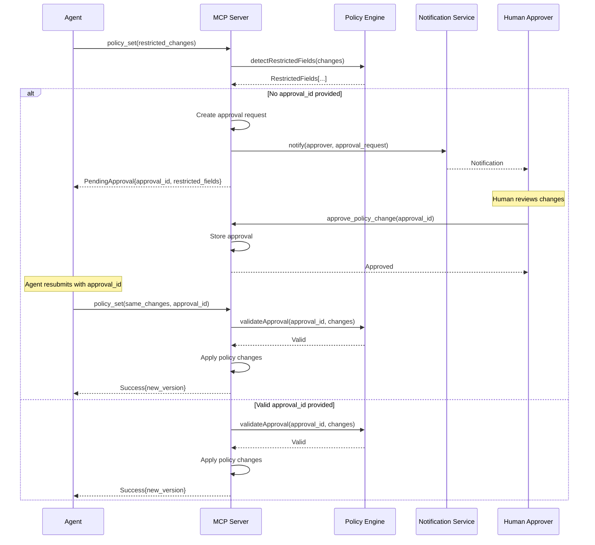

# policy_set MCP Tool Specification

**Version:** 1.0.0
**Date:** 2026-01-28
**Status:** Complete
**Security Classification:** CRITICAL

---

## Table of Contents

1. [Overview](#1-overview)
2. [Input Schema](#2-input-schema)
3. [Output Schema](#3-output-schema)
4. [Policy Validation Rules](#4-policy-validation-rules)
5. [Version Management](#5-version-management)
6. [Restricted Fields (Tier 3 Required)](#6-restricted-fields-tier-3-required)
7. [Merge vs Replace Semantics](#7-merge-vs-replace-semantics)
8. [Audit Logging](#8-audit-logging)
9. [Error Codes](#9-error-codes)
10. [Examples](#10-examples)

---

## 1. Overview

### 1.1 Description

The `policy_set` tool updates the security policy governing a wallet's transaction signing behavior. Policy changes are **security-sensitive operations** that modify the constraints under which AI agents can autonomously sign transactions.

**This tool controls the security boundaries for wallet operations.** Policy changes can expand or restrict agent capabilities, making every policy modification a potential security event.

### 1.2 Security Criticality

| Aspect | Classification |
|--------|----------------|
| **Tool Sensitivity** | CRITICAL (highest) |
| **Data Access** | Policy configuration |
| **Risk Level** | Security boundary modification |
| **Authentication** | Required |
| **Authorization** | Varies by field (see Section 6) |

### 1.3 Core Security Principles

1. **Immutable During Execution**: Policies cannot be modified while a signing operation is in progress
2. **Version Tracking**: Every policy change increments the version and creates an audit trail
3. **Restricted Field Protection**: Critical fields (limits, escalation thresholds) require Tier 3 human approval
4. **Atomic Updates**: Policy changes are all-or-nothing; partial updates are not persisted
5. **Validation Before Persistence**: All policy changes are validated before being saved
6. **LLM Isolation**: AI agents cannot bypass restricted field requirements

### 1.4 Tool Registration

```typescript
{
  name: 'policy_set',
  description: 'Update wallet security policy. Some fields require human approval (Tier 3). ' +
    'Supports merge mode for partial updates or replace mode for full policy replacement.',
  inputSchema: PolicySetInputSchema,
  outputSchema: PolicySetOutputSchema,
}
```

---

## 2. Input Schema

### 2.1 Schema Definition

```typescript
import { z } from 'zod';

export const PolicySetInputSchema = z.object({
  /**
   * Address of the wallet whose policy is being updated.
   * Must be a managed wallet in the keystore.
   */
  wallet_address: z
    .string()
    .min(25, 'XRPL address must be at least 25 characters')
    .max(35, 'XRPL address must be at most 35 characters')
    .regex(
      /^r[1-9A-HJ-NP-Za-km-z]{24,34}$/,
      'Invalid XRPL address format'
    )
    .describe('XRPL address of the wallet to update'),

  /**
   * Policy changes to apply.
   * Can be a complete policy (replace mode) or partial updates (merge mode).
   */
  policy: PolicyUpdateSchema
    .describe('Policy fields to update'),

  /**
   * Update mode: merge partial changes or replace entire policy.
   * Default: 'merge' for safety (preserves unspecified fields)
   */
  mode: z
    .enum(['merge', 'replace'])
    .default('merge')
    .describe('Update mode: merge partial changes or replace entire policy'),

  /**
   * Reason for the policy change (for audit trail).
   * Required for all policy modifications.
   */
  reason: z
    .string()
    .min(10, 'Reason must be at least 10 characters')
    .max(500, 'Reason must be at most 500 characters')
    .describe('Reason for this policy change (audit trail)'),

  /**
   * Approval ID for restricted field changes.
   * Required when modifying Tier 3 restricted fields.
   */
  approval_id: z
    .string()
    .uuid()
    .optional()
    .describe('Approval ID for restricted field changes (Tier 3)'),

  /**
   * Optional correlation ID for request tracing.
   * Auto-generated if not provided.
   */
  correlation_id: z
    .string()
    .uuid()
    .optional()
    .describe('Correlation ID for request tracing'),
}).describe('Update wallet security policy');
```

### 2.2 PolicyUpdateSchema Definition

```typescript
export const PolicyUpdateSchema = z.object({
  /**
   * Policy identifier (immutable after creation).
   * Cannot be changed via policy_set.
   */
  policy_id: z
    .string()
    .optional()
    .describe('Policy ID (read-only, cannot be changed)'),

  /**
   * Transaction and volume limits.
   * RESTRICTED: Requires Tier 3 approval to increase limits.
   */
  limits: z.object({
    max_amount_per_tx_drops: z.string().regex(/^\d+$/).optional(),
    max_daily_volume_drops: z.string().regex(/^\d+$/).optional(),
    max_tx_per_hour: z.number().int().min(1).max(1000).optional(),
    max_tx_per_day: z.number().int().min(1).max(10000).optional(),
  }).partial().optional(),

  /**
   * Destination address controls.
   */
  destinations: z.object({
    mode: z.enum(['allowlist', 'blocklist', 'open']).optional(),
    allowlist: z.array(z.string().regex(/^r[1-9A-HJ-NP-Za-km-z]{24,34}$/)).optional(),
    blocklist: z.array(z.string().regex(/^r[1-9A-HJ-NP-Za-km-z]{24,34}$/)).optional(),
    allow_new_destinations: z.boolean().optional(),
    new_destination_tier: z.union([z.literal(2), z.literal(3)]).optional(),
  }).partial().optional(),

  /**
   * Transaction type restrictions.
   * RESTRICTED: Adding to allowed list requires Tier 3 approval.
   */
  transaction_types: z.object({
    allowed: z.array(TransactionTypeSchema).optional(),
    require_approval: z.array(TransactionTypeSchema).optional(),
    blocked: z.array(TransactionTypeSchema).optional(),
  }).partial().optional(),

  /**
   * Time-based restrictions.
   */
  time_controls: z.object({
    active_hours_utc: z.object({
      start: z.number().int().min(0).max(23),
      end: z.number().int().min(0).max(23),
    }).optional(),
    active_days: z.array(z.number().int().min(0).max(6)).optional(),
    timezone: z.string().optional(),
  }).partial().nullable().optional(),

  /**
   * Escalation thresholds.
   * RESTRICTED: Requires Tier 3 approval to modify.
   */
  escalation: z.object({
    amount_threshold_drops: z.string().regex(/^\d+$/).optional(),
    new_destination: z.union([z.literal(2), z.literal(3)]).optional(),
    account_settings: z.literal(3).optional(),
    delay_seconds: z.number().int().min(60).max(86400).optional(),
  }).partial().optional(),

  /**
   * Notification settings.
   */
  notifications: z.object({
    webhook_url: z.string().url().optional(),
    notify_on: z.array(z.enum(['tier2', 'tier3', 'rejection', 'all'])).optional(),
  }).partial().nullable().optional(),
}).partial();
```

### 2.3 Field Details

| Field | Type | Required | Restricted | Description |
|-------|------|----------|------------|-------------|
| `wallet_address` | string | Yes | No | XRPL r-address of the wallet |
| `policy` | object | Yes | Varies | Policy fields to update |
| `mode` | enum | No | No | 'merge' or 'replace' (default: 'merge') |
| `reason` | string | Yes | No | Audit trail reason (10-500 chars) |
| `approval_id` | string | Conditional | No | Required for restricted field changes |
| `correlation_id` | string | No | No | Request tracing ID |

### 2.4 JSON Schema (for MCP Registration)

```json
{
  "name": "policy_set",
  "description": "Update wallet security policy with merge or replace semantics. Restricted fields require Tier 3 human approval.",
  "inputSchema": {
    "type": "object",
    "properties": {
      "wallet_address": {
        "type": "string",
        "description": "XRPL wallet address (rXXX format)",
        "pattern": "^r[1-9A-HJ-NP-Za-km-z]{24,34}$"
      },
      "policy": {
        "type": "object",
        "description": "Policy fields to update",
        "properties": {
          "limits": {
            "type": "object",
            "properties": {
              "max_amount_per_tx_drops": { "type": "string", "pattern": "^\\d+$" },
              "max_daily_volume_drops": { "type": "string", "pattern": "^\\d+$" },
              "max_tx_per_hour": { "type": "integer", "minimum": 1, "maximum": 1000 },
              "max_tx_per_day": { "type": "integer", "minimum": 1, "maximum": 10000 }
            }
          },
          "destinations": {
            "type": "object",
            "properties": {
              "mode": { "type": "string", "enum": ["allowlist", "blocklist", "open"] },
              "allowlist": { "type": "array", "items": { "type": "string" } },
              "blocklist": { "type": "array", "items": { "type": "string" } },
              "allow_new_destinations": { "type": "boolean" },
              "new_destination_tier": { "type": "integer", "enum": [2, 3] }
            }
          },
          "transaction_types": {
            "type": "object",
            "properties": {
              "allowed": { "type": "array", "items": { "type": "string" } },
              "require_approval": { "type": "array", "items": { "type": "string" } },
              "blocked": { "type": "array", "items": { "type": "string" } }
            }
          },
          "time_controls": {
            "type": "object",
            "nullable": true,
            "properties": {
              "active_hours_utc": {
                "type": "object",
                "properties": {
                  "start": { "type": "integer", "minimum": 0, "maximum": 23 },
                  "end": { "type": "integer", "minimum": 0, "maximum": 23 }
                }
              },
              "active_days": { "type": "array", "items": { "type": "integer" } },
              "timezone": { "type": "string" }
            }
          },
          "escalation": {
            "type": "object",
            "properties": {
              "amount_threshold_drops": { "type": "string", "pattern": "^\\d+$" },
              "new_destination": { "type": "integer", "enum": [2, 3] },
              "account_settings": { "type": "integer", "enum": [3] },
              "delay_seconds": { "type": "integer", "minimum": 60, "maximum": 86400 }
            }
          },
          "notifications": {
            "type": "object",
            "nullable": true,
            "properties": {
              "webhook_url": { "type": "string", "format": "uri" },
              "notify_on": { "type": "array", "items": { "type": "string" } }
            }
          }
        }
      },
      "mode": {
        "type": "string",
        "enum": ["merge", "replace"],
        "default": "merge"
      },
      "reason": {
        "type": "string",
        "minLength": 10,
        "maxLength": 500
      },
      "approval_id": {
        "type": "string",
        "format": "uuid"
      },
      "correlation_id": {
        "type": "string",
        "format": "uuid"
      }
    },
    "required": ["wallet_address", "policy", "reason"]
  }
}
```

---

## 3. Output Schema

### 3.1 Success Response

```typescript
export const PolicySetOutputSchema = z.object({
  /**
   * Indicates the policy was updated successfully.
   */
  success: z.literal(true),

  /**
   * Unique identifier for this policy update.
   */
  update_id: z
    .string()
    .uuid()
    .describe('Unique identifier for this policy update'),

  /**
   * Previous policy version.
   */
  previous_version: z
    .string()
    .describe('Policy version before update'),

  /**
   * New policy version after update.
   */
  new_version: z
    .string()
    .describe('Policy version after update'),

  /**
   * Hash of the new policy configuration.
   */
  policy_hash: z
    .string()
    .length(64)
    .describe('SHA-256 hash of the new policy'),

  /**
   * Summary of changes applied.
   */
  changes_applied: z.array(z.object({
    field: z.string(),
    previous_value: z.unknown().optional(),
    new_value: z.unknown(),
    restricted: z.boolean(),
  })).describe('Summary of policy changes'),

  /**
   * Whether this update required Tier 3 approval.
   */
  required_approval: z.boolean(),

  /**
   * Approval details if Tier 3 approval was used.
   */
  approval_details: z.object({
    approval_id: z.string().uuid(),
    approved_by: z.string(),
    approved_at: z.string().datetime(),
  }).optional(),

  /**
   * Timestamp when the policy was updated.
   */
  updated_at: z
    .string()
    .datetime()
    .describe('ISO 8601 timestamp of the update'),

  /**
   * Correlation ID for request tracing.
   */
  correlation_id: z.string().uuid(),
});
```

### 3.2 Pending Approval Response

When restricted fields are modified without a valid approval_id:

```typescript
export const PolicySetPendingOutputSchema = z.object({
  /**
   * Indicates approval is required.
   */
  success: z.literal(false),

  /**
   * Status indicating approval is pending.
   */
  status: z.literal('pending_approval'),

  /**
   * Approval request ID.
   */
  approval_id: z.string().uuid(),

  /**
   * Reason approval is required.
   */
  reason: z.string(),

  /**
   * List of restricted fields that require approval.
   */
  restricted_fields: z.array(z.object({
    field: z.string(),
    current_value: z.unknown(),
    proposed_value: z.unknown(),
    restriction_reason: z.string(),
  })),

  /**
   * When the approval request expires.
   */
  expires_at: z.string().datetime(),

  /**
   * Optional approval URL.
   */
  approval_url: z.string().url().optional(),

  /**
   * Correlation ID for request tracing.
   */
  correlation_id: z.string().uuid(),
});
```

---

## 4. Policy Validation Rules

### 4.1 Structural Validation

| Rule | Description | Error Code |
|------|-------------|------------|
| `policy_id` immutable | Cannot change policy_id after creation | `POLICY_ID_IMMUTABLE` |
| `max_daily_volume_drops` >= `max_amount_per_tx_drops` | Daily limit must be at least single TX limit | `INVALID_LIMIT_RELATIONSHIP` |
| `max_tx_per_day` >= `max_tx_per_hour` | Daily count must be at least hourly count | `INVALID_COUNT_RELATIONSHIP` |
| `allowed` and `blocked` disjoint | TX type cannot be in both lists | `CONFLICTING_TX_TYPES` |
| `allowlist` valid addresses | All allowlist entries must be valid XRPL addresses | `INVALID_ALLOWLIST_ADDRESS` |
| `blocklist` valid addresses | All blocklist entries must be valid XRPL addresses | `INVALID_BLOCKLIST_ADDRESS` |
| `active_hours_utc.start` != `end` | Active hours must define a range | `INVALID_TIME_RANGE` |
| `delay_seconds` range | Must be between 60 and 86400 seconds | `INVALID_DELAY_DURATION` |
| `webhook_url` HTTPS | Must be HTTPS (except localhost for dev) | `INSECURE_WEBHOOK_URL` |

### 4.2 Semantic Validation

| Rule | Description | Error Code |
|------|-------------|------------|
| At least one allowed TX type | Policy must allow at least one transaction type | `NO_ALLOWED_TX_TYPES` |
| Blocklist checked | Addresses in blocklist cannot also be in allowlist | `BLOCKLIST_ALLOWLIST_CONFLICT` |
| Quorum achievable | If cosign configured, signers must meet quorum | `QUORUM_NOT_ACHIEVABLE` |
| `account_settings` always 3 | Cannot set account_settings to tier < 3 | `INVALID_ACCOUNT_SETTINGS_TIER` |

### 4.3 Security Validation

| Rule | Description | Error Code |
|------|-------------|------------|
| Limit increase requires approval | Increasing any limit requires Tier 3 approval | `LIMIT_INCREASE_REQUIRES_APPROVAL` |
| Threshold decrease requires approval | Decreasing escalation threshold requires approval | `THRESHOLD_DECREASE_REQUIRES_APPROVAL` |
| New TX type requires approval | Adding TX types to allowed list requires approval | `TX_TYPE_EXPANSION_REQUIRES_APPROVAL` |
| Mode change to open requires approval | Changing destination mode to 'open' requires approval | `DESTINATION_MODE_REQUIRES_APPROVAL` |

### 4.4 Validation Order

```
Input Received
     |
     v
[Schema Validation] --> FAIL --> Return VALIDATION_ERROR
     |
     | PASS
     v
[Wallet Lookup] --> FAIL --> Return WALLET_NOT_FOUND
     |
     | FOUND
     v
[Field Immutability Check] --> FAIL --> Return IMMUTABLE_FIELD_ERROR
     |
     | PASS
     v
[Structural Validation] --> FAIL --> Return specific error
     |
     | PASS
     v
[Semantic Validation] --> FAIL --> Return specific error
     |
     | PASS
     v
[Restricted Field Detection]
     |
     +---> Has restricted changes?
             |
             +---> YES: Has valid approval_id?
             |            |
             |            +---> YES: Verify approval, continue
             |            |
             |            +---> NO: Return PENDING_APPROVAL
             |
             +---> NO: Continue to update
     |
     v
[Apply Policy Update]
     |
     v
[Audit Log]
     |
     v
Return SUCCESS
```

---

## 5. Version Management

### 5.1 Version Format

Policy versions follow semantic versioning with auto-increment:

```
{major}.{minor}.{patch}

Examples:
- 1.0.0  -> Initial policy
- 1.0.1  -> Minor field update (notifications)
- 1.1.0  -> Structural change (new destination mode)
- 2.0.0  -> Restricted field change (limits increased)
```

### 5.2 Version Increment Rules

| Change Type | Increment | Examples |
|-------------|-----------|----------|
| Notification settings | Patch (+0.0.1) | webhook_url, notify_on |
| Time controls | Patch (+0.0.1) | active_hours, active_days |
| Destination management | Minor (+0.1.0) | Add to allowlist/blocklist |
| Destination mode change | Major (+1.0.0) | mode: allowlist -> open |
| Limit changes | Major (+1.0.0) | max_amount_per_tx_drops |
| Escalation changes | Major (+1.0.0) | amount_threshold_drops |
| Transaction type changes | Major (+1.0.0) | Adding to allowed list |

### 5.3 Version History Storage

```typescript
interface PolicyVersion {
  version: string;                    // "1.2.3"
  policy_hash: string;                // SHA-256 of policy content
  previous_version: string | null;    // Previous version number
  previous_hash: string | null;       // Previous policy hash
  created_at: string;                 // ISO 8601 timestamp
  created_by: string;                 // "agent" | "human:{address}"
  reason: string;                     // Change reason from input
  changes: PolicyChangeRecord[];      // List of changes
  approval_id?: string;               // If Tier 3 approval was required
}

interface PolicyChangeRecord {
  field: string;                      // Dot-notation path (e.g., "limits.max_amount_per_tx_drops")
  operation: 'set' | 'unset' | 'add' | 'remove';
  previous_value: unknown;
  new_value: unknown;
  restricted: boolean;
}
```

### 5.4 Version Query

The current policy version can be queried via the `wallet_policy_check` tool which returns:
- `policy_version`: Current version string
- `policy_hash`: SHA-256 hash for integrity verification

---

## 6. Restricted Fields (Tier 3 Required)

### 6.1 Restricted Field Categories

The following fields require human approval (Tier 3) when modified in ways that **expand** agent capabilities:

#### Category A: Limit Increases

| Field | Restriction |
|-------|-------------|
| `limits.max_amount_per_tx_drops` | Requires approval when **increasing** |
| `limits.max_daily_volume_drops` | Requires approval when **increasing** |
| `limits.max_tx_per_hour` | Requires approval when **increasing** |
| `limits.max_tx_per_day` | Requires approval when **increasing** |

**Decreasing limits does NOT require approval** - reducing agent capability is always allowed.

#### Category B: Escalation Threshold Changes

| Field | Restriction |
|-------|-------------|
| `escalation.amount_threshold_drops` | Requires approval when **increasing** (higher amounts at lower tier) |
| `escalation.new_destination` | Requires approval when **decreasing** (e.g., 3 -> 2) |
| `escalation.delay_seconds` | Requires approval when **decreasing** |

#### Category C: Transaction Type Expansion

| Field | Restriction |
|-------|-------------|
| `transaction_types.allowed` | Requires approval when **adding** new types |
| `transaction_types.blocked` | NO approval required (always restricting) |
| `transaction_types.require_approval` | NO approval required (always restricting) |

#### Category D: Destination Mode Expansion

| Change | Restriction |
|--------|-------------|
| `allowlist` -> `blocklist` | Requires approval |
| `allowlist` -> `open` | Requires approval |
| `blocklist` -> `open` | Requires approval |
| Any mode -> `allowlist` | NO approval required (most restrictive) |
| `allow_new_destinations`: false -> true | Requires approval |
| `new_destination_tier`: 3 -> 2 | Requires approval |

### 6.2 Approval Workflow



### 6.3 Approval Request Expiration

| Approval Type | Expiration |
|---------------|------------|
| Limit increase | 24 hours |
| Escalation change | 24 hours |
| TX type expansion | 24 hours |
| Destination mode change | 24 hours |

Expired approvals must be re-requested.

### 6.4 Approval Reuse

An approval_id can only be used **once** and must match the exact changes proposed. If the agent modifies the proposed changes after receiving approval, a new approval is required.

---

## 7. Merge vs Replace Semantics

### 7.1 Merge Mode (Default)

In `merge` mode, only specified fields are updated. Unspecified fields retain their current values.

**Behavior:**
- Top-level unspecified fields: Unchanged
- Nested unspecified fields: Unchanged
- Arrays: **Replaced** (not merged element-by-element)
- `null` value: **Unsets** the field (removes it)

**Example - Merge:**

Current policy:
```json
{
  "limits": {
    "max_amount_per_tx_drops": "10000000",
    "max_daily_volume_drops": "100000000",
    "max_tx_per_hour": 10,
    "max_tx_per_day": 100
  },
  "destinations": {
    "mode": "allowlist",
    "allowlist": ["rAddr1", "rAddr2"],
    "blocklist": [],
    "allow_new_destinations": false
  }
}
```

Update request:
```json
{
  "mode": "merge",
  "policy": {
    "limits": {
      "max_tx_per_hour": 20
    },
    "destinations": {
      "allowlist": ["rAddr1", "rAddr2", "rAddr3"]
    }
  }
}
```

Result:
```json
{
  "limits": {
    "max_amount_per_tx_drops": "10000000",
    "max_daily_volume_drops": "100000000",
    "max_tx_per_hour": 20,
    "max_tx_per_day": 100
  },
  "destinations": {
    "mode": "allowlist",
    "allowlist": ["rAddr1", "rAddr2", "rAddr3"],
    "blocklist": [],
    "allow_new_destinations": false
  }
}
```

### 7.2 Replace Mode

In `replace` mode, the entire policy is replaced with the provided policy. All required fields must be present.

**Behavior:**
- Complete replacement of all policy fields
- Missing required fields cause validation error
- Used for complete policy reconfiguration

**Example - Replace:**

Update request:
```json
{
  "mode": "replace",
  "policy": {
    "policy_id": "conservative-v2",
    "policy_version": "1.0.0",
    "limits": {
      "max_amount_per_tx_drops": "5000000",
      "max_daily_volume_drops": "50000000",
      "max_tx_per_hour": 5,
      "max_tx_per_day": 50
    },
    "destinations": {
      "mode": "allowlist",
      "allowlist": ["rNewAddr1"],
      "blocklist": [],
      "allow_new_destinations": false
    },
    "transaction_types": {
      "allowed": ["Payment"],
      "blocked": ["AccountDelete", "SetRegularKey"]
    },
    "escalation": {
      "amount_threshold_drops": "2500000",
      "new_destination": 3,
      "account_settings": 3
    }
  }
}
```

### 7.3 Unsetting Fields with Merge

To remove optional fields (like `time_controls` or `notifications`), set them to `null`:

```json
{
  "mode": "merge",
  "policy": {
    "time_controls": null,
    "notifications": null
  }
}
```

This removes the fields from the policy entirely.

### 7.4 Array Handling

Arrays are **replaced**, not merged element-by-element:

| Current | Update | Result |
|---------|--------|--------|
| `["A", "B"]` | `["C"]` | `["C"]` |
| `["A", "B"]` | `[]` | `[]` |
| `["A", "B"]` | (not specified in merge) | `["A", "B"]` |

To add to an array, provide the complete new array including existing elements.

---

## 8. Audit Logging

### 8.1 Audit Events

All policy changes generate audit events regardless of outcome:

| Event | Severity | Trigger |
|-------|----------|---------|
| `policy_update_requested` | INFO | Every policy_set request received |
| `policy_validation_failed` | WARN | Validation failure |
| `restricted_field_detected` | INFO | Restricted fields in request |
| `approval_required` | INFO | Request requires Tier 3 approval |
| `approval_validated` | INFO | Valid approval_id provided |
| `approval_invalid` | WARN | Invalid or expired approval_id |
| `policy_updated` | INFO | Policy successfully updated |
| `policy_version_incremented` | INFO | Version number changed |

### 8.2 Audit Event Structure

```typescript
interface PolicyAuditEvent {
  seq: number;                        // Monotonic sequence
  timestamp: string;                  // ISO 8601
  event: PolicyAuditEventType;
  correlation_id: string;             // Request correlation

  // Context
  wallet_id: string;
  wallet_address: string;

  // Policy context
  previous_version?: string;
  new_version?: string;
  policy_hash?: string;

  // Changes (if applicable)
  changes_summary?: {
    fields_modified: number;
    restricted_fields: number;
    unrestricted_fields: number;
  };

  // Approval context (if applicable)
  approval_id?: string;
  approval_status?: 'required' | 'valid' | 'invalid' | 'expired';

  // Error context (if applicable)
  error_code?: string;
  error_message?: string;

  // Audit chain
  prev_hash: string;
  hash: string;
}
```

### 8.3 Sensitive Data Handling

The following data is logged in audit events:
- Field paths that changed (e.g., `limits.max_amount_per_tx_drops`)
- Previous and new values for non-sensitive fields
- Whether changes were restricted

The following is **NEVER** logged:
- Webhook URLs in full (only domain)
- Complete allowlist/blocklist (only count)

### 8.4 Change Record Example

```json
{
  "seq": 1001,
  "timestamp": "2026-01-28T14:30:00.000Z",
  "event": "policy_updated",
  "correlation_id": "550e8400-e29b-41d4-a716-446655440000",
  "wallet_id": "wallet-abc123",
  "wallet_address": "rHb9CJAWyB4rj91VRWn96DkukG4bwdtyTh",
  "previous_version": "1.0.0",
  "new_version": "1.0.1",
  "policy_hash": "a1b2c3d4e5f6...",
  "changes_summary": {
    "fields_modified": 2,
    "restricted_fields": 0,
    "unrestricted_fields": 2
  },
  "prev_hash": "xyz789...",
  "hash": "abc123..."
}
```

---

## 9. Error Codes

### 9.1 Complete Error Code Reference

| Code | HTTP | Description | Recovery |
|------|------|-------------|----------|
| `VALIDATION_ERROR` | 400 | Input failed schema validation | Fix input format |
| `INVALID_ADDRESS` | 400 | XRPL address format invalid | Verify address |
| `WALLET_NOT_FOUND` | 404 | Wallet not managed by server | Create wallet first |
| `POLICY_ID_IMMUTABLE` | 400 | Cannot change policy_id | Remove policy_id from update |
| `INVALID_LIMIT_RELATIONSHIP` | 400 | Daily limit < per-TX limit | Adjust limits |
| `INVALID_COUNT_RELATIONSHIP` | 400 | Daily count < hourly count | Adjust counts |
| `CONFLICTING_TX_TYPES` | 400 | TX type in both allowed and blocked | Remove conflict |
| `INVALID_ALLOWLIST_ADDRESS` | 400 | Invalid address in allowlist | Fix address format |
| `INVALID_BLOCKLIST_ADDRESS` | 400 | Invalid address in blocklist | Fix address format |
| `INVALID_TIME_RANGE` | 400 | Active hours start equals end | Define valid range |
| `INVALID_DELAY_DURATION` | 400 | Delay outside 60-86400 range | Adjust delay |
| `INSECURE_WEBHOOK_URL` | 400 | Webhook URL not HTTPS | Use HTTPS URL |
| `NO_ALLOWED_TX_TYPES` | 400 | No transaction types allowed | Allow at least one type |
| `BLOCKLIST_ALLOWLIST_CONFLICT` | 400 | Address in both lists | Remove from one list |
| `INVALID_ACCOUNT_SETTINGS_TIER` | 400 | account_settings not 3 | Set to 3 |
| `APPROVAL_REQUIRED` | 202 | Restricted fields need approval | Obtain approval |
| `APPROVAL_NOT_FOUND` | 404 | approval_id not found | Request new approval |
| `APPROVAL_EXPIRED` | 410 | Approval has expired | Request new approval |
| `APPROVAL_MISMATCH` | 400 | Changes don't match approval | Resubmit original changes |
| `APPROVAL_ALREADY_USED` | 400 | Approval already consumed | Request new approval |
| `REPLACE_MODE_INCOMPLETE` | 400 | Replace mode missing required fields | Provide all fields |
| `CONCURRENT_MODIFICATION` | 409 | Another update in progress | Retry after delay |
| `RATE_LIMIT_EXCEEDED` | 429 | Too many policy updates | Wait and retry |
| `INTERNAL_ERROR` | 500 | Unexpected server error | Retry or contact support |

### 9.2 Error Response Format

```typescript
interface ErrorResponse {
  code: ErrorCode;
  message: string;
  details?: {
    field?: string;
    current_value?: unknown;
    proposed_value?: unknown;
    constraint?: string;
  };
  correlation_id: string;
  timestamp: string;
}
```

### 9.3 Error Examples

**Validation Error - Invalid Limit Relationship:**
```json
{
  "code": "INVALID_LIMIT_RELATIONSHIP",
  "message": "Daily volume limit must be greater than or equal to per-transaction limit",
  "details": {
    "field": "limits",
    "constraint": "max_daily_volume_drops >= max_amount_per_tx_drops",
    "max_daily_volume_drops": "10000000",
    "max_amount_per_tx_drops": "50000000"
  },
  "correlation_id": "req_abc123",
  "timestamp": "2026-01-28T14:30:00Z"
}
```

**Approval Required:**
```json
{
  "code": "APPROVAL_REQUIRED",
  "message": "Restricted fields require human approval",
  "details": {
    "restricted_fields": [
      {
        "field": "limits.max_amount_per_tx_drops",
        "current_value": "10000000",
        "proposed_value": "50000000",
        "restriction_reason": "Increasing transaction limit expands agent capabilities"
      }
    ],
    "approval_id": "550e8400-e29b-41d4-a716-446655440000",
    "expires_at": "2026-01-29T14:30:00Z"
  },
  "correlation_id": "req_def456",
  "timestamp": "2026-01-28T14:30:00Z"
}
```

**Approval Expired:**
```json
{
  "code": "APPROVAL_EXPIRED",
  "message": "The approval request has expired",
  "details": {
    "approval_id": "550e8400-e29b-41d4-a716-446655440000",
    "expired_at": "2026-01-29T14:30:00Z"
  },
  "correlation_id": "req_ghi789",
  "timestamp": "2026-01-30T10:00:00Z"
}
```

---

## 10. Examples

### 10.1 Update Daily Transaction Limit (Decrease - No Approval)

**Request:**
```json
{
  "jsonrpc": "2.0",
  "method": "tools/call",
  "params": {
    "name": "policy_set",
    "arguments": {
      "wallet_address": "rHb9CJAWyB4rj91VRWn96DkukG4bwdtyTh",
      "policy": {
        "limits": {
          "max_tx_per_day": 50
        }
      },
      "mode": "merge",
      "reason": "Reducing daily transaction limit for tighter controls"
    }
  },
  "id": "1"
}
```

**Response (Success - No Approval Needed):**
```json
{
  "jsonrpc": "2.0",
  "result": {
    "success": true,
    "update_id": "660f9511-f30c-52e5-b827-557766551111",
    "previous_version": "1.0.0",
    "new_version": "1.0.1",
    "policy_hash": "a1b2c3d4e5f6789012345678901234567890123456789012345678901234abcd",
    "changes_applied": [
      {
        "field": "limits.max_tx_per_day",
        "previous_value": 100,
        "new_value": 50,
        "restricted": false
      }
    ],
    "required_approval": false,
    "updated_at": "2026-01-28T14:30:00.000Z",
    "correlation_id": "550e8400-e29b-41d4-a716-446655440000"
  },
  "id": "1"
}
```

### 10.2 Increase Per-Transaction Limit (Requires Approval)

**Request:**
```json
{
  "jsonrpc": "2.0",
  "method": "tools/call",
  "params": {
    "name": "policy_set",
    "arguments": {
      "wallet_address": "rHb9CJAWyB4rj91VRWn96DkukG4bwdtyTh",
      "policy": {
        "limits": {
          "max_amount_per_tx_drops": "50000000"
        }
      },
      "mode": "merge",
      "reason": "Increasing limit to accommodate larger batch payments"
    }
  },
  "id": "2"
}
```

**Response (Pending Approval):**
```json
{
  "jsonrpc": "2.0",
  "result": {
    "success": false,
    "status": "pending_approval",
    "approval_id": "770a0622-a41d-63f6-c938-668877662222",
    "reason": "Restricted fields require human approval",
    "restricted_fields": [
      {
        "field": "limits.max_amount_per_tx_drops",
        "current_value": "10000000",
        "proposed_value": "50000000",
        "restriction_reason": "Increasing transaction limit expands agent capabilities"
      }
    ],
    "expires_at": "2026-01-29T14:30:00.000Z",
    "approval_url": "https://dashboard.example.com/approvals/770a0622",
    "correlation_id": "550e8400-e29b-41d4-a716-446655440001"
  },
  "id": "2"
}
```

### 10.3 Submit with Approval ID

**Request (after human approval):**
```json
{
  "jsonrpc": "2.0",
  "method": "tools/call",
  "params": {
    "name": "policy_set",
    "arguments": {
      "wallet_address": "rHb9CJAWyB4rj91VRWn96DkukG4bwdtyTh",
      "policy": {
        "limits": {
          "max_amount_per_tx_drops": "50000000"
        }
      },
      "mode": "merge",
      "reason": "Increasing limit to accommodate larger batch payments",
      "approval_id": "770a0622-a41d-63f6-c938-668877662222"
    }
  },
  "id": "3"
}
```

**Response (Success with Approval):**
```json
{
  "jsonrpc": "2.0",
  "result": {
    "success": true,
    "update_id": "880b1733-b52e-74g7-d049-779988773333",
    "previous_version": "1.0.1",
    "new_version": "2.0.0",
    "policy_hash": "b2c3d4e5f67890123456789012345678901234567890123456789012345bcde",
    "changes_applied": [
      {
        "field": "limits.max_amount_per_tx_drops",
        "previous_value": "10000000",
        "new_value": "50000000",
        "restricted": true
      }
    ],
    "required_approval": true,
    "approval_details": {
      "approval_id": "770a0622-a41d-63f6-c938-668877662222",
      "approved_by": "rPT1Sjq2YGrBMTttX4GZHjKu9dyfzbpAYe",
      "approved_at": "2026-01-28T15:00:00.000Z"
    },
    "updated_at": "2026-01-28T15:05:00.000Z",
    "correlation_id": "550e8400-e29b-41d4-a716-446655440002"
  },
  "id": "3"
}
```

### 10.4 Add Destinations to Allowlist

**Request:**
```json
{
  "jsonrpc": "2.0",
  "method": "tools/call",
  "params": {
    "name": "policy_set",
    "arguments": {
      "wallet_address": "rHb9CJAWyB4rj91VRWn96DkukG4bwdtyTh",
      "policy": {
        "destinations": {
          "allowlist": [
            "rPT1Sjq2YGrBMTttX4GZHjKu9dyfzbpAYe",
            "r9cZA1mLK5R5Am25ArfXFmqgNwjZgnfk59",
            "rNewVendorAddress123456789ABCDEF"
          ]
        }
      },
      "mode": "merge",
      "reason": "Adding new verified vendor address for payments"
    }
  },
  "id": "4"
}
```

**Response (Success):**
```json
{
  "jsonrpc": "2.0",
  "result": {
    "success": true,
    "update_id": "990c2844-c63f-85h8-e150-880099884444",
    "previous_version": "2.0.0",
    "new_version": "2.1.0",
    "policy_hash": "c3d4e5f678901234567890123456789012345678901234567890123456cdef",
    "changes_applied": [
      {
        "field": "destinations.allowlist",
        "previous_value": ["rPT1Sjq2YGrBMTttX4GZHjKu9dyfzbpAYe", "r9cZA1mLK5R5Am25ArfXFmqgNwjZgnfk59"],
        "new_value": ["rPT1Sjq2YGrBMTttX4GZHjKu9dyfzbpAYe", "r9cZA1mLK5R5Am25ArfXFmqgNwjZgnfk59", "rNewVendorAddress123456789ABCDEF"],
        "restricted": false
      }
    ],
    "required_approval": false,
    "updated_at": "2026-01-28T16:00:00.000Z",
    "correlation_id": "550e8400-e29b-41d4-a716-446655440003"
  },
  "id": "4"
}
```

### 10.5 Add Address to Blocklist

**Request:**
```json
{
  "jsonrpc": "2.0",
  "method": "tools/call",
  "params": {
    "name": "policy_set",
    "arguments": {
      "wallet_address": "rHb9CJAWyB4rj91VRWn96DkukG4bwdtyTh",
      "policy": {
        "destinations": {
          "blocklist": [
            "rKnownScamAddress123456789ABCDEF"
          ]
        }
      },
      "mode": "merge",
      "reason": "Blocking known scam address reported by security team"
    }
  },
  "id": "5"
}
```

**Response (Success - No Approval for Blocklist):**
```json
{
  "jsonrpc": "2.0",
  "result": {
    "success": true,
    "update_id": "aa1d3955-d74g-96i9-f261-991100995555",
    "previous_version": "2.1.0",
    "new_version": "2.1.1",
    "policy_hash": "d4e5f6789012345678901234567890123456789012345678901234567defg",
    "changes_applied": [
      {
        "field": "destinations.blocklist",
        "previous_value": [],
        "new_value": ["rKnownScamAddress123456789ABCDEF"],
        "restricted": false
      }
    ],
    "required_approval": false,
    "updated_at": "2026-01-28T17:00:00.000Z",
    "correlation_id": "550e8400-e29b-41d4-a716-446655440004"
  },
  "id": "5"
}
```

### 10.6 Configure Time Controls

**Request:**
```json
{
  "jsonrpc": "2.0",
  "method": "tools/call",
  "params": {
    "name": "policy_set",
    "arguments": {
      "wallet_address": "rHb9CJAWyB4rj91VRWn96DkukG4bwdtyTh",
      "policy": {
        "time_controls": {
          "active_hours_utc": {
            "start": 9,
            "end": 17
          },
          "active_days": [1, 2, 3, 4, 5],
          "timezone": "America/New_York"
        }
      },
      "mode": "merge",
      "reason": "Restricting agent operations to business hours"
    }
  },
  "id": "6"
}
```

**Response (Success):**
```json
{
  "jsonrpc": "2.0",
  "result": {
    "success": true,
    "update_id": "bb2e4066-e85h-07j0-g372-002211006666",
    "previous_version": "2.1.1",
    "new_version": "2.1.2",
    "policy_hash": "e5f67890123456789012345678901234567890123456789012345678efgh",
    "changes_applied": [
      {
        "field": "time_controls",
        "previous_value": null,
        "new_value": {
          "active_hours_utc": { "start": 9, "end": 17 },
          "active_days": [1, 2, 3, 4, 5],
          "timezone": "America/New_York"
        },
        "restricted": false
      }
    ],
    "required_approval": false,
    "updated_at": "2026-01-28T18:00:00.000Z",
    "correlation_id": "550e8400-e29b-41d4-a716-446655440005"
  },
  "id": "6"
}
```

### 10.7 Remove Time Controls

**Request:**
```json
{
  "jsonrpc": "2.0",
  "method": "tools/call",
  "params": {
    "name": "policy_set",
    "arguments": {
      "wallet_address": "rHb9CJAWyB4rj91VRWn96DkukG4bwdtyTh",
      "policy": {
        "time_controls": null
      },
      "mode": "merge",
      "reason": "Removing time restrictions for 24/7 operations"
    }
  },
  "id": "7"
}
```

**Response (Success):**
```json
{
  "jsonrpc": "2.0",
  "result": {
    "success": true,
    "update_id": "cc3f5177-f96i-18k1-h483-113322117777",
    "previous_version": "2.1.2",
    "new_version": "2.1.3",
    "policy_hash": "f6789012345678901234567890123456789012345678901234567890fghi",
    "changes_applied": [
      {
        "field": "time_controls",
        "previous_value": {
          "active_hours_utc": { "start": 9, "end": 17 },
          "active_days": [1, 2, 3, 4, 5],
          "timezone": "America/New_York"
        },
        "new_value": null,
        "restricted": false
      }
    ],
    "required_approval": false,
    "updated_at": "2026-01-28T19:00:00.000Z",
    "correlation_id": "550e8400-e29b-41d4-a716-446655440006"
  },
  "id": "7"
}
```

### 10.8 Full Policy Replace

**Request:**
```json
{
  "jsonrpc": "2.0",
  "method": "tools/call",
  "params": {
    "name": "policy_set",
    "arguments": {
      "wallet_address": "rHb9CJAWyB4rj91VRWn96DkukG4bwdtyTh",
      "policy": {
        "limits": {
          "max_amount_per_tx_drops": "5000000",
          "max_daily_volume_drops": "25000000",
          "max_tx_per_hour": 5,
          "max_tx_per_day": 25
        },
        "destinations": {
          "mode": "allowlist",
          "allowlist": ["rTreasuryAddress123456789"],
          "blocklist": [],
          "allow_new_destinations": false
        },
        "transaction_types": {
          "allowed": ["Payment"],
          "blocked": ["AccountDelete", "SetRegularKey", "SignerListSet"]
        },
        "escalation": {
          "amount_threshold_drops": "2500000",
          "new_destination": 3,
          "account_settings": 3,
          "delay_seconds": 1800
        }
      },
      "mode": "replace",
      "reason": "Applying new conservative policy for reduced operations",
      "approval_id": "dd4g6288-g07j-29l2-i594-224433228888"
    }
  },
  "id": "8"
}
```

**Response (Success - Full Replace with Approval):**
```json
{
  "jsonrpc": "2.0",
  "result": {
    "success": true,
    "update_id": "ee5h7399-h18k-30m3-j605-335544339999",
    "previous_version": "2.1.3",
    "new_version": "3.0.0",
    "policy_hash": "g78901234567890123456789012345678901234567890123456789ghij",
    "changes_applied": [
      {
        "field": "limits.max_amount_per_tx_drops",
        "previous_value": "50000000",
        "new_value": "5000000",
        "restricted": false
      },
      {
        "field": "limits.max_daily_volume_drops",
        "previous_value": "100000000",
        "new_value": "25000000",
        "restricted": false
      },
      {
        "field": "limits.max_tx_per_hour",
        "previous_value": 20,
        "new_value": 5,
        "restricted": false
      },
      {
        "field": "limits.max_tx_per_day",
        "previous_value": 50,
        "new_value": 25,
        "restricted": false
      },
      {
        "field": "destinations.allowlist",
        "previous_value": ["rPT1Sjq2YGrBMTttX4GZHjKu9dyfzbpAYe", "r9cZA1mLK5R5Am25ArfXFmqgNwjZgnfk59", "rNewVendorAddress123456789ABCDEF"],
        "new_value": ["rTreasuryAddress123456789"],
        "restricted": false
      },
      {
        "field": "escalation.amount_threshold_drops",
        "previous_value": "10000000",
        "new_value": "2500000",
        "restricted": true
      }
    ],
    "required_approval": true,
    "approval_details": {
      "approval_id": "dd4g6288-g07j-29l2-i594-224433228888",
      "approved_by": "rPT1Sjq2YGrBMTttX4GZHjKu9dyfzbpAYe",
      "approved_at": "2026-01-28T20:00:00.000Z"
    },
    "updated_at": "2026-01-28T20:05:00.000Z",
    "correlation_id": "550e8400-e29b-41d4-a716-446655440007"
  },
  "id": "8"
}
```

### 10.9 Validation Error Example

**Request:**
```json
{
  "jsonrpc": "2.0",
  "method": "tools/call",
  "params": {
    "name": "policy_set",
    "arguments": {
      "wallet_address": "rHb9CJAWyB4rj91VRWn96DkukG4bwdtyTh",
      "policy": {
        "limits": {
          "max_amount_per_tx_drops": "100000000",
          "max_daily_volume_drops": "50000000"
        }
      },
      "mode": "merge",
      "reason": "Attempting invalid limit configuration"
    }
  },
  "id": "9"
}
```

**Response (Validation Error):**
```json
{
  "jsonrpc": "2.0",
  "error": {
    "code": -32000,
    "message": "Policy validation failed",
    "data": {
      "code": "INVALID_LIMIT_RELATIONSHIP",
      "message": "Daily volume limit must be greater than or equal to per-transaction limit",
      "details": {
        "field": "limits",
        "constraint": "max_daily_volume_drops >= max_amount_per_tx_drops",
        "max_daily_volume_drops": "50000000",
        "max_amount_per_tx_drops": "100000000"
      },
      "correlation_id": "550e8400-e29b-41d4-a716-446655440008",
      "timestamp": "2026-01-28T21:00:00.000Z"
    }
  },
  "id": "9"
}
```

---

## Related Documents

- [wallet_create](/docs/api/tools/wallet-create.md) - Initial policy configuration
- [wallet_policy_check](/docs/api/tools/wallet-policy-check.md) - Dry-run policy evaluation
- [wallet_sign](/docs/api/tools/wallet-sign.md) - Transaction signing with policy enforcement
- [ADR-003: Policy Engine Design](/docs/architecture/09-decisions/ADR-003-policy-engine.md) - Policy architecture
- [Security Requirements](/docs/security/security-requirements.md) - Security controls

---

## Compliance Mapping

| Security Requirement | Implementation |
|---------------------|----------------|
| AUTHZ-002 | Tier classification for restricted fields |
| AUTHZ-006 | Immutable policy during execution |
| AUTHZ-007 | Blocklist management |
| AUDIT-002 | Complete audit trail for policy changes |
| AUDIT-003 | Version history tracking |

---

**Document History**

| Version | Date | Author | Changes |
|---------|------|--------|---------|
| 1.0.0 | 2026-01-28 | JavaScript Developer Agent | Initial specification |

---

*This document is the authoritative specification for the policy_set MCP tool. All implementations must conform to this specification.*
