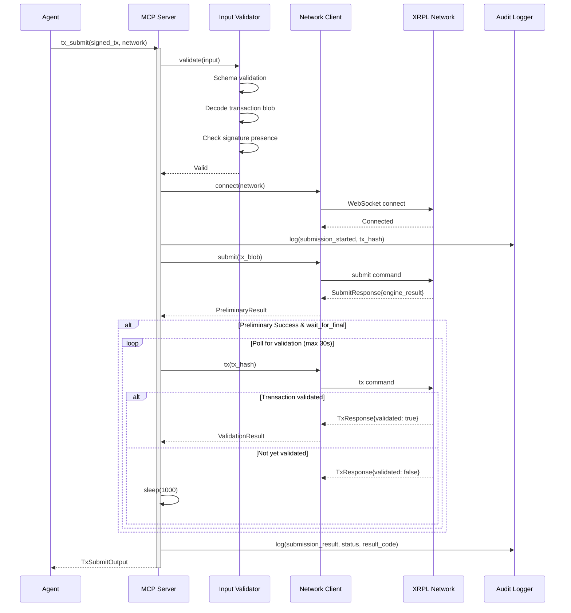

# tx_submit MCP Tool Specification

**Version:** 2.0.0
**Date:** 2026-01-29
**Status:** Complete
**Security Classification:** HIGH

---

## Table of Contents

1. [Overview](#1-overview)
2. [Input Schema](#2-input-schema)
3. [Output Schema](#3-output-schema)
4. [XRPL Submit Method](#4-xrpl-submit-method)
5. [Transaction Validation Flow](#5-transaction-validation-flow)
6. [Result Codes Reference](#6-result-codes-reference)
7. [Network Alignment Validation](#7-network-alignment-validation)
8. [Error Codes](#8-error-codes)
9. [Rate Limiting](#9-rate-limiting)
10. [Audit Events](#10-audit-events)
11. [Examples](#11-examples)
12. [Security Considerations](#12-security-considerations)
13. [Related Tools](#13-related-tools)

---

## 1. Overview

### 1.1 Description

The `tx_submit` tool submits a signed XRPL transaction blob to the network for validation and inclusion in a ledger. This is the final step in the transaction lifecycle after signing with `wallet_sign`.

**This tool broadcasts transactions to the XRPL network.** Submitted transactions are irreversible once validated into a ledger.

### 1.2 Security Classification

| Aspect | Classification |
|--------|----------------|
| **Tool Sensitivity** | HIGH |
| **Data Access** | Signed transaction blob (no key material) |
| **Risk Level** | Financial (irreversible transactions) |
| **Authentication** | Required |
| **Network Interaction** | Required (broadcasts to XRPL) |

### 1.3 Core Principles

1. **Network Verification**: Validates the target network matches the transaction's intended network
2. **Pre-Submission Validation**: Basic checks before broadcasting to reduce failed submissions
3. **Comprehensive Result Reporting**: Returns full XRPL result codes and preliminary/final status
4. **Audit Trail**: Every submission attempt is logged regardless of outcome
5. **Idempotent Design**: Resubmitting the same signed blob is safe (same tx_hash)

### 1.4 Tool Registration

```typescript
{
  name: 'tx_submit',
  description: 'Submit a signed XRPL transaction blob to the network. ' +
    'Returns transaction hash, result code, and ledger index. ' +
    'Use after wallet_sign to broadcast the signed transaction.',
  inputSchema: TxSubmitInputSchema,
  outputSchema: TxSubmitOutputSchema,
}
```

---

## 2. Input Schema

### 2.1 Schema Definition

```typescript
import { z } from 'zod';

export const TxSubmitInputSchema = z.object({
  /**
   * Hex-encoded signed transaction blob.
   * Must be a valid, signed XRPL transaction.
   * Typically obtained from wallet_sign response.
   */
  signed_tx: z
    .string()
    .min(100, 'Signed transaction blob too short')
    .max(1000000, 'Transaction blob exceeds maximum size')
    .regex(/^[A-Fa-f0-9]+$/, 'Transaction blob must be hexadecimal')
    .describe('Signed XRPL transaction blob (hex-encoded)'),

  /**
   * Target network for submission.
   * MUST match the network the transaction was constructed for.
   */
  network: z
    .enum(['mainnet', 'testnet', 'devnet'])
    .describe('XRPL network to submit to'),

  /**
   * Whether to wait for final validation.
   * If true, waits up to ~30 seconds for ledger validation.
   * If false, returns after preliminary result.
   */
  wait_for_final: z
    .boolean()
    .default(true)
    .describe('Wait for final ledger validation (default: true)'),

  /**
   * Maximum time in seconds to wait for final validation.
   * Only applicable when wait_for_final is true.
   */
  timeout_seconds: z
    .number()
    .int()
    .min(5)
    .max(60)
    .default(30)
    .optional()
    .describe('Timeout for final validation (default: 30s)'),

  /**
   * Fail-safe mode: if true, only submit if transaction has not
   * been seen before on the network. Prevents accidental resubmission.
   */
  fail_if_pending: z
    .boolean()
    .default(false)
    .optional()
    .describe('Fail if transaction already pending on network'),

}).describe('Submit a signed transaction to XRPL');
```

### 2.2 Field Details

| Field | Type | Required | Default | Description |
|-------|------|----------|---------|-------------|
| `signed_tx` | string | Yes | - | Hex-encoded signed transaction blob |
| `network` | enum | Yes | - | Target network: mainnet, testnet, devnet |
| `wait_for_final` | boolean | No | true | Wait for ledger validation |
| `timeout_seconds` | number | No | 30 | Max wait time for validation (5-60s) |
| `fail_if_pending` | boolean | No | false | Reject if already pending |

### 2.3 Input Validation

Validation occurs in this exact order:

1. **Schema validation**: Zod validates all fields against schema
2. **Hex format validation**: Verify signed_tx is valid hexadecimal
3. **Blob length check**: Ensure minimum viable transaction size
4. **Transaction decode**: Attempt to deserialize the blob
5. **Signature presence**: Verify SigningPubKey and TxnSignature fields exist
6. **Network parameter**: Validate network enum value
7. **Network alignment**: Check transaction network ID matches target network

### 2.4 JSON Schema

```json
{
  "$schema": "https://json-schema.org/draft/2020-12/schema",
  "type": "object",
  "required": ["signed_tx", "network"],
  "properties": {
    "signed_tx": {
      "type": "string",
      "minLength": 100,
      "maxLength": 1000000,
      "pattern": "^[A-Fa-f0-9]+$",
      "description": "Hex-encoded signed XRPL transaction blob"
    },
    "network": {
      "type": "string",
      "enum": ["mainnet", "testnet", "devnet"],
      "description": "XRPL network to submit to"
    },
    "wait_for_final": {
      "type": "boolean",
      "default": true,
      "description": "Wait for ledger validation"
    },
    "timeout_seconds": {
      "type": "integer",
      "minimum": 5,
      "maximum": 60,
      "default": 30,
      "description": "Timeout for final validation"
    },
    "fail_if_pending": {
      "type": "boolean",
      "default": false,
      "description": "Fail if transaction already pending"
    }
  },
  "additionalProperties": false
}
```

---

## 3. Output Schema

### 3.1 Discriminated Union

The output is a discriminated union with three possible shapes based on the `status` field:

```typescript
export const TxSubmitOutputSchema = z.discriminatedUnion('status', [
  TxSubmitSuccessSchema,        // status: 'validated' | 'pending'
  TxSubmitPendingSchema,        // status: 'pending'
  TxSubmitFailedSchema,         // status: 'failed'
]);
```

### 3.2 Success Output (Validated)

Returned when the transaction is validated into a ledger.

```typescript
export const TxSubmitSuccessSchema = z.object({
  /**
   * Discriminator field
   */
  status: z.literal('validated'),

  /**
   * XRPL transaction hash (64 hex characters).
   * Use this to track and verify the transaction.
   */
  tx_hash: z
    .string()
    .length(64, 'Transaction hash must be 64 characters')
    .regex(/^[A-Fa-f0-9]{64}$/, 'Must be 64 hex characters')
    .transform(val => val.toUpperCase())
    .describe('XRPL transaction hash'),

  /**
   * XRPL engine result code from submission.
   * tesSUCCESS indicates the transaction succeeded.
   */
  result_code: z
    .string()
    .describe('XRPL engine result code (e.g., tesSUCCESS)'),

  /**
   * Human-readable result message.
   */
  result_message: z
    .string()
    .describe('Human-readable result description'),

  /**
   * Ledger index where the transaction was validated.
   */
  ledger_index: z
    .number()
    .int()
    .positive()
    .describe('Ledger index where transaction was validated'),

  /**
   * Ledger hash where the transaction was validated.
   */
  ledger_hash: z
    .string()
    .length(64)
    .optional()
    .describe('Ledger hash'),

  /**
   * Whether the transaction achieved its intended effect.
   * Note: Some tec codes indicate "claimed cost only" - the
   * transaction was included but did not achieve its goal.
   */
  transaction_succeeded: z
    .boolean()
    .describe('Whether transaction achieved intended effect'),

  /**
   * Network where the transaction was submitted.
   */
  network: z.enum(['mainnet', 'testnet', 'devnet']),

  /**
   * ISO 8601 timestamp when validated.
   */
  validated_at: z.string().datetime(),

  /**
   * Close time of the ledger (XRPL epoch).
   */
  close_time: z
    .number()
    .int()
    .optional()
    .describe('Ledger close time (XRPL epoch)'),

  /**
   * Fee consumed by the transaction (in drops).
   */
  fee_drops: z
    .string()
    .regex(/^\d+$/)
    .optional()
    .describe('Transaction fee consumed'),

  /**
   * Account sequence used by this transaction.
   */
  sequence: z
    .number()
    .int()
    .optional()
    .describe('Account sequence number used'),

  /**
   * Transaction type extracted from the transaction.
   * Useful for routing logic and escrow workflows.
   * @since 2.0.0
   */
  tx_type: z
    .string()
    .optional()
    .describe('Transaction type (e.g., "Payment", "EscrowCreate")'),

  /**
   * Sequence number used by this transaction.
   * Critical for escrow tracking (EscrowFinish/EscrowCancel require this).
   * @since 2.0.0
   */
  sequence_used: z
    .number()
    .int()
    .optional()
    .describe('Sequence number consumed by this transaction'),

  /**
   * Escrow reference for EscrowCreate transactions.
   * Provides the owner+sequence needed for EscrowFinish/EscrowCancel.
   * Only present for successful EscrowCreate transactions.
   * @since 2.0.0
   */
  escrow_reference: z
    .object({
      owner: z.string().describe('Escrow owner (creator) address'),
      sequence: z.number().int().describe('Sequence number to reference the escrow'),
    })
    .optional()
    .describe('Reference for EscrowFinish/EscrowCancel operations'),
});
```

### 3.3 Pending Output

Returned when wait_for_final is false and transaction is queued.

```typescript
export const TxSubmitPendingSchema = z.object({
  /**
   * Discriminator field
   */
  status: z.literal('pending'),

  /**
   * XRPL transaction hash.
   */
  tx_hash: z
    .string()
    .length(64)
    .regex(/^[A-Fa-f0-9]{64}$/)
    .transform(val => val.toUpperCase())
    .describe('XRPL transaction hash'),

  /**
   * Preliminary result code from initial submission.
   * Note: This is NOT final - transaction may still fail.
   */
  preliminary_result: z
    .string()
    .describe('Preliminary engine result (NOT final)'),

  /**
   * Whether the preliminary result indicates likely success.
   */
  preliminary_success: z
    .boolean()
    .describe('Whether preliminary result suggests success'),

  /**
   * Network where the transaction was submitted.
   */
  network: z.enum(['mainnet', 'testnet', 'devnet']),

  /**
   * ISO 8601 timestamp when submitted.
   */
  submitted_at: z.string().datetime(),

  /**
   * Current open ledger sequence.
   */
  current_ledger: z
    .number()
    .int()
    .optional()
    .describe('Current open ledger at submission'),

  /**
   * Expected ledger range for validation.
   */
  expected_ledger_range: z.object({
    min: z.number().int(),
    max: z.number().int(),
  }).optional().describe('Expected validation ledger range'),
});
```

### 3.4 Failed Output

Returned when submission fails or transaction is rejected.

```typescript
export const TxSubmitFailedSchema = z.object({
  /**
   * Discriminator field
   */
  status: z.literal('failed'),

  /**
   * Transaction hash (if transaction could be decoded).
   */
  tx_hash: z
    .string()
    .length(64)
    .optional()
    .describe('Transaction hash (if available)'),

  /**
   * XRPL result code indicating failure reason.
   */
  result_code: z
    .string()
    .describe('XRPL result code'),

  /**
   * Human-readable error message.
   */
  result_message: z
    .string()
    .describe('Human-readable error description'),

  /**
   * Category of the failure.
   */
  failure_category: z.enum([
    'local_error',      // Error before submission (validation, encoding)
    'malformed',        // Transaction structure invalid (tem codes)
    'failed_precondition', // Account state prevents execution (tef codes)
    'claimed_cost_only',   // Executed but failed objective (tec codes)
    'retry_possible',   // Temporary failure, retry may succeed (ter codes)
    'network_error',    // Network connectivity issue
  ]).describe('Category of failure'),

  /**
   * Network where submission was attempted.
   */
  network: z.enum(['mainnet', 'testnet', 'devnet']),

  /**
   * ISO 8601 timestamp of failure.
   */
  failed_at: z.string().datetime(),

  /**
   * Ledger index where transaction failed (if known).
   */
  ledger_index: z
    .number()
    .int()
    .optional()
    .describe('Ledger index where failure occurred'),

  /**
   * Whether retrying might succeed.
   */
  retryable: z
    .boolean()
    .describe('Whether retry might succeed'),

  /**
   * Suggested action for recovery.
   */
  suggestion: z
    .string()
    .optional()
    .describe('Suggested recovery action'),
});
```

---

## 4. XRPL Submit Method

### 4.1 Submit Command

The `tx_submit` tool uses the XRPL `submit` command:

```typescript
// Basic submit request
const submitRequest = {
  command: 'submit',
  tx_blob: input.signed_tx,
};

// Submit response structure
interface SubmitResponse {
  result: {
    accepted: boolean;
    applied: boolean;
    broadcast: boolean;
    kept: boolean;
    queued: boolean;
    engine_result: string;
    engine_result_code: number;
    engine_result_message: string;
    tx_blob: string;
    tx_json: TransactionJSON;
  };
}
```

### 4.2 Submit Response Fields

| Field | Type | Description |
|-------|------|-------------|
| `accepted` | boolean | Server accepted the transaction |
| `applied` | boolean | Applied to current open ledger |
| `broadcast` | boolean | Broadcast to peer servers |
| `kept` | boolean | Held in transaction queue |
| `queued` | boolean | Transaction is in queue |
| `engine_result` | string | Result code (e.g., `tesSUCCESS`) |
| `engine_result_code` | number | Numeric result code |
| `engine_result_message` | string | Human-readable message |
| `tx_blob` | string | Echo of submitted blob |
| `tx_json` | object | Decoded transaction JSON |

### 4.3 Validation Polling

When `wait_for_final` is true, the tool polls for transaction validation:

```typescript
async function waitForValidation(
  client: XrplClient,
  txHash: string,
  timeoutMs: number
): Promise<TransactionResult> {
  const startTime = Date.now();

  while (Date.now() - startTime < timeoutMs) {
    try {
      const response = await client.request({
        command: 'tx',
        transaction: txHash,
      });

      if (response.result.validated) {
        return {
          status: 'validated',
          ledger_index: response.result.ledger_index,
          result_code: response.result.meta?.TransactionResult || 'unknown',
        };
      }
    } catch (error) {
      // Transaction not found yet, continue polling
    }

    await sleep(1000); // Poll every 1 second
  }

  return { status: 'timeout' };
}
```

### 4.4 Network Endpoints

| Network | WebSocket URL | Status |
|---------|--------------|--------|
| mainnet | `wss://xrplcluster.com/` | Production |
| mainnet | `wss://s1.ripple.com/` | Backup |
| testnet | `wss://s.altnet.rippletest.net:51233/` | Testing |
| devnet | `wss://s.devnet.rippletest.net:51233/` | Development |

---

## 5. Transaction Validation Flow

### 5.1 Submission Pipeline

```
   Input
     |
     v
+--------------------+
| 1. INPUT VALIDATION|  Schema, hex format, structure
+--------------------+
     |
     v
+--------------------+
| 2. DECODE TX       |  Deserialize blob, extract fields
+--------------------+
     |
     v
+--------------------+
| 3. NETWORK CHECK   |  Verify network alignment
+--------------------+
     |
     v
+--------------------+
| 4. SIGNATURE CHECK |  Verify signature fields present
+--------------------+
     |
     v
+--------------------+
| 5. CONNECT NETWORK |  Establish WebSocket connection
+--------------------+
     |
     v
+--------------------+
| 6. SUBMIT TX       |  Send to rippled via 'submit'
+--------------------+
     |
     v
+--------------------+
| 7. PRELIMINARY     |  Check engine_result
|    RESULT CHECK    |
+--------------------+
     |
     +--> wait_for_final = false --> Return PENDING
     |
     v
+--------------------+
| 8. POLL FOR        |  Check 'tx' command periodically
|    VALIDATION      |
+--------------------+
     |
     v
+--------------------+
| 9. RETURN RESULT   |  Validated, Failed, or Timeout
+--------------------+
```

### 5.2 Submission Sequence Diagram



### 5.3 Validation States

| State | Description | Action |
|-------|-------------|--------|
| **Queued** | Transaction accepted, in queue | Wait for validation |
| **Applied** | Applied to open ledger | Wait for ledger close |
| **Validated** | Included in validated ledger | Success (final) |
| **Failed** | Rejected by consensus | Return failure (final) |
| **Expired** | LastLedgerSequence passed | Transaction will never validate |

---

## 6. Result Codes Reference

### 6.1 Result Code Categories

XRPL uses prefixed result codes to indicate transaction outcomes:

| Prefix | Category | Description | Final? |
|--------|----------|-------------|--------|
| `tes` | Success | Transaction succeeded | Yes |
| `tec` | Claimed Cost Only | Included but failed objective | Yes |
| `tef` | Failed | Account state prevents execution | Yes |
| `tel` | Local | Server rejected before relay | No* |
| `tem` | Malformed | Invalid transaction structure | Yes |
| `ter` | Retry | Temporary failure, may succeed later | No |

*`tel` codes prevent the transaction from being broadcast, so they're final in practice.

### 6.2 Success Codes (tes)

| Code | Value | Description |
|------|-------|-------------|
| `tesSUCCESS` | 0 | Transaction applied successfully |

### 6.3 Claimed Cost Only (tec)

Transaction was included in a ledger but did not achieve its intended effect. The transaction fee was still consumed.

| Code | Value | Description | Common Cause |
|------|-------|-------------|--------------|
| `tecCLAIM` | 100 | Fee claimed, no other effect | Generic failure |
| `tecPATH_PARTIAL` | 101 | Path payment partially completed | Insufficient liquidity |
| `tecUNFUNDED_ADD` | 102 | Insufficient XRP for account reserve | Creating objects below reserve |
| `tecUNFUNDED_OFFER` | 103 | Insufficient funds for offer | Offer amount > available balance |
| `tecUNFUNDED_PAYMENT` | 104 | Insufficient funds for payment | Payment amount > available balance |
| `tecFAILED_PROCESSING` | 105 | Generic processing failure | Various |
| `tecDIR_FULL` | 121 | Owner directory full | Too many objects owned |
| `tecINSUF_RESERVE_LINE` | 122 | Below reserve after adding trust line | Insufficient XRP for new trust line |
| `tecINSUF_RESERVE_OFFER` | 123 | Below reserve after adding offer | Insufficient XRP for new offer |
| `tecNO_DST` | 124 | Destination account does not exist | Paying to unfunded account |
| `tecNO_DST_INSUF_XRP` | 125 | Destination below reserve threshold | Payment amount too small to fund |
| `tecNO_LINE_INSUF_RESERVE` | 126 | No trust line and can't create | Receiver lacks reserve for trust line |
| `tecNO_LINE_REDUNDANT` | 127 | Trust line redundant | Issuer trusting itself |
| `tecPATH_DRY` | 128 | Path found no liquidity | No viable payment path |
| `tecUNFUNDED` | 129 | Generic underfunded | Insufficient balance |
| `tecNO_ALTERNATIVE_KEY` | 130 | No alternative signing key | Disabling master without regular key |
| `tecNO_REGULAR_KEY` | 131 | No regular key set | Regular key required but not set |
| `tecOWNERS` | 132 | Cannot delete account with objects | Account owns ledger objects |
| `tecNO_ISSUER` | 133 | Issuer does not exist | Token issuer not on ledger |
| `tecNO_AUTH` | 134 | Not authorized | Authorization required |
| `tecNO_LINE` | 135 | No trust line exists | Required trust line missing |
| `tecINSUFF_FEE` | 136 | Insufficient fee | Fee too low for current load |
| `tecFROZEN` | 137 | Asset frozen | Trust line or global freeze active |
| `tecNO_TARGET` | 138 | Target does not exist | Referenced object not found |
| `tecNO_PERMISSION` | 139 | No permission | Authorization denied |
| `tecNO_ENTRY` | 140 | No ledger entry | Referenced entry not found |
| `tecINSUFFICIENT_RESERVE` | 141 | Insufficient reserve | Below reserve requirement |
| `tecNEED_MASTER_KEY` | 142 | Master key required | Operation requires master key |
| `tecDST_TAG_NEEDED` | 143 | Destination tag required | Receiver requires destination tag |
| `tecINTERNAL` | 144 | Internal error | Server internal error |
| `tecOVERSIZE` | 145 | Object too large | Data exceeds size limits |
| `tecCRYPTOCONDITION_ERROR` | 146 | Crypto condition failed | Escrow condition not met |
| `tecINVARIANT_FAILED` | 147 | Invariant check failed | Ledger consistency violation |
| `tecNO_SUITABLE_NFTOKEN_PAGE` | 148 | No suitable NFT page | NFT storage issue |
| `tecNFTOKEN_BUY_SELL_MISMATCH` | 149 | Buy/sell offer mismatch | NFT offer parameters don't match |
| `tecNFTOKEN_OFFER_TYPE_MISMATCH` | 150 | Offer type mismatch | Wrong NFT offer type |
| `tecCANT_ACCEPT_OWN_NFTOKEN_OFFER` | 151 | Can't accept own offer | Self-acceptance not allowed |
| `tecINSUFFICIENT_FUNDS` | 152 | Insufficient funds | Generic insufficient balance |
| `tecOBJECT_NOT_FOUND` | 153 | Object not found | Referenced object missing |
| `tecINSUFFICIENT_PAYMENT` | 154 | Insufficient payment | Payment amount too low |
| `tecDUPLICATE` | 155 | Duplicate entry | Object already exists |

### 6.4 Failed Codes (tef)

Transaction cannot be applied due to current account state.

| Code | Value | Description | Common Cause |
|------|-------|-------------|--------------|
| `tefFAILURE` | -199 | Generic failure | Various |
| `tefALREADY` | -198 | Transaction already applied | Duplicate submission |
| `tefBAD_ADD_AUTH` | -197 | Bad authorization | Invalid authorization |
| `tefBAD_AUTH` | -196 | Bad auth signature | Signature doesn't match |
| `tefBAD_LEDGER` | -195 | Bad ledger | Ledger state issue |
| `tefCREATED` | -194 | Can't modify created object | Object creation conflict |
| `tefEXCEPTION` | -193 | Exception occurred | Server exception |
| `tefINTERNAL` | -192 | Internal error | Server internal error |
| `tefNO_AUTH_REQUIRED` | -191 | No auth required | Auth provided but not needed |
| `tefPAST_SEQ` | -190 | Sequence too old | Transaction replayed |
| `tefWRONG_PRIOR` | -189 | Wrong prior transaction | Dependency not met |
| `tefMASTER_DISABLED` | -188 | Master key disabled | Can't use disabled master key |
| `tefMAX_LEDGER` | -187 | LastLedgerSequence passed | Transaction expired |
| `tefNOT_MULTI_SIGNING` | -186 | Not a multi-sign transaction | Multi-sign expected |
| `tefBAD_AUTH_MASTER` | -185 | Bad master key auth | Invalid master key |
| `tefINVARIANT_FAILED` | -184 | Invariant failed | Consistency check failed |
| `tefTOO_BIG` | -183 | Transaction too large | Exceeds size limits |
| `tefNO_TICKET` | -182 | Ticket not found | Referenced ticket missing |
| `tefNFTOKEN_IS_NOT_TRANSFERABLE` | -181 | NFT not transferable | NFT transfer disabled |

### 6.5 Local Codes (tel)

Server rejected the transaction before broadcasting.

| Code | Value | Description | Common Cause |
|------|-------|-------------|--------------|
| `telLOCAL_ERROR` | -399 | Local error | Generic local failure |
| `telBAD_DOMAIN` | -398 | Bad domain | Invalid domain |
| `telBAD_PATH_COUNT` | -397 | Too many paths | Path finding limit exceeded |
| `telBAD_PUBLIC_KEY` | -396 | Bad public key | Invalid signing key |
| `telFAILED_PROCESSING` | -395 | Processing failed | Server processing error |
| `telINSUF_FEE_P` | -394 | Insufficient fee | Fee below minimum |
| `telNO_DST_PARTIAL` | -393 | No destination (partial) | Partial payment destination issue |
| `telCAN_NOT_QUEUE` | -392 | Cannot queue | Queue full |
| `telCAN_NOT_QUEUE_BALANCE` | -391 | Cannot queue (balance) | Insufficient balance for queue |
| `telCAN_NOT_QUEUE_BLOCKS` | -390 | Cannot queue (blocked) | Transaction blocked |
| `telCAN_NOT_QUEUE_BLOCKED` | -389 | Cannot queue (blocked) | Queue blocked |
| `telCAN_NOT_QUEUE_FEE` | -388 | Cannot queue (fee) | Fee too low for queue |
| `telCAN_NOT_QUEUE_FULL` | -387 | Queue full | Transaction queue at capacity |
| `telWRONG_NETWORK` | -386 | Wrong network | Network ID mismatch |
| `telREQUIRES_NETWORK_ID` | -385 | Requires network ID | Network ID required |
| `telNETWORK_ID_MAKES_TX_NON_CANONICAL` | -384 | Non-canonical with network ID | Network ID issue |

### 6.6 Malformed Codes (tem)

Transaction structure is invalid.

| Code | Value | Description | Common Cause |
|------|-------|-------------|--------------|
| `temMALFORMED` | -299 | Malformed transaction | Invalid structure |
| `temBAD_AMOUNT` | -298 | Bad amount | Invalid amount value |
| `temBAD_CURRENCY` | -297 | Bad currency | Invalid currency code |
| `temBAD_EXPIRATION` | -296 | Bad expiration | Invalid expiration time |
| `temBAD_FEE` | -295 | Bad fee | Invalid fee value |
| `temBAD_ISSUER` | -294 | Bad issuer | Invalid issuer address |
| `temBAD_LIMIT` | -293 | Bad limit | Invalid limit value |
| `temBAD_OFFER` | -292 | Bad offer | Invalid offer structure |
| `temBAD_PATH` | -291 | Bad path | Invalid payment path |
| `temBAD_PATH_LOOP` | -290 | Path loop | Circular path detected |
| `temBAD_REGKEY` | -289 | Bad regular key | Invalid regular key |
| `temBAD_SEND_XRP_LIMIT` | -288 | Bad send XRP limit | Invalid XRP limit |
| `temBAD_SEND_XRP_MAX` | -287 | Bad send XRP max | Invalid max XRP |
| `temBAD_SEND_XRP_NO_DIRECT` | -286 | Bad send XRP no direct | Direct XRP not allowed |
| `temBAD_SEND_XRP_PARTIAL` | -285 | Bad send XRP partial | Partial XRP issue |
| `temBAD_SEND_XRP_PATHS` | -284 | Bad send XRP paths | Paths with XRP issue |
| `temBAD_SEQUENCE` | -283 | Bad sequence | Invalid sequence number |
| `temBAD_SIGNATURE` | -282 | Bad signature | Invalid signature format |
| `temBAD_SRC_ACCOUNT` | -281 | Bad source account | Invalid source address |
| `temBAD_TRANSFER_RATE` | -280 | Bad transfer rate | Invalid transfer rate |
| `temDST_IS_SRC` | -279 | Destination is source | Self-transfer not allowed |
| `temDST_NEEDED` | -278 | Destination needed | Missing destination |
| `temINVALID` | -277 | Invalid | Generic invalid |
| `temINVALID_FLAG` | -276 | Invalid flag | Bad flag value |
| `temREDUNDANT` | -275 | Redundant | Operation has no effect |
| `temRIPPLE_EMPTY` | -274 | Empty ripple | No ripple effect |
| `temUNCERTAIN` | -273 | Uncertain | Result uncertain |
| `temUNKNOWN` | -272 | Unknown | Unknown issue |
| `temDISABLED` | -271 | Disabled | Feature disabled |
| `temBAD_TICK_SIZE` | -270 | Bad tick size | Invalid tick size |
| `temINVALID_ACCOUNT_ID` | -269 | Invalid account ID | Bad account address |
| `temCANNOT_PREAUTH_SELF` | -268 | Cannot preauth self | Self-preauth not allowed |
| `temINVALID_COUNT` | -267 | Invalid count | Bad count value |
| `temSEQ_AND_TICKET` | -266 | Sequence and ticket | Conflicting sequence |
| `temBAD_NFTOKEN_TRANSFER_FEE` | -265 | Bad NFT transfer fee | Invalid NFT fee |

### 6.7 Retry Codes (ter)

Temporary failure; transaction may succeed if retried.

| Code | Value | Description | Common Cause |
|------|-------|-------------|--------------|
| `terRETRY` | -99 | Retry | Generic retry |
| `terFUNDS_SPENT` | -98 | Funds spent | Funds used by another tx |
| `terINSUF_FEE_B` | -97 | Insufficient fee (B) | Fee too low |
| `terNO_ACCOUNT` | -96 | No account | Account not found |
| `terNO_AUTH` | -95 | No authorization | Auth required |
| `terNO_LINE` | -94 | No trust line | Trust line not found |
| `terOWNERS` | -93 | Owners | Object has owners |
| `terPRE_SEQ` | -92 | Pre-sequence | Sequence too high |
| `terLAST` | -91 | Last | Last in sequence |
| `terNO_RIPPLE` | -90 | No ripple | Ripple not enabled |
| `terQUEUED` | -89 | Queued | Transaction queued |
| `terPRE_TICKET` | -88 | Pre-ticket | Ticket not available |
| `terNO_AMM` | -87 | No AMM | AMM not found |

---

## 7. Network Alignment Validation

### 7.1 Network Verification

Before submitting, the tool verifies that the transaction is intended for the target network:

```typescript
function validateNetworkAlignment(
  decodedTx: DecodedTransaction,
  targetNetwork: Network
): ValidationResult {
  // Check NetworkID field if present
  if (decodedTx.NetworkID !== undefined) {
    const expectedNetworkId = NETWORK_IDS[targetNetwork];
    if (decodedTx.NetworkID !== expectedNetworkId) {
      return {
        valid: false,
        error: `NetworkID mismatch: transaction has ${decodedTx.NetworkID}, expected ${expectedNetworkId}`,
      };
    }
  }

  return { valid: true };
}
```

### 7.2 Network IDs

| Network | Network ID | Description |
|---------|------------|-------------|
| mainnet | 0 | Production network |
| testnet | 1 | Public test network |
| devnet | 2 | Development network |

### 7.3 Cross-Network Protection

The tool prevents accidental submission to the wrong network through:

1. **NetworkID field validation**: If the transaction includes a NetworkID, it must match the target
2. **Explicit network parameter**: The `network` input parameter is always required
3. **Connection isolation**: Separate WebSocket connections per network
4. **Audit logging**: Network mismatches are logged as warnings

### 7.4 LastLedgerSequence Check

Transactions include a `LastLedgerSequence` field that sets an expiration:

```typescript
function checkLastLedgerSequence(
  tx: DecodedTransaction,
  currentLedger: number
): ValidationResult {
  if (tx.LastLedgerSequence && tx.LastLedgerSequence < currentLedger) {
    return {
      valid: false,
      error: `Transaction expired: LastLedgerSequence ${tx.LastLedgerSequence} < current ${currentLedger}`,
    };
  }
  return { valid: true };
}
```

---

## 8. Error Codes

### 8.1 Complete Error Code Reference

| Code | HTTP | Description | Retryable | Recovery |
|------|------|-------------|-----------|----------|
| `VALIDATION_ERROR` | 400 | Input failed schema validation | No | Fix input format |
| `INVALID_BLOB` | 400 | Transaction blob cannot be decoded | No | Verify blob format |
| `MISSING_SIGNATURE` | 400 | Signed transaction lacks signature | No | Re-sign transaction |
| `NETWORK_MISMATCH` | 400 | Transaction NetworkID doesn't match target | No | Submit to correct network |
| `TRANSACTION_EXPIRED` | 400 | LastLedgerSequence has passed | No | Create new transaction |
| `ALREADY_SUBMITTED` | 409 | Transaction already pending (fail_if_pending) | Maybe | Wait for validation |
| `NETWORK_ERROR` | 503 | Cannot connect to XRPL network | Yes | Retry with backoff |
| `SUBMISSION_FAILED` | 502 | rippled rejected the submission | Maybe | Check result code |
| `VALIDATION_TIMEOUT` | 504 | Timed out waiting for validation | Maybe | Check tx status manually |
| `INTERNAL_ERROR` | 500 | Unexpected server error | Maybe | Retry or contact support |

### 8.2 Error Response Format

```typescript
interface TxSubmitErrorResponse {
  code: string;
  message: string;
  details?: {
    tx_hash?: string;
    result_code?: string;
    network?: string;
    current_ledger?: number;
    last_ledger_sequence?: number;
  };
  correlation_id: string;
  timestamp: string;
}
```

### 8.3 Error Examples

**Invalid Blob**
```json
{
  "code": "INVALID_BLOB",
  "message": "Failed to decode transaction blob",
  "details": {
    "error": "Invalid transaction type at offset 4"
  },
  "correlation_id": "req_abc123",
  "timestamp": "2026-01-28T14:30:00Z"
}
```

**Network Mismatch**
```json
{
  "code": "NETWORK_MISMATCH",
  "message": "Transaction was built for a different network",
  "details": {
    "tx_network_id": 0,
    "target_network": "testnet",
    "expected_network_id": 1
  },
  "correlation_id": "req_def456",
  "timestamp": "2026-01-28T14:30:00Z"
}
```

**Transaction Expired**
```json
{
  "code": "TRANSACTION_EXPIRED",
  "message": "Transaction LastLedgerSequence has passed",
  "details": {
    "last_ledger_sequence": 85000000,
    "current_ledger": 85000050,
    "tx_hash": "ABC123..."
  },
  "correlation_id": "req_ghi789",
  "timestamp": "2026-01-28T14:30:00Z"
}
```

**Validation Timeout**
```json
{
  "code": "VALIDATION_TIMEOUT",
  "message": "Transaction not validated within timeout period",
  "details": {
    "tx_hash": "DEF456...",
    "timeout_seconds": 30,
    "current_ledger": 85000100,
    "preliminary_result": "tesSUCCESS"
  },
  "correlation_id": "req_jkl012",
  "timestamp": "2026-01-28T14:30:30Z"
}
```

---

## 9. Rate Limiting

### 9.1 Rate Limit Configuration

The `tx_submit` tool is classified as **HIGH** sensitivity:

| Tier | Limit | Burst | Scope |
|------|-------|-------|-------|
| **HIGH** | 10 requests / minute | 2 | Per wallet address |
| Per Client | 30 requests / minute | 5 | Per client ID |
| Global | 100 requests / minute | 10 | Server-wide |

### 9.2 Rate Limit Implementation

```typescript
const txSubmitRateLimit = {
  tier: 'HIGH',
  window_seconds: 60,
  max_requests: 10,
  burst_allowed: 2,
  scope: 'per_wallet_address',
};
```

### 9.3 Rate Limit Response

When rate limit is exceeded:

```json
{
  "code": "RATE_LIMIT_EXCEEDED",
  "message": "Transaction submission rate limit exceeded",
  "details": {
    "limit": 10,
    "window_seconds": 60,
    "retry_after_seconds": 45
  },
  "correlation_id": "req_xyz123",
  "timestamp": "2026-01-28T14:30:00Z"
}
```

---

## 10. Audit Events

### 10.1 Audit Event Types

| Event | Severity | Trigger |
|-------|----------|---------|
| `tx_submission_started` | INFO | Submission request received |
| `tx_validation_passed` | INFO | Input validation successful |
| `tx_validation_failed` | WARN | Input validation failed |
| `tx_network_connected` | INFO | Connected to XRPL network |
| `tx_submitted` | INFO | Transaction sent to rippled |
| `tx_preliminary_result` | INFO | Received preliminary result |
| `tx_validated` | INFO | Transaction validated in ledger |
| `tx_failed` | WARN | Transaction failed |
| `tx_timeout` | WARN | Validation timeout |
| `tx_network_error` | ERROR | Network connectivity failure |

### 10.2 Audit Event Structure

```typescript
interface TxSubmitAuditEvent {
  seq: number;
  timestamp: string;
  event: AuditEventType;
  correlation_id: string;

  // Transaction context
  tx_hash?: string;
  network?: string;
  source_address?: string;
  transaction_type?: string;

  // Result context
  result_code?: string;
  ledger_index?: number;
  fee_drops?: string;

  // Audit chain
  prev_hash: string;
  hash: string;
}
```

### 10.3 Example Audit Trail

```json
[
  {
    "seq": 2001,
    "timestamp": "2026-01-28T14:30:00.000Z",
    "event": "tx_submission_started",
    "correlation_id": "corr_abc123",
    "network": "testnet",
    "prev_hash": "xyz...",
    "hash": "abc..."
  },
  {
    "seq": 2002,
    "timestamp": "2026-01-28T14:30:00.050Z",
    "event": "tx_validation_passed",
    "correlation_id": "corr_abc123",
    "tx_hash": "E08D6E975...",
    "transaction_type": "Payment",
    "prev_hash": "abc...",
    "hash": "def..."
  },
  {
    "seq": 2003,
    "timestamp": "2026-01-28T14:30:00.100Z",
    "event": "tx_submitted",
    "correlation_id": "corr_abc123",
    "tx_hash": "E08D6E975...",
    "prev_hash": "def...",
    "hash": "ghi..."
  },
  {
    "seq": 2004,
    "timestamp": "2026-01-28T14:30:00.500Z",
    "event": "tx_preliminary_result",
    "correlation_id": "corr_abc123",
    "tx_hash": "E08D6E975...",
    "result_code": "tesSUCCESS",
    "prev_hash": "ghi...",
    "hash": "jkl..."
  },
  {
    "seq": 2005,
    "timestamp": "2026-01-28T14:30:04.000Z",
    "event": "tx_validated",
    "correlation_id": "corr_abc123",
    "tx_hash": "E08D6E975...",
    "result_code": "tesSUCCESS",
    "ledger_index": 85432105,
    "fee_drops": "12",
    "prev_hash": "jkl...",
    "hash": "mno..."
  }
]
```

---

## 11. Examples

### 11.1 Successful Submission with Validation

**Request**
```json
{
  "jsonrpc": "2.0",
  "method": "tools/call",
  "params": {
    "name": "tx_submit",
    "arguments": {
      "signed_tx": "1200002280000000240000000161D4838D7EA4C6800000000000000000000000000055534400000000004B4E9C06F24296074F7BC48F92A97916C6DC5EA968400000000000000C7321ED9876543210FEDCBA9876543210FEDCBA9876543210FEDCBA9876543210FEDCBA7440E08D6E9754025BA2534A78707605E0601F03ACE063687A0CA1BDDACFCD1698C7",
      "network": "testnet",
      "wait_for_final": true,
      "timeout_seconds": 30
    }
  },
  "id": "1"
}
```

**Response (Validated)**
```json
{
  "jsonrpc": "2.0",
  "result": {
    "status": "validated",
    "tx_hash": "E08D6E9754025BA2534A78707605E0601F03ACE063687A0CA1BDDACFCD1698C7",
    "result_code": "tesSUCCESS",
    "result_message": "The transaction was applied. Only final in a validated ledger.",
    "ledger_index": 85432105,
    "ledger_hash": "ABC123DEF456789012345678901234567890123456789012345678901234",
    "transaction_succeeded": true,
    "network": "testnet",
    "validated_at": "2026-01-28T14:30:04.000Z",
    "close_time": 755438204,
    "fee_drops": "12",
    "sequence": 42
  },
  "id": "1"
}
```

### 11.2 Submission Without Waiting (Pending)

**Request**
```json
{
  "jsonrpc": "2.0",
  "method": "tools/call",
  "params": {
    "name": "tx_submit",
    "arguments": {
      "signed_tx": "1200002280000000240000000261D5E7AB3D5F1800000000000000000000000000055534400000000004B4E9C06F24296074F7BC48F92A97916C6DC5EA968400000000000000C7321ED...",
      "network": "testnet",
      "wait_for_final": false
    }
  },
  "id": "2"
}
```

**Response (Pending)**
```json
{
  "jsonrpc": "2.0",
  "result": {
    "status": "pending",
    "tx_hash": "F19E7FA864036BB2635A79707715F0702F14BDF074798B1CB2CEBAEGD2789D8",
    "preliminary_result": "tesSUCCESS",
    "preliminary_success": true,
    "network": "testnet",
    "submitted_at": "2026-01-28T14:30:00.500Z",
    "current_ledger": 85432100,
    "expected_ledger_range": {
      "min": 85432101,
      "max": 85432110
    }
  },
  "id": "2"
}
```

### 11.3 Failed Submission - Insufficient Funds

**Request**
```json
{
  "jsonrpc": "2.0",
  "method": "tools/call",
  "params": {
    "name": "tx_submit",
    "arguments": {
      "signed_tx": "1200002280000000240000000361D9E85538C5A000000000000000000000000000055534400000000004B4E9C06F24296074F7BC48F92A97916C6DC5EA968400000000000000C7321ED...",
      "network": "mainnet",
      "wait_for_final": true
    }
  },
  "id": "3"
}
```

**Response (Failed)**
```json
{
  "jsonrpc": "2.0",
  "result": {
    "status": "failed",
    "tx_hash": "G20F8GB975147CC3746B80818826G1813G25CEG185899C2DC3DFCBFHE3890E9",
    "result_code": "tecUNFUNDED_PAYMENT",
    "result_message": "Insufficient XRP balance to send.",
    "failure_category": "claimed_cost_only",
    "network": "mainnet",
    "failed_at": "2026-01-28T14:30:05.000Z",
    "ledger_index": 85500200,
    "retryable": false,
    "suggestion": "Check wallet balance with wallet_balance tool. Ensure available balance exceeds payment amount plus fee."
  },
  "id": "3"
}
```

### 11.4 Failed Submission - Destination Not Funded

**Request**
```json
{
  "jsonrpc": "2.0",
  "method": "tools/call",
  "params": {
    "name": "tx_submit",
    "arguments": {
      "signed_tx": "1200002280000000240000000461D4838D7EA4C68...",
      "network": "mainnet",
      "wait_for_final": true
    }
  },
  "id": "4"
}
```

**Response (Failed - tecNO_DST_INSUF_XRP)**
```json
{
  "jsonrpc": "2.0",
  "result": {
    "status": "failed",
    "tx_hash": "H31G9HC086258DD4857C91929937H2924H36DFH296900D3ED4EGDCGIF4901F0",
    "result_code": "tecNO_DST_INSUF_XRP",
    "result_message": "Destination does not exist. Too little XRP sent to create it.",
    "failure_category": "claimed_cost_only",
    "network": "mainnet",
    "failed_at": "2026-01-28T14:30:06.000Z",
    "ledger_index": 85500205,
    "retryable": false,
    "suggestion": "Destination account is not funded. Send at least 1 XRP (base reserve) to create the account."
  },
  "id": "4"
}
```

### 11.5 Network Mismatch Error

**Request**
```json
{
  "jsonrpc": "2.0",
  "method": "tools/call",
  "params": {
    "name": "tx_submit",
    "arguments": {
      "signed_tx": "1200002280000000240000000561D4838D7EA4C68...",
      "network": "testnet"
    }
  },
  "id": "5"
}
```

**Response (Error - Network Mismatch)**
```json
{
  "jsonrpc": "2.0",
  "error": {
    "code": -32000,
    "message": "Network mismatch",
    "data": {
      "code": "NETWORK_MISMATCH",
      "message": "Transaction was built for a different network",
      "details": {
        "tx_network_id": 0,
        "target_network": "testnet",
        "expected_network_id": 1
      },
      "correlation_id": "req_mno345",
      "timestamp": "2026-01-28T14:30:00Z"
    }
  },
  "id": "5"
}
```

### 11.6 Validation Timeout

**Request**
```json
{
  "jsonrpc": "2.0",
  "method": "tools/call",
  "params": {
    "name": "tx_submit",
    "arguments": {
      "signed_tx": "1200002280000000240000000661D4838D7EA4C68...",
      "network": "mainnet",
      "wait_for_final": true,
      "timeout_seconds": 15
    }
  },
  "id": "6"
}
```

**Response (Timeout)**
```json
{
  "jsonrpc": "2.0",
  "error": {
    "code": -32000,
    "message": "Validation timeout",
    "data": {
      "code": "VALIDATION_TIMEOUT",
      "message": "Transaction not validated within timeout period",
      "details": {
        "tx_hash": "J53K1JE198470FF6079E13141159J4146J58HGJ418012F5GF6GIEJHKL6123H2",
        "timeout_seconds": 15,
        "preliminary_result": "tesSUCCESS",
        "current_ledger": 85500300
      },
      "correlation_id": "req_pqr678",
      "timestamp": "2026-01-28T14:30:15Z"
    }
  },
  "id": "6"
}
```

### 11.7 Retry-Possible Error (terQUEUED)

**Request**
```json
{
  "jsonrpc": "2.0",
  "method": "tools/call",
  "params": {
    "name": "tx_submit",
    "arguments": {
      "signed_tx": "1200002280000000240000000761D4838D7EA4C68...",
      "network": "mainnet",
      "wait_for_final": false
    }
  },
  "id": "7"
}
```

**Response (Pending with Queue Info)**
```json
{
  "jsonrpc": "2.0",
  "result": {
    "status": "pending",
    "tx_hash": "K64L2KF209581GG7180F24252260K5257K69IHK529123G6HG7HFKIJM7234I3",
    "preliminary_result": "terQUEUED",
    "preliminary_success": true,
    "network": "mainnet",
    "submitted_at": "2026-01-28T14:30:00.600Z",
    "current_ledger": 85500310
  },
  "id": "7"
}
```

### 11.8 EscrowCreate with Escrow Reference (v2.0.0+)

**Request**
```json
{
  "jsonrpc": "2.0",
  "method": "tools/call",
  "params": {
    "name": "tx_submit",
    "arguments": {
      "signed_tx": "1200012280000000240000002A2E00000001614000000005F5E10068400000000000000C7321ED...",
      "network": "testnet",
      "wait_for_final": true
    }
  },
  "id": "8"
}
```

**Response (EscrowCreate Success)**
```json
{
  "jsonrpc": "2.0",
  "result": {
    "status": "validated",
    "tx_hash": "M86N4MH421803II9302H46474482M7479M81KJM741345I8JI9JHMKLO9456K5",
    "result_code": "tesSUCCESS",
    "result_message": "The transaction was applied. Only final in a validated ledger.",
    "ledger_index": 85432200,
    "transaction_succeeded": true,
    "network": "testnet",
    "validated_at": "2026-01-29T10:30:04.000Z",
    "fee_drops": "12",
    "sequence": 42,
    "tx_type": "EscrowCreate",
    "sequence_used": 42,
    "escrow_reference": {
      "owner": "rAgentWallet123...",
      "sequence": 42
    }
  },
  "id": "8"
}
```

> **Note**: The `escrow_reference` field is only present for successful `EscrowCreate` transactions. Use `escrow_reference.owner` and `escrow_reference.sequence` to construct `EscrowFinish` or `EscrowCancel` transactions.

### 11.9 tec Code - Claimed Cost Only

**Request**
```json
{
  "jsonrpc": "2.0",
  "method": "tools/call",
  "params": {
    "name": "tx_submit",
    "arguments": {
      "signed_tx": "1200072280000000240000000861D4838D7EA4C68...",
      "network": "mainnet",
      "wait_for_final": true
    }
  },
  "id": "8"
}
```

**Response (Failed - tecPATH_DRY)**
```json
{
  "jsonrpc": "2.0",
  "result": {
    "status": "failed",
    "tx_hash": "L75M3LG310692HH8291G35363371L6368L70JIL630234H7IH8IGLJKN8345J4",
    "result_code": "tecPATH_DRY",
    "result_message": "Path could not send requested amount.",
    "failure_category": "claimed_cost_only",
    "network": "mainnet",
    "failed_at": "2026-01-28T14:30:08.000Z",
    "ledger_index": 85500320,
    "retryable": false,
    "suggestion": "The payment path has no liquidity. Try a smaller amount or different path. Cross-currency payments may need sufficient DEX liquidity."
  },
  "id": "8"
}
```

---

## 12. Security Considerations

### 12.1 Security Classification

This tool is classified as **HIGH** sensitivity because:
- Broadcasts irreversible financial transactions
- Requires network connectivity
- Actions cannot be undone once validated

### 12.2 Pre-Submission Checks

| Check | Purpose | Failure Action |
|-------|---------|----------------|
| Signature presence | Ensure transaction is signed | Reject submission |
| Network alignment | Prevent cross-network submission | Reject with error |
| Blob format | Validate hex encoding | Reject with error |
| Transaction decode | Verify valid structure | Reject with error |
| LastLedgerSequence | Check not expired | Reject with warning |

### 12.3 No Key Material Access

**Critical**: This tool does NOT access any private key material. It only handles:
- Signed transaction blobs (already signed by `wallet_sign`)
- Public transaction data

### 12.4 Rate Limiting Rationale

Rate limits prevent:
- Rapid transaction flooding
- Denial-of-service via network saturation
- Accidental runaway transaction loops

### 12.5 Audit Requirements

All submissions are logged with:
- Transaction hash
- Source address (extracted from tx_json)
- Network target
- Result code
- Ledger index (if validated)

### 12.6 Idempotency

Resubmitting the same signed blob is safe:
- Same transaction produces same hash
- If already validated, server returns existing result
- If pending, server acknowledges duplicate

---

## 13. Related Tools

| Tool | Relationship |
|------|--------------|
| `wallet_sign` | Signs transactions before submission |
| `wallet_balance` | Check balance before submitting payment |
| `wallet_policy_check` | Dry-run policy check before signing |
| `tx_status` | Check status of submitted transaction |
| `wallet_history` | View past transactions |

### 13.1 Typical Workflow

```
1. wallet_balance      -> Check available funds
2. wallet_policy_check -> Verify transaction would be allowed
3. wallet_sign         -> Sign the transaction
4. tx_submit           -> Submit to network
5. tx_status           -> (Optional) Verify final status
```

### 13.2 Integration with wallet_sign

The `tx_submit` tool is designed to accept the `signed_tx` output from `wallet_sign`:

```typescript
// Step 1: Sign
const signResult = await mcpClient.callTool('wallet_sign', {
  wallet_address: 'rAgent...',
  unsigned_tx: '1200002280000000...',
  context: 'Payment for service',
});

// Step 2: Submit
const submitResult = await mcpClient.callTool('tx_submit', {
  signed_tx: signResult.signed_tx,  // Pass directly from sign result
  network: 'mainnet',
  wait_for_final: true,
});
```

---

## References

- [XRPL submit Reference](https://xrpl.org/submit.html)
- [XRPL Transaction Results](https://xrpl.org/transaction-results.html)
- [XRPL tx Reference](https://xrpl.org/tx.html)
- [XRPL LastLedgerSequence](https://xrpl.org/reliable-transaction-submission.html)

---

## Document History

| Version | Date | Author | Changes |
|---------|------|--------|---------|
| 1.0.0 | 2026-01-28 | JavaScript Developer Agent | Initial comprehensive specification |
| 2.0.0 | 2026-01-29 | - | Added `tx_type`, `sequence_used`, and `escrow_reference` fields for escrow integration support |

---

**Related Documentation**

- [Network Timing Reference](../../user/reference/network-timing.md) - Comprehensive guide on XRPL timing considerations
- [ADR-012: Escrow Integration Improvements](../../architecture/09-decisions/ADR-012-escrow-integration-improvements.md) - Decision record for escrow integration enhancements

---

*This document is the authoritative specification for the tx_submit MCP tool. All implementations must conform to this specification.*
