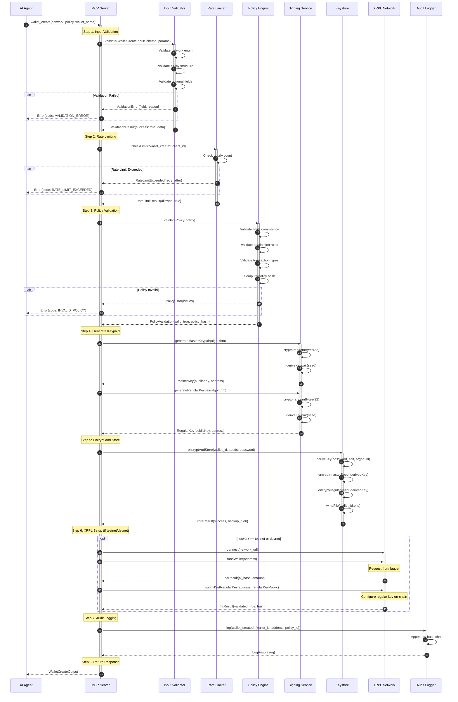

# wallet_create

**MCP Tool**: `wallet_create`
**Version**: 1.0.0
**Category**: Wallet Management
**Tier Required**: N/A (Administrative)
**Date**: 2026-01-28

---

## Table of Contents

1. [Overview](#1-overview)
2. [Input Schema](#2-input-schema)
3. [Output Schema](#3-output-schema)
4. [Security Requirements](#4-security-requirements)
5. [Flow Diagram](#5-flow-diagram)
6. [Error Codes](#6-error-codes)
7. [Usage Examples](#7-usage-examples)
8. [Policy Initialization](#8-policy-initialization)
9. [XRPL Account Creation Process](#9-xrpl-account-creation-process)
10. [Audit Events](#10-audit-events)
11. [Related Tools](#11-related-tools)

---

## 1. Overview

### 1.1 Description

The `wallet_create` tool creates a new XRPL wallet with policy-based security controls. This is the foundational tool that establishes an agent's ability to interact with the XRP Ledger in a secure, controlled manner.

### 1.2 Purpose

- Generate cryptographically secure keypairs for XRPL account operations
- Establish policy constraints that govern all future wallet operations
- Configure the wallet for agent use with a regular key (recommended security model)
- Initialize audit logging and rate limiting for the new wallet

### 1.3 Key Characteristics

| Characteristic | Value |
|----------------|-------|
| **Operation Type** | Write (creates wallet and optionally on-chain account) |
| **Idempotent** | No - each call creates a new wallet |
| **Requires Authentication** | Yes (MCP client authentication) |
| **Network Interaction** | Optional (testnet funding, regular key setup) |
| **Reversible** | No - wallet creation is permanent |

### 1.4 Prerequisites

- MCP server running and accessible
- Valid policy configuration prepared
- For testnet/devnet: Network connectivity to XRPL nodes
- For mainnet: Funding source address (manual funding required)

---

## 2. Input Schema

### 2.1 Schema Definition

```typescript
interface WalletCreateInput {
  network: "mainnet" | "testnet" | "devnet";
  policy: AgentWalletPolicy;
  wallet_name?: string;
  funding_source?: string;     // XRPL r-address
  initial_funding_drops?: string;  // Amount in drops (string for precision)
}
```

### 2.2 Field Descriptions

#### `network` (required)

| Property | Value |
|----------|-------|
| **Type** | `enum` |
| **Values** | `"mainnet"`, `"testnet"`, `"devnet"` |
| **Description** | Target XRPL network for the wallet. Keys are isolated per network. |

**Network Details**:

| Network | Use Case | Funding | Stability |
|---------|----------|---------|-----------|
| `mainnet` | Production | Manual funding required | Stable |
| `testnet` | Integration testing | Faucet available | Stable |
| `devnet` | Development, latest features | Faucet available | May reset |

#### `policy` (required)

| Property | Value |
|----------|-------|
| **Type** | `AgentWalletPolicy` object |
| **Description** | Complete policy configuration defining security constraints |

See [Policy Initialization](#8-policy-initialization) for full policy schema details.

#### `wallet_name` (optional)

| Property | Value |
|----------|-------|
| **Type** | `string` |
| **Min Length** | 1 |
| **Max Length** | 64 |
| **Description** | Human-readable wallet name for identification |
| **Example** | `"trading-agent-alpha"` |

#### `funding_source` (optional)

| Property | Value |
|----------|-------|
| **Type** | `string` (XRPL address) |
| **Pattern** | `^r[1-9A-HJ-NP-Za-km-z]{24,34}$` |
| **Description** | Address to fund the new wallet from (requires separate signing) |
| **Example** | `"rHb9CJAWyB4rj91VRWn96DkukG4bwdtyTh"` |

**Note**: This is informational only. The actual funding transaction must be signed separately by the funding source's owner.

#### `initial_funding_drops` (optional)

| Property | Value |
|----------|-------|
| **Type** | `string` (drops amount) |
| **Pattern** | `^[1-9]\d*$` |
| **Min Value** | `"10000000"` (10 XRP - minimum reserve) |
| **Max Value** | `"100000000000000000"` (100 billion XRP) |
| **Description** | Suggested initial funding amount in drops |
| **Example** | `"50000000"` (50 XRP) |

### 2.3 JSON Schema

```json
{
  "$schema": "https://json-schema.org/draft/2020-12/schema",
  "type": "object",
  "required": ["network", "policy"],
  "properties": {
    "network": {
      "type": "string",
      "enum": ["mainnet", "testnet", "devnet"],
      "description": "XRPL network environment"
    },
    "policy": {
      "$ref": "#/$defs/AgentWalletPolicy"
    },
    "wallet_name": {
      "type": "string",
      "minLength": 1,
      "maxLength": 64,
      "description": "Human-readable wallet name"
    },
    "funding_source": {
      "type": "string",
      "pattern": "^r[1-9A-HJ-NP-Za-km-z]{24,34}$",
      "description": "XRPL address to fund from"
    },
    "initial_funding_drops": {
      "type": "string",
      "pattern": "^[1-9]\\d*$",
      "description": "Initial funding amount in drops"
    }
  },
  "additionalProperties": false
}
```

### 2.4 Validation Rules

| Rule | Description | Error Code |
|------|-------------|------------|
| Network must be valid enum | Only mainnet/testnet/devnet accepted | `VALIDATION_ERROR` |
| Policy must be complete | All required policy fields present | `INVALID_POLICY` |
| Policy limits must be positive | All limit values > 0 | `INVALID_POLICY` |
| Funding amount meets reserve | >= 10,000,000 drops if specified | `VALIDATION_ERROR` |
| Funding address valid checksum | XRPL address checksum verification | `INVALID_ADDRESS` |
| Wallet name no special chars | Alphanumeric, hyphens, underscores only | `VALIDATION_ERROR` |

---

## 3. Output Schema

### 3.1 Success Response

```typescript
interface WalletCreateOutput {
  address: string;              // New wallet's XRPL address
  regular_key_public: string;   // Agent's signing key (public only)
  master_key_backup: string;    // Encrypted master key backup
  policy_id: string;            // Policy identifier
  wallet_id: string;            // Internal wallet identifier
  network: "mainnet" | "testnet" | "devnet";
  created_at: string;           // ISO 8601 timestamp
}
```

### 3.2 Field Descriptions

#### `address`

| Property | Value |
|----------|-------|
| **Type** | `string` (XRPL address) |
| **Format** | `r[Base58]{24,34}` |
| **Description** | The new wallet's XRPL Classic Address |
| **Example** | `"rN7n3473SaZBCG4dFL83w7a1RXtXtbK2D9"` |

#### `regular_key_public`

| Property | Value |
|----------|-------|
| **Type** | `string` (public key) |
| **Format** | Ed25519 (`ED...`) or secp256k1 (`02...`/`03...`) |
| **Length** | 66 characters |
| **Description** | Agent's signing key - only the public component |
| **Example** | `"ED7E123456789ABCDEF..."` |

**Security Note**: The private key is never exposed. It is stored encrypted in the keystore.

#### `master_key_backup`

| Property | Value |
|----------|-------|
| **Type** | `string` (encrypted blob) |
| **Format** | Base64-encoded AES-256-GCM ciphertext |
| **Description** | Encrypted backup of the master key for disaster recovery |

**CRITICAL**: Store this backup securely. It is required for disaster recovery scenarios where the regular key is compromised.

#### `policy_id`

| Property | Value |
|----------|-------|
| **Type** | `string` |
| **Pattern** | `^[a-z0-9-]+$` |
| **Description** | Unique identifier for the applied policy |
| **Example** | `"conservative-v1"` |

#### `wallet_id`

| Property | Value |
|----------|-------|
| **Type** | `string` |
| **Pattern** | `^[a-zA-Z0-9][a-zA-Z0-9_-]*$` |
| **Description** | Internal identifier for referencing this wallet |
| **Example** | `"wallet-1706438400-abc123"` |

#### `network`

| Property | Value |
|----------|-------|
| **Type** | `enum` |
| **Description** | Confirms the network the wallet was created on |

#### `created_at`

| Property | Value |
|----------|-------|
| **Type** | `string` (ISO 8601 timestamp) |
| **Format** | `YYYY-MM-DDTHH:mm:ss.sssZ` |
| **Description** | Wallet creation timestamp |
| **Example** | `"2026-01-28T14:30:00.000Z"` |

### 3.3 Error Response

```typescript
interface ErrorResponse {
  code: ErrorCode;
  message: string;
  details?: Record<string, unknown>;
  request_id?: string;
  timestamp: string;
}
```

---

## 4. Security Requirements

### 4.1 Authentication

| Requirement | Implementation |
|-------------|----------------|
| MCP client must be authenticated | Valid MCP session token |
| Rate limiting applied | Max 10 wallet creations per hour per client |
| IP-based restrictions | Optional: Allowlisted IPs only |

### 4.2 Cryptographic Requirements

| Component | Specification |
|-----------|---------------|
| **Key Algorithm** | Ed25519 (default) or secp256k1 |
| **Entropy Source** | Node.js crypto.randomBytes (CSPRNG) |
| **Seed Length** | 32 bytes (256 bits) |
| **Key Derivation** | Argon2id for encryption key |
| **Encryption** | AES-256-GCM for stored keys |

### 4.3 Key Storage Security

```
Encryption Parameters:
- Algorithm: AES-256-GCM
- Key Derivation: Argon2id
  - Memory: 64 MiB
  - Iterations: 3
  - Parallelism: 4
  - Salt: 32 bytes (unique per wallet)
- IV: 12 bytes (unique per encryption)
- Auth Tag: 16 bytes
```

### 4.4 Memory Security

| Requirement | Implementation |
|-------------|----------------|
| Sensitive data in SecureBuffer | Keys stored in non-swappable memory |
| Memory zeroing | Keys zeroed immediately after use |
| No logging of secrets | Private keys never logged |

### 4.5 Policy Immutability

- Policy is stored separately from keys
- Policy cannot be modified by agent operations
- Policy changes require `policy_set` with human approval
- Original policy hash stored for integrity verification

### 4.6 Rate Limiting

| Limit | Value | Window |
|-------|-------|--------|
| Wallet creation | 10 | Per hour |
| Per client ID | 10 | Per hour |
| Per IP address | 20 | Per hour |

---

## 5. Flow Diagram

### 5.1 Wallet Creation Sequence



### 5.2 Simplified Flow

```
Agent Request
     |
     v
[Input Validation] --> FAIL --> Return VALIDATION_ERROR
     |
     | PASS
     v
[Rate Limit Check] --> FAIL --> Return RATE_LIMIT_EXCEEDED
     |
     | PASS
     v
[Policy Validation] --> FAIL --> Return INVALID_POLICY
     |
     | PASS
     v
[Generate Master Keypair]
     |
     v
[Generate Regular Keypair]
     |
     v
[Encrypt & Store Keys]
     |
     v
[XRPL Setup] --> FAIL --> Return wallet (unfunded)
     |
     | SUCCESS
     v
[Audit Log Entry]
     |
     v
Return WalletCreateOutput
```

---

## 6. Error Codes

### 6.1 Error Code Reference

| Code | HTTP Equiv | Description | Retry | User Action |
|------|-----------|-------------|-------|-------------|
| `VALIDATION_ERROR` | 400 | Input validation failed | No | Fix input parameters |
| `INVALID_POLICY` | 400 | Policy structure invalid | No | Correct policy configuration |
| `INVALID_ADDRESS` | 400 | XRPL address format invalid | No | Provide valid r-address |
| `RATE_LIMIT_EXCEEDED` | 429 | Too many wallet creations | Yes | Wait for retry_after period |
| `KEYSTORE_ERROR` | 500 | Key storage operation failed | Maybe | Check disk space, retry |
| `NETWORK_ERROR` | 503 | XRPL network unreachable | Yes | Retry after delay |
| `FUNDING_FAILED` | 503 | Faucet funding failed (testnet) | Yes | Manual funding or retry |
| `ENCRYPTION_ERROR` | 500 | Cryptographic operation failed | No | Contact support |
| `INTERNAL_ERROR` | 500 | Unexpected server error | Maybe | Retry, contact support if persists |

### 6.2 Error Response Examples

#### Validation Error
```json
{
  "code": "VALIDATION_ERROR",
  "message": "Invalid input parameters",
  "details": {
    "field": "policy.limits.max_amount_per_tx_drops",
    "reason": "Must be a positive integer string",
    "received": "-1000"
  },
  "request_id": "req_abc123",
  "timestamp": "2026-01-28T14:30:00.000Z"
}
```

#### Invalid Policy
```json
{
  "code": "INVALID_POLICY",
  "message": "Policy validation failed",
  "details": {
    "issues": [
      {
        "path": "transaction_types.allowed",
        "reason": "Must contain at least one transaction type"
      },
      {
        "path": "limits.max_daily_volume_drops",
        "reason": "Must be greater than max_amount_per_tx_drops"
      }
    ]
  },
  "request_id": "req_def456",
  "timestamp": "2026-01-28T14:30:00.000Z"
}
```

#### Rate Limit Exceeded
```json
{
  "code": "RATE_LIMIT_EXCEEDED",
  "message": "Wallet creation rate limit exceeded",
  "details": {
    "limit": 10,
    "window": "1 hour",
    "retry_after_seconds": 1800
  },
  "request_id": "req_ghi789",
  "timestamp": "2026-01-28T14:30:00.000Z"
}
```

#### Network Error
```json
{
  "code": "NETWORK_ERROR",
  "message": "Unable to connect to XRPL network",
  "details": {
    "network": "testnet",
    "url": "wss://s.altnet.rippletest.net:51233",
    "error": "Connection timeout after 30000ms"
  },
  "request_id": "req_jkl012",
  "timestamp": "2026-01-28T14:30:00.000Z"
}
```

---

## 7. Usage Examples

### 7.1 Basic Testnet Wallet Creation

Create a simple testnet wallet for development:

```typescript
// Request
const result = await mcpClient.callTool("wallet_create", {
  network: "testnet",
  policy: {
    policy_id: "dev-testing-v1",
    policy_version: "1.0.0",
    limits: {
      max_amount_per_tx_drops: "10000000",      // 10 XRP
      max_daily_volume_drops: "100000000",       // 100 XRP
      max_tx_per_hour: 60,
      max_tx_per_day: 500
    },
    destinations: {
      mode: "open",
      allow_new_destinations: true,
      blocklist: []
    },
    transaction_types: {
      allowed: ["Payment"],
      blocked: ["AccountDelete", "SetRegularKey", "SignerListSet"]
    },
    escalation: {
      amount_threshold_drops: "5000000",         // 5 XRP triggers tier 2
      new_destination: 2,
      account_settings: 3
    }
  },
  wallet_name: "dev-test-wallet"
});

// Response
{
  "address": "rN7n3473SaZBCG4dFL83w7a1RXtXtbK2D9",
  "regular_key_public": "ED1234567890ABCDEF1234567890ABCDEF1234567890ABCDEF1234567890ABCDEF",
  "master_key_backup": "AQIDBAUGBwgJCgsMDQ4PEBESExQVFhcY...",
  "policy_id": "dev-testing-v1",
  "wallet_id": "wallet-1706438400-xyz789",
  "network": "testnet",
  "created_at": "2026-01-28T14:30:00.000Z"
}
```

### 7.2 Production Wallet with Conservative Policy

Create a mainnet wallet with strict security controls:

```typescript
// Request
const result = await mcpClient.callTool("wallet_create", {
  network: "mainnet",
  policy: {
    policy_id: "production-conservative-v1",
    policy_version: "1.0.0",
    limits: {
      max_amount_per_tx_drops: "50000000",       // 50 XRP max per tx
      max_daily_volume_drops: "500000000",       // 500 XRP daily
      max_tx_per_hour: 10,
      max_tx_per_day: 50
    },
    destinations: {
      mode: "allowlist",
      allowlist: [
        "rPT1Sjq2YGrBMTttX4GZHjKu9dyfzbpAYe",  // Treasury
        "r9cZA1mLK5R5Am25ArfXFmqgNwjZgnfk59"   // Operations
      ],
      blocklist: [],
      allow_new_destinations: false
    },
    transaction_types: {
      allowed: ["Payment", "EscrowFinish"],
      require_approval: ["EscrowCreate", "TrustSet"],
      blocked: ["AccountDelete", "SetRegularKey", "SignerListSet", "AccountSet"]
    },
    time_controls: {
      active_hours_utc: {
        start: 9,
        end: 17
      },
      active_days: [1, 2, 3, 4, 5],  // Monday-Friday
      timezone: "America/New_York"
    },
    escalation: {
      amount_threshold_drops: "10000000",        // 10 XRP triggers tier 2
      new_destination: 3,                         // New destinations always tier 3
      account_settings: 3,
      delay_seconds: 3600                         // 1 hour delay for tier 2
    },
    notifications: {
      webhook_url: "https://api.company.com/webhooks/wallet-events",
      notify_on: ["tier2", "tier3", "rejection"]
    }
  },
  wallet_name: "production-trading-bot",
  funding_source: "rHb9CJAWyB4rj91VRWn96DkukG4bwdtyTh",
  initial_funding_drops: "100000000"             // 100 XRP suggested
});

// Response
{
  "address": "rKLpjpCoXgLQQYQyj13zgay73rsgmzNH13",
  "regular_key_public": "ED9876543210FEDCBA9876543210FEDCBA9876543210FEDCBA9876543210FEDCBA",
  "master_key_backup": "YWJjZGVmZ2hpamtsbW5vcHFyc3R1dnd4...",
  "policy_id": "production-conservative-v1",
  "wallet_id": "wallet-1706438400-prod001",
  "network": "mainnet",
  "created_at": "2026-01-28T14:30:00.000Z"
}
```

### 7.3 Escrow-Focused Agent Wallet

Create a wallet specifically for managing escrows:

```typescript
// Request
const result = await mcpClient.callTool("wallet_create", {
  network: "mainnet",
  policy: {
    policy_id: "escrow-manager-v1",
    policy_version: "1.0.0",
    limits: {
      max_amount_per_tx_drops: "1000000000",     // 1000 XRP (escrow amounts can be larger)
      max_daily_volume_drops: "10000000000",     // 10,000 XRP
      max_tx_per_hour: 20,
      max_tx_per_day: 100
    },
    destinations: {
      mode: "allowlist",
      allowlist: [
        "rEscrowRecipient1...",
        "rEscrowRecipient2...",
        "rRefundAddress..."
      ],
      blocklist: [],
      allow_new_destinations: true,
      new_destination_tier: 3                     // New destinations require co-sign
    },
    transaction_types: {
      allowed: ["EscrowCreate", "EscrowFinish", "EscrowCancel", "Payment"],
      require_approval: [],
      blocked: ["AccountDelete", "SetRegularKey", "SignerListSet", "OfferCreate"]
    },
    escalation: {
      amount_threshold_drops: "100000000",       // 100 XRP triggers tier 2
      new_destination: 3,
      account_settings: 3,
      delay_seconds: 1800                         // 30 min delay for tier 2
    }
  },
  wallet_name: "escrow-management-agent"
});

// Response
{
  "address": "rEscrowAgent123456789...",
  "regular_key_public": "EDABC123...",
  "master_key_backup": "encrypted-backup-blob...",
  "policy_id": "escrow-manager-v1",
  "wallet_id": "wallet-1706438400-escrow",
  "network": "mainnet",
  "created_at": "2026-01-28T14:30:00.000Z"
}
```

### 7.4 Error Handling Example

```typescript
try {
  const result = await mcpClient.callTool("wallet_create", {
    network: "mainnet",
    policy: invalidPolicy  // Missing required fields
  });
  console.log("Wallet created:", result.address);
} catch (error) {
  if (error.code === "INVALID_POLICY") {
    console.error("Policy validation failed:");
    error.details.issues.forEach(issue => {
      console.error(`  - ${issue.path}: ${issue.reason}`);
    });
  } else if (error.code === "RATE_LIMIT_EXCEEDED") {
    console.log(`Rate limited. Retry after ${error.details.retry_after_seconds} seconds`);
    // Schedule retry
  } else {
    console.error("Unexpected error:", error.message);
  }
}
```

---

## 8. Policy Initialization

### 8.1 Complete Policy Schema

```typescript
interface AgentWalletPolicy {
  // Required: Unique policy identifier
  policy_id: string;              // e.g., "conservative-v1"

  // Required: Policy version (semver)
  policy_version: string;         // e.g., "1.0.0"

  // Required: Transaction and volume limits
  limits: {
    max_amount_per_tx_drops: string;   // Max per single transaction
    max_daily_volume_drops: string;    // Max daily total
    max_tx_per_hour: number;           // Transaction count limit
    max_tx_per_day: number;            // Daily transaction count
  };

  // Required: Destination address controls
  destinations: {
    mode: "allowlist" | "blocklist" | "open";
    allowlist?: string[];              // Allowed addresses
    blocklist?: string[];              // Blocked addresses
    allow_new_destinations: boolean;
    new_destination_tier?: 2 | 3;      // Tier for new addresses
  };

  // Required: Transaction type restrictions
  transaction_types: {
    allowed: TransactionType[];        // Autonomously allowed
    require_approval?: TransactionType[];  // Require human approval
    blocked?: TransactionType[];       // Never allowed
  };

  // Optional: Time-based restrictions
  time_controls?: {
    active_hours_utc?: {
      start: number;                   // 0-23
      end: number;                     // 0-23
    };
    active_days?: number[];            // 0=Sunday, 6=Saturday
    timezone?: string;                 // IANA timezone
  };

  // Required: Escalation thresholds
  escalation: {
    amount_threshold_drops: string;    // Amount triggering tier 2
    new_destination: 2 | 3;            // Tier for new destinations
    account_settings: 3;               // Always tier 3
    delay_seconds?: number;            // Tier 2 auto-approval delay
  };

  // Optional: Notification settings
  notifications?: {
    webhook_url?: string;              // HTTPS webhook endpoint
    notify_on?: ("tier2" | "tier3" | "rejection" | "all")[];
  };
}
```

### 8.2 Policy Validation Rules

| Rule | Description |
|------|-------------|
| `policy_id` format | Lowercase alphanumeric with hyphens only |
| `policy_version` format | Semantic versioning (X.Y or X.Y.Z) |
| `max_daily_volume_drops` > `max_amount_per_tx_drops` | Daily limit must exceed single transaction limit |
| `max_tx_per_day` >= `max_tx_per_hour` | Daily count must be >= hourly count |
| `allowed` transaction types non-empty | At least one transaction type must be allowed |
| No overlap between `allowed` and `blocked` | Transaction type cannot be in both lists |
| `blocklist` always enforced | Blocklist applies regardless of mode |
| `active_hours_utc.start` != `active_hours_utc.end` | Active hours must define a range |
| `delay_seconds` between 60-86400 | Tier 2 delay must be 1 minute to 24 hours |
| `webhook_url` must be HTTPS | Exception: `http://localhost` for development |

### 8.3 Recommended Policies by Use Case

#### Conservative (Low Risk)
```typescript
{
  limits: {
    max_amount_per_tx_drops: "10000000",     // 10 XRP
    max_daily_volume_drops: "100000000",      // 100 XRP
    max_tx_per_hour: 10,
    max_tx_per_day: 50
  },
  destinations: { mode: "allowlist", allow_new_destinations: false },
  escalation: { amount_threshold_drops: "5000000" }  // 5 XRP triggers tier 2
}
```

#### Moderate (Balanced)
```typescript
{
  limits: {
    max_amount_per_tx_drops: "100000000",    // 100 XRP
    max_daily_volume_drops: "1000000000",    // 1,000 XRP
    max_tx_per_hour: 30,
    max_tx_per_day: 200
  },
  destinations: { mode: "blocklist", allow_new_destinations: true, new_destination_tier: 2 },
  escalation: { amount_threshold_drops: "50000000" }  // 50 XRP triggers tier 2
}
```

#### High Volume (Trading)
```typescript
{
  limits: {
    max_amount_per_tx_drops: "1000000000",   // 1,000 XRP
    max_daily_volume_drops: "50000000000",   // 50,000 XRP
    max_tx_per_hour: 100,
    max_tx_per_day: 1000
  },
  destinations: { mode: "open", allow_new_destinations: true, new_destination_tier: 3 },
  escalation: { amount_threshold_drops: "500000000" }  // 500 XRP triggers tier 2
}
```

---

## 9. XRPL Account Creation Process

### 9.1 Account Lifecycle

```
[Key Generation]
     |
     v
[Address Derivation] --> Address exists only as potential
     |
     v
[Funding Transaction] --> Account created on ledger
     |
     v
[SetRegularKey TX] --> Agent key configured
     |
     v
[Ready for Operations]
```

### 9.2 Key Generation Process

1. **Master Key Generation**
   - Generate 32 bytes of cryptographically secure random data
   - Derive Ed25519 keypair from seed
   - Derive XRPL Classic Address from public key
   - Encrypt and store seed

2. **Regular Key Generation**
   - Generate separate 32 bytes of random data
   - Derive Ed25519 keypair for agent signing
   - This key is used for day-to-day operations
   - Master key remains secured for recovery

### 9.3 Testnet/Devnet Funding

For test networks, the wallet is automatically funded via the XRPL faucet:

```typescript
// Faucet request (internal)
POST https://faucet.altnet.rippletest.net/accounts
Content-Type: application/json

{
  "destination": "rN7n3473SaZBCG4dFL83w7a1RXtXtbK2D9"
}

// Faucet response
{
  "account": {
    "address": "rN7n3473SaZBCG4dFL83w7a1RXtXtbK2D9",
    "secret": "sn3nxiW7v8KXzPzAqzyHXbSSKNuN9"  // Not used - we have our own keys
  },
  "amount": 1000,
  "balance": 1000
}
```

**Note**: The faucet provides 1,000 XRP (testnet) or 10,000 XRP (devnet).

### 9.4 SetRegularKey Transaction

After funding, the regular key is configured on-chain:

```typescript
// SetRegularKey transaction
{
  "TransactionType": "SetRegularKey",
  "Account": "rN7n3473SaZBCG4dFL83w7a1RXtXtbK2D9",
  "RegularKey": "rPVMhWBsfF9iMXYj3aAzJVkPDTFNSyWdKy",  // Address of regular key
  "Fee": "12",
  "Sequence": 1,
  "SigningPubKey": "ED...",  // Master key signs this
  "TxnSignature": "..."
}
```

### 9.5 Mainnet Funding

For mainnet, manual funding is required:

1. `wallet_create` returns the new address
2. User manually sends XRP from their existing wallet
3. Minimum 10 XRP required for account reserve
4. Use `wallet_fund` tool with mainnet-funded source (requires external signing)

---

## 10. Audit Events

### 10.1 Events Generated

The `wallet_create` operation generates the following audit events:

| Event | Severity | Trigger | Data Captured |
|-------|----------|---------|---------------|
| `wallet_creation_started` | INFO | Request received | wallet_id, network, policy_hash, client_id |
| `keypair_generated` | INFO | Keys created | wallet_id, algorithm, public_key (no private data) |
| `keystore_write_success` | INFO | Keys stored | wallet_id, file_path, encryption_algorithm |
| `account_funded` | INFO | Faucet funding complete | wallet_id, address, amount_xrp, tx_hash |
| `regular_key_set` | INFO | SetRegularKey validated | wallet_id, address, regular_key_public, tx_hash |
| `wallet_created` | INFO | Creation complete | wallet_id, address, policy_id, network |
| `rate_limit_triggered` | WARN | Rate limit exceeded | client_id, limit, window |
| `validation_failed` | WARN | Input validation failed | field, reason, value_type |
| `policy_validation_failed` | WARN | Policy validation failed | issues_count, first_issue |
| `keypair_generation_error` | ERROR | Key generation failed | error_type (no sensitive data) |
| `keystore_error` | ERROR | Storage operation failed | error_type, file_operation |
| `network_error` | ERROR | XRPL connection failed | network, url, error_type |

### 10.2 Audit Log Entry Format

```typescript
interface AuditLogEntry {
  seq: number;                    // Sequence number
  timestamp: string;              // ISO 8601
  event: AuditEventType;          // Event type
  wallet_id?: string;             // Wallet identifier
  wallet_address?: string;        // XRPL address
  network?: string;               // Network
  policy_id?: string;             // Policy identifier
  tx_hash?: string;               // Transaction hash
  tier?: number;                  // Approval tier
  policy_decision?: string;       // allowed/denied/pending
  context?: string;               // Additional context
  prev_hash: string;              // Previous entry hash
  hash: string;                   // This entry hash
}
```

### 10.3 Example Audit Trail

```json
[
  {
    "seq": 1001,
    "timestamp": "2026-01-28T14:30:00.000Z",
    "event": "wallet_creation_started",
    "wallet_id": "wallet-1706438400-xyz789",
    "network": "testnet",
    "prev_hash": "abc123...",
    "hash": "def456..."
  },
  {
    "seq": 1002,
    "timestamp": "2026-01-28T14:30:00.150Z",
    "event": "keypair_generated",
    "wallet_id": "wallet-1706438400-xyz789",
    "context": "algorithm=Ed25519",
    "prev_hash": "def456...",
    "hash": "ghi789..."
  },
  {
    "seq": 1003,
    "timestamp": "2026-01-28T14:30:00.300Z",
    "event": "keystore_write_success",
    "wallet_id": "wallet-1706438400-xyz789",
    "prev_hash": "ghi789...",
    "hash": "jkl012..."
  },
  {
    "seq": 1004,
    "timestamp": "2026-01-28T14:30:02.500Z",
    "event": "account_funded",
    "wallet_id": "wallet-1706438400-xyz789",
    "wallet_address": "rN7n3473SaZBCG4dFL83w7a1RXtXtbK2D9",
    "tx_hash": "ABC123...",
    "prev_hash": "jkl012...",
    "hash": "mno345..."
  },
  {
    "seq": 1005,
    "timestamp": "2026-01-28T14:30:05.000Z",
    "event": "regular_key_set",
    "wallet_id": "wallet-1706438400-xyz789",
    "wallet_address": "rN7n3473SaZBCG4dFL83w7a1RXtXtbK2D9",
    "tx_hash": "DEF456...",
    "prev_hash": "mno345...",
    "hash": "pqr678..."
  },
  {
    "seq": 1006,
    "timestamp": "2026-01-28T14:30:05.100Z",
    "event": "wallet_created",
    "wallet_id": "wallet-1706438400-xyz789",
    "wallet_address": "rN7n3473SaZBCG4dFL83w7a1RXtXtbK2D9",
    "policy_id": "dev-testing-v1",
    "network": "testnet",
    "prev_hash": "pqr678...",
    "hash": "stu901..."
  }
]
```

---

## 11. Related Tools

| Tool | Purpose | Relationship |
|------|---------|--------------|
| `wallet_balance` | Query wallet balance and status | Use after creation to verify funding |
| `wallet_sign` | Sign transactions | Primary operation after wallet creation |
| `wallet_policy_check` | Dry-run policy evaluation | Test transactions before signing |
| `wallet_rotate` | Rotate regular key | Key rotation after creation |
| `wallet_fund` | Fund from testnet faucet | Alternative funding method |
| `wallet_list` | List all managed wallets | View created wallets |
| `policy_set` | Update wallet policy | Modify policy after creation |

---

## Document History

| Version | Date | Author | Changes |
|---------|------|--------|---------|
| 1.0.0 | 2026-01-28 | JavaScript Developer Agent | Initial specification |

---

*XRPL Agent Wallet MCP - Tool Specification*
