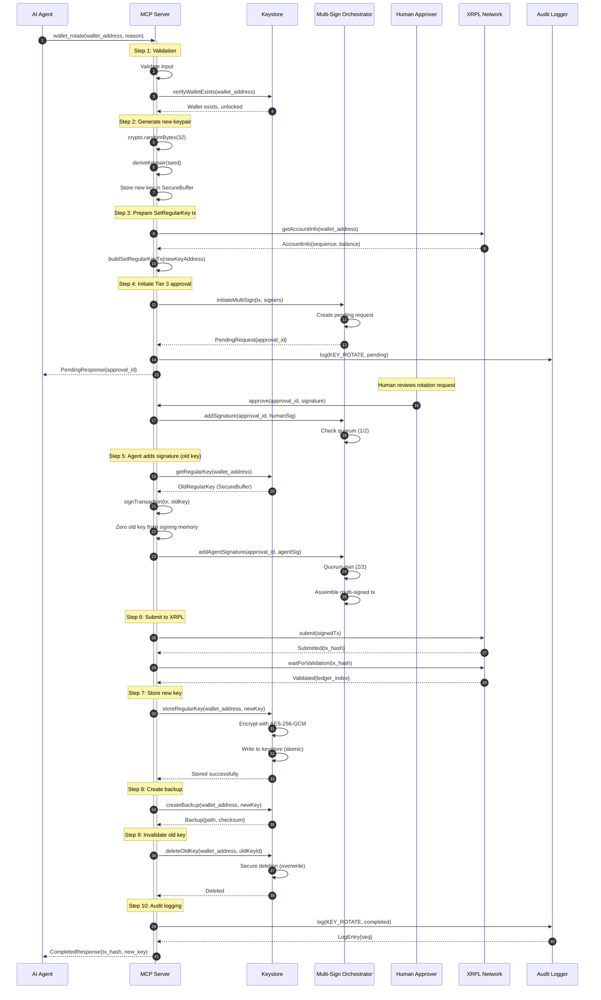

# wallet_rotate

**MCP Tool**: `wallet_rotate`
**Version**: 1.0.0
**Category**: Key Management
**Tier Required**: 3 (Co-Sign/Human Approval)
**Security Classification**: DESTRUCTIVE
**Date**: 2026-01-28

---

## Table of Contents

1. [Overview](#1-overview)
2. [Input Schema](#2-input-schema)
3. [Output Schema](#3-output-schema)
4. [Security Requirements](#4-security-requirements)
5. [XRPL SetRegularKey Transaction Flow](#5-xrpl-setregularkey-transaction-flow)
6. [Old Key Invalidation Process](#6-old-key-invalidation-process)
7. [New Key Storage in Keystore](#7-new-key-storage-in-keystore)
8. [Backup Procedures](#8-backup-procedures)
9. [Audit Trail Requirements](#9-audit-trail-requirements)
10. [Recovery Procedures](#10-recovery-procedures)
11. [Flow Diagrams](#11-flow-diagrams)
12. [Error Codes](#12-error-codes)
13. [Usage Examples](#13-usage-examples)
14. [Related Tools](#14-related-tools)

---

## 1. Overview

### 1.1 Description

The `wallet_rotate` tool performs **security-critical key rotation** for XRPL agent wallets. It generates a new regular key, configures it on-chain via the SetRegularKey transaction, securely stores the new key, and invalidates the old key. This operation is **DESTRUCTIVE** and requires human approval (Tier 3).

### 1.2 Purpose

Key rotation is essential for:

- **Periodic Security Hygiene**: Rotate keys on a regular schedule to limit exposure window
- **Incident Response**: Immediately invalidate potentially compromised keys
- **Personnel Changes**: Rotate keys when team members with key access depart
- **Compliance Requirements**: Meet regulatory requirements for key lifecycle management
- **Key Compromise Mitigation**: Replace suspected compromised keys before exploitation

### 1.3 Key Characteristics

| Characteristic | Value |
|----------------|-------|
| **Operation Type** | DESTRUCTIVE (replaces key material) |
| **Idempotent** | No - each call generates new key and submits on-chain transaction |
| **Requires Human Approval** | Yes (Tier 3 - Co-Sign required) |
| **Network Interaction** | Yes (SetRegularKey transaction submission) |
| **Reversible** | No - old key is permanently invalidated on-chain |
| **Sensitivity Level** | DESTRUCTIVE (highest) |

### 1.4 Prerequisites

- MCP server running and accessible
- Valid wallet exists in keystore
- Wallet is unlocked (authenticated session)
- Human approver available for Tier 3 co-sign
- Network connectivity to XRPL nodes
- Sufficient XRP balance for transaction fee (minimum 12 drops)

### 1.5 Security Classification

This tool is classified as **DESTRUCTIVE** per AUTHZ-001 because:

1. **Permanent Key Invalidation**: Old key can never sign again for this account
2. **Access Revocation Risk**: Incorrect rotation locks out the agent
3. **Financial Control Transfer**: New key gains all signing authority
4. **No Undo**: SetRegularKey is permanent until another rotation

---

## 2. Input Schema

### 2.1 Schema Definition

```typescript
import { z } from 'zod';

export const WalletRotateInputSchema = z.object({
  /**
   * Address of the wallet to rotate the key for.
   * Must be a managed wallet in the keystore.
   */
  wallet_address: z
    .string()
    .min(25, 'XRPL address must be at least 25 characters')
    .max(35, 'XRPL address must be at most 35 characters')
    .regex(
      /^r[1-9A-HJ-NP-Za-km-z]{24,34}$/,
      'Invalid XRPL address format'
    )
    .describe('XRPL address of the wallet to rotate'),

  /**
   * Reason for rotation (required for audit trail).
   * This field is logged and required for compliance.
   */
  reason: z
    .enum([
      'scheduled',           // Regular periodic rotation
      'personnel_change',    // Team member departure
      'suspected_compromise',// Key may be compromised
      'security_upgrade',    // Moving to stronger key type
      'incident_response',   // Active security incident
      'compliance',          // Regulatory requirement
      'other'               // Other reason (requires description)
    ])
    .describe('Reason for key rotation'),

  /**
   * Detailed description for audit trail.
   * Required when reason is 'other' or 'incident_response'.
   */
  reason_description: z
    .string()
    .max(500, 'Description must be 500 characters or less')
    .optional()
    .describe('Detailed description of rotation reason'),

  /**
   * Whether to create encrypted backup of new key.
   * Strongly recommended to be true.
   */
  create_backup: z
    .boolean()
    .default(true)
    .describe('Create encrypted backup of new key'),

  /**
   * Optional: Force rotation even if recent rotation occurred.
   * Requires explicit confirmation for safety.
   */
  force: z
    .boolean()
    .default(false)
    .describe('Force rotation bypassing cooldown period'),

}).refine(
  (data) => {
    // Require description for 'other' or 'incident_response'
    if ((data.reason === 'other' || data.reason === 'incident_response') &&
        !data.reason_description) {
      return false;
    }
    return true;
  },
  {
    message: 'reason_description is required when reason is "other" or "incident_response"',
    path: ['reason_description']
  }
).describe('Rotate the regular key for an XRPL wallet');
```

### 2.2 Field Descriptions

#### `wallet_address` (required)

| Property | Value |
|----------|-------|
| **Type** | `string` (XRPL address) |
| **Pattern** | `^r[1-9A-HJ-NP-Za-km-z]{24,34}$` |
| **Description** | The XRPL account address whose regular key will be rotated |
| **Example** | `"rN7n3473SaZBCG4dFL83w7a1RXtXtbK2D9"` |

#### `reason` (required)

| Property | Value |
|----------|-------|
| **Type** | `enum` |
| **Values** | See table below |
| **Description** | Categorized reason for rotation (audit/compliance) |

**Reason Values:**

| Value | Description | Urgency |
|-------|-------------|---------|
| `scheduled` | Regular periodic rotation per policy | Low |
| `personnel_change` | Team member with key access departed | Medium |
| `suspected_compromise` | Key material may have been exposed | High |
| `security_upgrade` | Upgrading key algorithm or strength | Low |
| `incident_response` | Active security incident in progress | Critical |
| `compliance` | Regulatory or audit requirement | Medium |
| `other` | Other reason (requires description) | Varies |

#### `reason_description` (conditional)

| Property | Value |
|----------|-------|
| **Type** | `string` |
| **Max Length** | 500 characters |
| **Required When** | `reason` is `"other"` or `"incident_response"` |
| **Description** | Detailed explanation for audit trail |

#### `create_backup` (optional)

| Property | Value |
|----------|-------|
| **Type** | `boolean` |
| **Default** | `true` |
| **Description** | Whether to create encrypted backup of the new key |

**RECOMMENDATION**: Always keep this `true`. Backups are essential for disaster recovery.

#### `force` (optional)

| Property | Value |
|----------|-------|
| **Type** | `boolean` |
| **Default** | `false` |
| **Description** | Bypass the 24-hour cooldown between rotations |

**WARNING**: Use `force: true` only in emergency situations. Frequent rotations increase risk of operational issues.

### 2.3 JSON Schema

```json
{
  "$schema": "https://json-schema.org/draft/2020-12/schema",
  "type": "object",
  "required": ["wallet_address", "reason"],
  "properties": {
    "wallet_address": {
      "type": "string",
      "pattern": "^r[1-9A-HJ-NP-Za-km-z]{24,34}$",
      "description": "XRPL address to rotate"
    },
    "reason": {
      "type": "string",
      "enum": [
        "scheduled",
        "personnel_change",
        "suspected_compromise",
        "security_upgrade",
        "incident_response",
        "compliance",
        "other"
      ],
      "description": "Reason for rotation"
    },
    "reason_description": {
      "type": "string",
      "maxLength": 500,
      "description": "Detailed rotation reason"
    },
    "create_backup": {
      "type": "boolean",
      "default": true,
      "description": "Create encrypted backup"
    },
    "force": {
      "type": "boolean",
      "default": false,
      "description": "Force rotation bypassing cooldown"
    }
  },
  "additionalProperties": false
}
```

### 2.4 Validation Rules

| Rule | Description | Error Code |
|------|-------------|------------|
| Address format valid | Must match XRPL address pattern | `INVALID_ADDRESS` |
| Address checksum valid | Base58Check verification passes | `INVALID_ADDRESS` |
| Wallet exists | Must be managed by this server | `WALLET_NOT_FOUND` |
| Wallet unlocked | Valid authenticated session | `WALLET_LOCKED` |
| Reason valid | Must be allowed enum value | `VALIDATION_ERROR` |
| Description when required | Required for `other`/`incident_response` | `VALIDATION_ERROR` |
| Cooldown respected | 24 hours since last rotation (unless `force`) | `ROTATION_COOLDOWN` |
| Sufficient balance | Account has >= 12 drops for fee | `INSUFFICIENT_BALANCE` |

---

## 3. Output Schema

### 3.1 Discriminated Union

The output is a discriminated union based on the operation status:

```typescript
export const WalletRotateOutputSchema = z.discriminatedUnion('status', [
  WalletRotatePendingOutputSchema,    // status: 'pending_approval'
  WalletRotateCompletedOutputSchema,  // status: 'completed'
  WalletRotateRejectedOutputSchema,   // status: 'rejected'
]);
```

### 3.2 Pending Approval Output (Initial Response)

Key rotation always requires Tier 3 approval. The initial response will be pending:

```typescript
export const WalletRotatePendingOutputSchema = z.object({
  /**
   * Discriminator field
   */
  status: z.literal('pending_approval'),

  /**
   * Unique approval request ID for tracking
   */
  approval_id: z
    .string()
    .uuid()
    .describe('Unique approval request identifier'),

  /**
   * Why approval is required
   */
  reason: z.literal('key_rotation_requires_cosign'),

  /**
   * Policy tier (always 3 for key rotation)
   */
  policy_tier: z.literal(3),

  /**
   * Required signers for multi-sign completion
   */
  required_signers: z.array(z.object({
    address: z.string().regex(/^r[1-9A-HJ-NP-Za-km-z]{24,34}$/),
    role: z.enum(['human_approver', 'agent']),
    signed: z.boolean(),
  })),

  /**
   * Current quorum status
   */
  quorum: z.object({
    collected: z.number().int().min(0),
    required: z.number().int().min(1),
  }),

  /**
   * When this approval request expires
   */
  expires_at: z.string().datetime(),

  /**
   * URL for human approval interface (if configured)
   */
  approval_url: z.string().url().optional(),

  /**
   * Key rotation never auto-approves
   */
  auto_approve_in_seconds: z.null(),

  /**
   * Preview of new key (public component only)
   */
  new_key_preview: z.object({
    public_key: z.string(),
    address: z.string(),
    algorithm: z.enum(['ed25519', 'secp256k1']),
  }),

  /**
   * Request timestamp
   */
  requested_at: z.string().datetime(),
});
```

### 3.3 Completed Output (After Approval)

Returned after human approves and transaction confirms:

```typescript
export const WalletRotateCompletedOutputSchema = z.object({
  /**
   * Discriminator field
   */
  status: z.literal('completed'),

  /**
   * XRPL transaction hash for SetRegularKey
   */
  tx_hash: z
    .string()
    .length(64)
    .regex(/^[A-Fa-f0-9]{64}$/)
    .transform(val => val.toUpperCase())
    .describe('SetRegularKey transaction hash'),

  /**
   * Ledger index where transaction was validated
   */
  ledger_index: z.number().int().positive(),

  /**
   * New regular key details
   */
  new_key: z.object({
    /**
     * Public key (hex encoded)
     */
    public_key: z.string(),

    /**
     * Derived XRPL address of the new key
     */
    address: z.string().regex(/^r[1-9A-HJ-NP-Za-km-z]{24,34}$/),

    /**
     * Key algorithm
     */
    algorithm: z.enum(['ed25519', 'secp256k1']),
  }),

  /**
   * Old key details (now invalidated)
   */
  old_key: z.object({
    /**
     * Public key (hex encoded)
     */
    public_key: z.string(),

    /**
     * XRPL address of old key
     */
    address: z.string().regex(/^r[1-9A-HJ-NP-Za-km-z]{24,34}$/),

    /**
     * When old key was invalidated
     */
    invalidated_at: z.string().datetime(),
  }),

  /**
   * Backup information (if backup was created)
   */
  backup: z.object({
    /**
     * Whether backup was created
     */
    created: z.boolean(),

    /**
     * Backup file path (if created)
     */
    path: z.string().optional(),

    /**
     * Backup checksum for verification
     */
    checksum: z.string().optional(),
  }),

  /**
   * Completion timestamp
   */
  completed_at: z.string().datetime(),

  /**
   * Audit log sequence number
   */
  audit_seq: z.number().int().positive(),
});
```

### 3.4 Rejected Output

Returned when rotation is rejected or fails:

```typescript
export const WalletRotateRejectedOutputSchema = z.object({
  /**
   * Discriminator field
   */
  status: z.literal('rejected'),

  /**
   * Human-readable rejection reason
   */
  reason: z.string().max(500),

  /**
   * Rejection code for programmatic handling
   */
  rejection_code: z.enum([
    'HUMAN_REJECTED',           // Human approver rejected
    'APPROVAL_EXPIRED',         // Approval timed out
    'TRANSACTION_FAILED',       // On-chain tx failed
    'KEYSTORE_ERROR',           // Failed to store new key
    'BACKUP_FAILED',            // Backup creation failed
    'ROLLBACK_COMPLETED',       // Rotation was rolled back
    'INSUFFICIENT_BALANCE',     // Not enough XRP for fee
    'NETWORK_ERROR',            // XRPL network unreachable
  ]),

  /**
   * Policy tier (always 3 for rejected rotation)
   */
  policy_tier: z.literal(3),

  /**
   * Rejection timestamp
   */
  rejected_at: z.string().datetime(),

  /**
   * ID of approver who rejected (if applicable)
   */
  rejected_by: z.string().optional(),

  /**
   * Recovery instructions
   */
  recovery_steps: z.array(z.string()).optional(),
});
```

---

## 4. Security Requirements

### 4.1 Authentication & Authorization

| Requirement | Implementation |
|-------------|----------------|
| Session authentication | Valid MCP session token required |
| Wallet unlocked | Password-derived key in memory |
| Tier 3 approval | Human co-signature mandatory |
| Per-operation check | Authorization verified independently |

### 4.2 Cryptographic Requirements

| Component | Specification |
|-----------|---------------|
| **New Key Algorithm** | Ed25519 (default) or secp256k1 |
| **Entropy Source** | Node.js crypto.randomBytes (CSPRNG) |
| **Seed Length** | 32 bytes (256 bits) |
| **Key Derivation** | Argon2id for encryption key |
| **Encryption** | AES-256-GCM for stored keys |

### 4.3 Key Security During Rotation

```
Security Timeline:

     OLD KEY        ROTATION WINDOW       NEW KEY
   (Active)         (Critical)           (Active)
       |                |                    |
       v                v                    v
  +---------+      +---------+         +---------+
  | Can Sign|      |BOTH KEYS|         | Can Sign|
  | Normally|      |EXIST    |         | Normally|
  +---------+      +---------+         +---------+
                        |
                   VULNERABLE:
                   - Both keys valid
                   - Old key must be
                     securely destroyed
                   - New key must be
                     verified working
```

**Critical Security Rules:**

1. **New key generated BEFORE old key invalidated** - Never leave wallet without signing capability
2. **New key verified working BEFORE old key destroyed** - Test signature with new key
3. **Old key memory zeroed AFTER on-chain confirmation** - Prevent rollback attacks
4. **Backup created BEFORE old key destruction** - Disaster recovery
5. **All operations atomic where possible** - No partial states

### 4.4 Memory Security During Rotation

```typescript
// Rotation key lifecycle
interface RotationKeyLifecycle {
  newKeySeed: SecureBuffer;      // Zeroed after encryption
  newKeyPair: SecureBuffer;      // Zeroed after signing
  oldKeySeed: SecureBuffer;      // Zeroed after confirmation
  encryptionKey: SecureBuffer;   // Zeroed after storage
}

// Maximum time keys can exist in memory
const MAX_KEY_MEMORY_LIFETIME_MS = 5000;  // 5 seconds
```

### 4.5 Rate Limiting

| Limit | Value | Window | Reason |
|-------|-------|--------|--------|
| Rotation requests | 1 | Per 24 hours | Prevent rapid key churn |
| Rotation requests (force) | 5 | Per 24 hours | Emergency limit |
| Approval attempts | 3 | Per rotation | Prevent brute force |

---

## 5. XRPL SetRegularKey Transaction Flow

### 5.1 Transaction Structure

```typescript
interface SetRegularKeyTransaction {
  TransactionType: 'SetRegularKey';
  Account: string;           // Wallet address (not the key address)
  RegularKey: string;        // NEW regular key address
  Fee: string;               // Transaction fee in drops
  Sequence: number;          // Account sequence number
  SigningPubKey: string;     // OLD key signs this (master key in recovery)
  TxnSignature: string;      // Signature from old key
}
```

### 5.2 Signing Authority

**Normal Rotation (Old Regular Key Signs):**
```
Account: rWalletAddress...
    |
    v
Old Regular Key (rOldKeyAddress...)
    |
    v
Signs SetRegularKey Transaction
    |
    v
Sets New Regular Key (rNewKeyAddress...)
```

**Emergency Rotation (Master Key Signs):**
```
Account: rWalletAddress...
    |
    v
Master Key (Cold Storage)
    |
    v
Signs SetRegularKey Transaction
    |
    v
Sets New Regular Key (rNewKeyAddress...)
```

### 5.3 Transaction Flow Sequence



### 5.4 Transaction Verification

Before considering rotation complete, verify:

1. **Transaction Validated**: `ledger_index` returned from XRPL
2. **Regular Key Updated**: `account_info` shows new RegularKey
3. **New Key Can Sign**: Test signature operation succeeds
4. **Old Key Cannot Sign**: Verify old key signing fails

---

## 6. Old Key Invalidation Process

### 6.1 Invalidation Timeline

```
Timeline:

t0: Rotation requested
    |
t1: New key generated (memory only)
    |
t2: Human approval granted
    |
t3: SetRegularKey submitted
    |
t4: SetRegularKey validated (ON-CHAIN INVALIDATION POINT)
    |  [Old key can no longer sign for this account]
    |
t5: New key stored in keystore
    |
t6: New key verified working
    |
t7: Old key securely deleted from keystore
    |
t8: Rotation complete
```

### 6.2 Secure Deletion of Old Key

```typescript
async function securelyDeleteOldKey(
  walletId: string,
  oldKeyId: string
): Promise<void> {
  // Step 1: Read old key location
  const oldKeyPath = getKeyPath(walletId, oldKeyId);

  // Step 2: Overwrite with random data (3 passes)
  for (let pass = 0; pass < 3; pass++) {
    const randomData = crypto.randomBytes(await getFileSize(oldKeyPath));
    await fs.writeFile(oldKeyPath, randomData);
    await fsync(oldKeyPath);  // Force flush to disk
  }

  // Step 3: Overwrite with zeros
  const fileSize = await getFileSize(oldKeyPath);
  await fs.writeFile(oldKeyPath, Buffer.alloc(fileSize, 0));
  await fsync(oldKeyPath);

  // Step 4: Delete file
  await fs.unlink(oldKeyPath);

  // Step 5: Remove from keystore index
  await removeKeyFromIndex(walletId, oldKeyId);
}
```

### 6.3 Memory Cleanup

```typescript
function cleanupRotationMemory(state: RotationState): void {
  // Zero all sensitive buffers
  if (state.oldKeySeed) {
    state.oldKeySeed.zero();
  }
  if (state.oldKeyPair) {
    state.oldKeyPair.zero();
  }
  if (state.newKeySeed) {
    state.newKeySeed.zero();
  }
  if (state.newKeyPair) {
    state.newKeyPair.zero();
  }
  if (state.encryptionKey) {
    state.encryptionKey.zero();
  }

  // Force garbage collection hint (not guaranteed)
  if (global.gc) {
    global.gc();
  }
}
```

### 6.4 Rollback Handling

If rotation fails after on-chain submission:

| Failure Point | Old Key Status | New Key Status | Recovery |
|---------------|----------------|----------------|----------|
| Before submit | Valid | Generated (memory) | Discard new key, abort |
| Submit failed | Valid | Generated (memory) | Discard new key, retry |
| Validated, storage failed | **INVALID** | Not stored | **CRITICAL**: Use backup |
| Validated, stored | **INVALID** | Valid | Complete, delete old |

---

## 7. New Key Storage in Keystore

### 7.1 Keystore Structure Update

```typescript
interface KeystoreEntry {
  version: 2;
  wallet_address: string;
  network: 'mainnet' | 'testnet' | 'devnet';

  // Current active key
  regular_key: {
    id: string;                    // UUID for this key version
    address: string;               // XRPL address of key
    public_key: string;            // Hex-encoded public key
    encrypted_seed: string;        // AES-256-GCM encrypted
    algorithm: 'ed25519' | 'secp256k1';
    created_at: string;            // ISO 8601
    rotation_reason?: string;      // Why this key was created
    previous_key_id?: string;      // Link to previous key (audit trail)
  };

  // Key history (for audit, not for signing)
  key_history: {
    id: string;
    address: string;
    created_at: string;
    invalidated_at: string;
    rotation_reason: string;
    rotation_tx_hash: string;
  }[];

  // Encryption metadata
  encryption: {
    salt: string;                  // 32 bytes, hex
    iv: string;                    // 12 bytes, hex
    algorithm: 'aes-256-gcm';
    kdf: 'argon2id';
    kdf_params: {
      memory: number;
      iterations: number;
      parallelism: number;
    };
  };
}
```

### 7.2 Atomic Storage Update

```typescript
async function storeNewKey(
  walletId: string,
  newKey: GeneratedKey,
  password: string,
  rotationReason: string,
  previousKeyId: string
): Promise<StorageResult> {
  // Step 1: Encrypt new key
  const salt = crypto.randomBytes(32);
  const iv = crypto.randomBytes(12);
  const encryptionKey = await deriveKey(password, salt);
  const encrypted = encryptAesGcm(newKey.seed, encryptionKey, iv);

  // Step 2: Build new keystore entry
  const newEntry: KeystoreEntry = {
    version: 2,
    wallet_address: walletId,
    // ... complete entry
    regular_key: {
      id: crypto.randomUUID(),
      address: newKey.address,
      public_key: newKey.publicKey,
      encrypted_seed: encrypted.ciphertext,
      algorithm: newKey.algorithm,
      created_at: new Date().toISOString(),
      rotation_reason: rotationReason,
      previous_key_id: previousKeyId,
    },
    // ... encryption metadata
  };

  // Step 3: Write atomically
  const tempPath = `${keystorePath}.tmp.${Date.now()}`;
  await fs.writeFile(tempPath, JSON.stringify(newEntry), { mode: 0o600 });

  // Step 4: Verify integrity
  const verification = JSON.parse(await fs.readFile(tempPath, 'utf8'));
  if (verification.regular_key.id !== newEntry.regular_key.id) {
    await fs.unlink(tempPath);
    throw new Error('Keystore verification failed');
  }

  // Step 5: Atomic rename
  await fs.rename(tempPath, keystorePath);

  // Step 6: Zero encryption key
  encryptionKey.zero();

  return {
    keyId: newEntry.regular_key.id,
    storedAt: newEntry.regular_key.created_at,
  };
}
```

### 7.3 Key History Tracking

For audit compliance, maintain history of all keys:

```typescript
function addKeyToHistory(
  entry: KeystoreEntry,
  oldKey: RegularKeyInfo,
  rotationTxHash: string
): KeystoreEntry {
  const historyEntry = {
    id: oldKey.id,
    address: oldKey.address,
    created_at: oldKey.created_at,
    invalidated_at: new Date().toISOString(),
    rotation_reason: oldKey.rotation_reason || 'initial',
    rotation_tx_hash: rotationTxHash,
  };

  return {
    ...entry,
    key_history: [...entry.key_history, historyEntry],
  };
}
```

---

## 8. Backup Procedures

### 8.1 Backup Creation

```typescript
interface KeyBackup {
  version: 1;
  type: 'regular_key_backup';
  created_at: string;
  wallet_address: string;
  network: 'mainnet' | 'testnet' | 'devnet';

  key: {
    id: string;
    address: string;
    public_key: string;
    algorithm: 'ed25519' | 'secp256k1';
  };

  // Encrypted with separate backup password
  encrypted_seed: {
    ciphertext: string;
    iv: string;
    salt: string;
    algorithm: 'aes-256-gcm';
    kdf: 'argon2id';
    kdf_params: {
      memory: 65536;
      iterations: 3;
      parallelism: 4;
    };
  };

  // Checksum for integrity verification
  checksum: string;  // SHA256 of decrypted seed
}
```

### 8.2 Backup Procedure

1. **Generate Backup Password** (if not provided):
   - Use separate password from keystore password
   - Display to user for secure storage
   - Never store backup password

2. **Encrypt Key for Backup**:
   ```typescript
   async function createKeyBackup(
     key: GeneratedKey,
     walletAddress: string,
     network: string,
     backupPassword: string
   ): Promise<{ backup: KeyBackup; path: string }> {
     const salt = crypto.randomBytes(32);
     const iv = crypto.randomBytes(12);
     const backupKey = await deriveKey(backupPassword, salt);

     const encrypted = encryptAesGcm(key.seed, backupKey, iv);
     const checksum = sha256(key.seed).toString('hex');

     const backup: KeyBackup = {
       version: 1,
       type: 'regular_key_backup',
       created_at: new Date().toISOString(),
       wallet_address: walletAddress,
       network: network,
       key: {
         id: key.id,
         address: key.address,
         public_key: key.publicKey,
         algorithm: key.algorithm,
       },
       encrypted_seed: {
         ciphertext: encrypted.ciphertext,
         iv: iv.toString('hex'),
         salt: salt.toString('hex'),
         algorithm: 'aes-256-gcm',
         kdf: 'argon2id',
         kdf_params: { memory: 65536, iterations: 3, parallelism: 4 },
       },
       checksum: checksum,
     };

     const backupPath = getBackupPath(walletAddress, key.id);
     await fs.writeFile(backupPath, JSON.stringify(backup), { mode: 0o600 });

     backupKey.zero();

     return { backup, path: backupPath };
   }
   ```

3. **Backup Storage Locations**:
   - Local: `~/.xrpl-wallet-mcp/backups/{wallet_address}/{key_id}.backup.json`
   - Offsite: User responsibility (encrypted cloud storage, hardware wallet)

### 8.3 Backup Verification

```typescript
async function verifyBackup(
  backupPath: string,
  backupPassword: string
): Promise<BackupVerificationResult> {
  const backup = JSON.parse(await fs.readFile(backupPath, 'utf8'));

  // Decrypt seed
  const salt = Buffer.from(backup.encrypted_seed.salt, 'hex');
  const iv = Buffer.from(backup.encrypted_seed.iv, 'hex');
  const backupKey = await deriveKey(backupPassword, salt);
  const decrypted = decryptAesGcm(
    backup.encrypted_seed.ciphertext,
    backupKey,
    iv
  );

  // Verify checksum
  const computedChecksum = sha256(decrypted).toString('hex');
  const checksumValid = computedChecksum === backup.checksum;

  // Verify key derivation
  const derivedKey = deriveKeypair(decrypted);
  const addressValid = derivedKey.address === backup.key.address;

  backupKey.zero();
  decrypted.zero();

  return {
    valid: checksumValid && addressValid,
    checksumValid,
    addressValid,
    keyAddress: backup.key.address,
    createdAt: backup.created_at,
  };
}
```

### 8.4 Backup Restoration

See [Section 10: Recovery Procedures](#10-recovery-procedures) for complete restoration workflow.

---

## 9. Audit Trail Requirements

### 9.1 Required Audit Events

Key rotation generates the following mandatory audit events:

| Event | Trigger | Severity |
|-------|---------|----------|
| `key.rotate.requested` | Rotation initiated | INFO |
| `key.rotate.new_key_generated` | New keypair created | INFO |
| `key.rotate.pending_approval` | Waiting for Tier 3 approval | INFO |
| `key.rotate.approved` | Human approved rotation | INFO |
| `key.rotate.rejected` | Human rejected rotation | WARN |
| `key.rotate.tx_submitted` | SetRegularKey submitted | INFO |
| `key.rotate.tx_validated` | SetRegularKey confirmed | INFO |
| `key.rotate.tx_failed` | SetRegularKey failed | ERROR |
| `key.rotate.new_key_stored` | New key saved to keystore | INFO |
| `key.rotate.backup_created` | Backup file created | INFO |
| `key.rotate.old_key_deleted` | Old key securely removed | INFO |
| `key.rotate.completed` | Full rotation complete | INFO |
| `key.rotate.rollback` | Rotation rolled back | WARN |
| `key.rotate.failure` | Rotation failed | ERROR |

### 9.2 Audit Entry Structure

```typescript
interface KeyRotationAuditEntry {
  seq: number;
  timestamp: string;
  event: KeyRotationEventType;
  correlationId: string;        // Links all rotation events

  // Wallet context
  wallet_address: string;
  network: 'mainnet' | 'testnet' | 'devnet';

  // Rotation context
  rotation: {
    reason: RotationReason;
    reason_description?: string;
    forced: boolean;
  };

  // Key information (public only, NEVER private)
  keys?: {
    old_key_address?: string;
    new_key_address?: string;
    algorithm?: string;
  };

  // Transaction context
  transaction?: {
    hash?: string;
    ledger_index?: number;
    fee_drops?: string;
    result?: string;
  };

  // Approval context
  approval?: {
    approval_id?: string;
    approved_by?: string;
    rejected_by?: string;
    rejection_reason?: string;
  };

  // Hash chain
  prev_hash: string;
  hash: string;
}
```

### 9.3 Audit Data Never Logged

| Data Type | Reason |
|-----------|--------|
| Private keys | Direct fund theft risk |
| Seeds | Recovery phrase exposure |
| Backup passwords | Credential theft |
| Decryption keys | Key material exposure |
| Full encrypted blobs | Offline attack vector |

### 9.4 Audit Retention

| Network | Retention Period | Reason |
|---------|------------------|--------|
| Mainnet | 7 years | Regulatory compliance |
| Testnet | 1 year | Development records |
| Devnet | 90 days | Short-term testing |

---

## 10. Recovery Procedures

### 10.1 Recovery Scenarios

| Scenario | Cause | Recovery Method |
|----------|-------|-----------------|
| Rotation interrupted mid-process | Network failure, crash | Resume or rollback |
| New key storage failed | Disk error, permissions | Restore from backup |
| Backup not created | Skipped, failed | Use master key for emergency rotation |
| Both keys lost | Catastrophic failure | Master key recovery only |
| Transaction failed on-chain | Invalid, network issue | Retry with same new key |

### 10.2 Mid-Process Failure Recovery

```typescript
interface RotationRecoveryState {
  rotation_id: string;
  wallet_address: string;
  stage: RotationStage;

  // State snapshots
  new_key_generated?: {
    address: string;
    public_key: string;
    encrypted_seed: string;  // Temporary storage
  };

  approval_granted?: {
    approval_id: string;
    approved_at: string;
  };

  tx_submitted?: {
    tx_hash: string;
    submitted_at: string;
  };

  tx_validated?: {
    ledger_index: number;
    validated_at: string;
  };
}

enum RotationStage {
  INITIATED = 'initiated',
  KEY_GENERATED = 'key_generated',
  APPROVAL_PENDING = 'approval_pending',
  APPROVAL_GRANTED = 'approval_granted',
  TX_SUBMITTED = 'tx_submitted',
  TX_VALIDATED = 'tx_validated',
  KEY_STORED = 'key_stored',
  BACKUP_CREATED = 'backup_created',
  OLD_KEY_DELETED = 'old_key_deleted',
  COMPLETED = 'completed',
  FAILED = 'failed',
  ROLLED_BACK = 'rolled_back',
}
```

### 10.3 Recovery Flowchart

```
                    FAILURE DETECTED
                          |
                          v
                  +----------------+
                  | Check Recovery |
                  | State File     |
                  +----------------+
                          |
          +---------------+---------------+
          |               |               |
          v               v               v
    KEY_GENERATED   TX_SUBMITTED    TX_VALIDATED
          |               |               |
          v               v               v
    +----------+    +----------+    +----------+
    | Discard  |    | Check TX |    | Complete |
    | New Key  |    | Status   |    | Storage  |
    +----------+    +----------+    +----------+
          |               |               |
          v               |               v
      ROLLBACK     +------+------+    RESUME
                   |             |
                   v             v
              VALIDATED     NOT FOUND
                   |             |
                   v             v
               RESUME       RETRY TX
```

### 10.4 Emergency Master Key Recovery

If both regular keys are lost, use master key from cold storage:

```typescript
async function emergencyMasterKeyRotation(
  walletAddress: string,
  masterSeed: string  // From cold storage
): Promise<EmergencyRotationResult> {
  // WARNING: Master key should NEVER touch MCP server in normal operation
  // This is ONLY for disaster recovery

  // Step 1: Verify master key ownership
  const masterWallet = Wallet.fromSeed(masterSeed);
  if (masterWallet.classicAddress !== deriveAccountFromMaster(masterSeed)) {
    throw new Error('Master key does not match account');
  }

  // Step 2: Generate new regular key
  const newKey = await generateRegularKey();

  // Step 3: Build SetRegularKey transaction
  const tx: SetRegularKey = {
    TransactionType: 'SetRegularKey',
    Account: walletAddress,
    RegularKey: newKey.address,
  };

  // Step 4: Sign with master key
  const signed = masterWallet.sign(await autofill(tx));

  // Step 5: Submit
  const result = await client.submitAndWait(signed.tx_blob);

  // Step 6: Store new key
  await storeNewKey(walletAddress, newKey, password, 'emergency_recovery', null);

  // Step 7: Create backup
  await createKeyBackup(newKey, walletAddress, network, backupPassword);

  // Step 8: Zero master key from memory IMMEDIATELY
  masterSeed = '';
  // Force GC if available
  if (global.gc) global.gc();

  return {
    tx_hash: result.result.hash,
    new_key_address: newKey.address,
    recovered_at: new Date().toISOString(),
  };
}
```

### 10.5 Backup Restoration Procedure

```typescript
async function restoreFromBackup(
  backupPath: string,
  backupPassword: string,
  keystorePassword: string
): Promise<RestorationResult> {
  // Step 1: Load and verify backup
  const verification = await verifyBackup(backupPath, backupPassword);
  if (!verification.valid) {
    throw new Error('Backup verification failed');
  }

  // Step 2: Decrypt seed from backup
  const backup = JSON.parse(await fs.readFile(backupPath, 'utf8'));
  const salt = Buffer.from(backup.encrypted_seed.salt, 'hex');
  const iv = Buffer.from(backup.encrypted_seed.iv, 'hex');
  const backupKey = await deriveKey(backupPassword, salt);
  const seed = decryptAesGcm(backup.encrypted_seed.ciphertext, backupKey, iv);

  // Step 3: Verify key is currently valid on-chain
  const accountInfo = await client.request({
    command: 'account_info',
    account: backup.wallet_address,
  });

  if (accountInfo.result.account_data.RegularKey !== backup.key.address) {
    backupKey.zero();
    seed.zero();
    throw new Error('Backup key is not the current regular key on-chain');
  }

  // Step 4: Re-encrypt for keystore
  const derivedKey = deriveKeypair(seed);
  await storeNewKey(
    backup.wallet_address,
    {
      id: backup.key.id,
      seed: seed,
      address: derivedKey.address,
      publicKey: derivedKey.publicKey,
      algorithm: backup.key.algorithm,
    },
    keystorePassword,
    'restored_from_backup',
    null
  );

  // Step 5: Zero sensitive data
  backupKey.zero();
  seed.zero();

  return {
    restored: true,
    wallet_address: backup.wallet_address,
    key_address: backup.key.address,
    restored_at: new Date().toISOString(),
  };
}
```

---

## 11. Flow Diagrams

### 11.1 Complete Rotation Flow

```
+----------------+
| Agent Request  |
| wallet_rotate  |
+----------------+
        |
        v
+----------------+
| Input          |
| Validation     |
+----------------+
        |
        v
+----------------+
| Check Wallet   |
| Exists/Unlocked|
+----------------+
        |
        v
+----------------+
| Check Cooldown |
| (24h default)  |
+----------------+
        |
        v
+----------------+
| Generate New   |
| Keypair        |
| (SecureBuffer) |
+----------------+
        |
        v
+----------------+
| Build          |
| SetRegularKey  |
| Transaction    |
+----------------+
        |
        v
+----------------+
| Initiate       |
| Tier 3 Multi-  |
| Sign Approval  |
+----------------+
        |
        v
+----------------+
| Return Pending |
| Response       |
+----------------+
        |
        | (Human Reviews)
        v
+----------------+
| Human Approves |
| or Rejects     |
+----------------+
        |
    +---+---+
    |       |
    v       v
REJECTED  APPROVED
    |       |
    v       v
+--------+  +----------------+
| Return |  | Sign TX with   |
| Error  |  | Old Key        |
+--------+  +----------------+
                    |
                    v
            +----------------+
            | Submit to      |
            | XRPL Network   |
            +----------------+
                    |
                    v
            +----------------+
            | Wait for       |
            | Validation     |
            +----------------+
                    |
                    v
            +----------------+
            | Store New Key  |
            | in Keystore    |
            +----------------+
                    |
                    v
            +----------------+
            | Create Backup  |
            | (if enabled)   |
            +----------------+
                    |
                    v
            +----------------+
            | Securely       |
            | Delete Old Key |
            +----------------+
                    |
                    v
            +----------------+
            | Audit Log      |
            | Completion     |
            +----------------+
                    |
                    v
            +----------------+
            | Return         |
            | Completed      |
            | Response       |
            +----------------+
```

### 11.2 Rollback Decision Tree

```
              FAILURE OCCURS
                    |
                    v
        +------------------------+
        | What stage failed?     |
        +------------------------+
                    |
    +---------------+---------------+---------------+
    |               |               |               |
    v               v               v               v
BEFORE TX       TX SUBMIT       TX PENDING     AFTER TX
SUBMITTED       FAILED          (Unknown)      VALIDATED
    |               |               |               |
    v               v               v               v
+--------+     +--------+     +----------+    +----------+
|Discard |     |Retry   |     |Query TX  |    |MUST      |
|new key |     |submit  |     |status    |    |COMPLETE  |
|ROLLBACK|     |with    |     |          |    |STORAGE   |
+--------+     |same key|     +----------+    +----------+
               +--------+          |               |
                                   |               v
                               +---+---+      Use backup
                               |       |      if storage
                               v       v      fails
                           FOUND   NOT FOUND
                               |       |
                               v       v
                           RESUME  ROLLBACK
```

---

## 12. Error Codes

### 12.1 Complete Error Reference

| Code | HTTP | Description | Recovery |
|------|------|-------------|----------|
| `VALIDATION_ERROR` | 400 | Input validation failed | Fix input parameters |
| `INVALID_ADDRESS` | 400 | XRPL address format invalid | Verify address |
| `WALLET_NOT_FOUND` | 404 | Wallet not managed by server | Create wallet first |
| `WALLET_LOCKED` | 403 | Wallet not unlocked | Authenticate first |
| `ROTATION_COOLDOWN` | 429 | Recent rotation, cooldown active | Wait 24h or use force=true |
| `INSUFFICIENT_BALANCE` | 400 | Not enough XRP for fee | Fund wallet |
| `APPROVAL_REQUIRED` | 202 | Waiting for human approval | Poll status or check dashboard |
| `APPROVAL_EXPIRED` | 410 | Approval request timed out | Resubmit request |
| `APPROVAL_REJECTED` | 403 | Human rejected rotation | Review reason, retry if appropriate |
| `KEY_GENERATION_ERROR` | 500 | Failed to generate keypair | Retry, check entropy source |
| `TRANSACTION_BUILD_ERROR` | 500 | Failed to build SetRegularKey | Check account state |
| `TRANSACTION_SIGN_ERROR` | 500 | Failed to sign transaction | Check key access |
| `TRANSACTION_SUBMIT_ERROR` | 503 | Failed to submit to XRPL | Retry, check network |
| `TRANSACTION_FAILED` | 500 | SetRegularKey rejected on-chain | Check error details |
| `KEYSTORE_ERROR` | 500 | Failed to store new key | Check disk, retry |
| `BACKUP_ERROR` | 500 | Failed to create backup | Check disk, permissions |
| `DELETION_ERROR` | 500 | Failed to delete old key | Manual cleanup required |
| `ROLLBACK_ERROR` | 500 | Rollback failed | Manual intervention required |
| `NETWORK_ERROR` | 503 | XRPL network unreachable | Retry after delay |
| `INTERNAL_ERROR` | 500 | Unexpected error | Contact support |

### 12.2 Error Response Format

```typescript
interface RotationErrorResponse {
  code: RotationErrorCode;
  message: string;
  details?: {
    stage?: RotationStage;
    tx_hash?: string;
    recovery_state_id?: string;
    can_retry?: boolean;
    retry_after_seconds?: number;
  };
  correlation_id: string;
  timestamp: string;
}
```

### 12.3 Error Examples

#### Cooldown Active
```json
{
  "code": "ROTATION_COOLDOWN",
  "message": "Key rotation cooldown period active",
  "details": {
    "last_rotation": "2026-01-27T10:00:00.000Z",
    "cooldown_ends": "2026-01-28T10:00:00.000Z",
    "can_force": true,
    "retry_after_seconds": 3600
  },
  "correlation_id": "req_abc123",
  "timestamp": "2026-01-28T06:00:00.000Z"
}
```

#### Transaction Failed On-Chain
```json
{
  "code": "TRANSACTION_FAILED",
  "message": "SetRegularKey transaction failed on-chain",
  "details": {
    "stage": "tx_submitted",
    "tx_hash": "ABC123DEF456...",
    "xrpl_result": "tecNO_PERMISSION",
    "xrpl_message": "Account does not have permission to set regular key",
    "can_retry": false
  },
  "correlation_id": "req_def456",
  "timestamp": "2026-01-28T14:30:00.000Z"
}
```

#### Keystore Error (Critical)
```json
{
  "code": "KEYSTORE_ERROR",
  "message": "CRITICAL: Failed to store new key after on-chain validation",
  "details": {
    "stage": "tx_validated",
    "tx_hash": "GHI789JKL012...",
    "ledger_index": 12345678,
    "recovery_state_id": "recovery_xyz789",
    "backup_available": true,
    "backup_path": "~/.xrpl-wallet-mcp/backups/rWallet.../key_abc.backup.json"
  },
  "recovery_steps": [
    "1. Do NOT retry rotation - transaction is already validated on-chain",
    "2. Use backup file to restore key using wallet_restore_key tool",
    "3. Verify restored key can sign transactions",
    "4. Contact support if backup restoration fails"
  ],
  "correlation_id": "req_ghi789",
  "timestamp": "2026-01-28T14:35:00.000Z"
}
```

---

## 13. Usage Examples

### 13.1 Scheduled Rotation

Regular periodic key rotation:

```typescript
// Request
const result = await mcpClient.callTool("wallet_rotate", {
  wallet_address: "rN7n3473SaZBCG4dFL83w7a1RXtXtbK2D9",
  reason: "scheduled",
  create_backup: true,
});

// Initial Response (Pending Approval)
{
  "status": "pending_approval",
  "approval_id": "550e8400-e29b-41d4-a716-446655440000",
  "reason": "key_rotation_requires_cosign",
  "policy_tier": 3,
  "required_signers": [
    {
      "address": "rN7n3473SaZBCG4dFL83w7a1RXtXtbK2D9",
      "role": "agent",
      "signed": false
    },
    {
      "address": "rHumanApprover1234567890abcdef",
      "role": "human_approver",
      "signed": false
    }
  ],
  "quorum": {
    "collected": 0,
    "required": 2
  },
  "expires_at": "2026-01-29T14:30:00.000Z",
  "approval_url": "https://dashboard.example.com/approvals/550e8400",
  "auto_approve_in_seconds": null,
  "new_key_preview": {
    "public_key": "ED1234567890ABCDEF...",
    "address": "rNewKeyAddress12345678901234",
    "algorithm": "ed25519"
  },
  "requested_at": "2026-01-28T14:30:00.000Z"
}

// After Human Approval - Poll for completion
const status = await mcpClient.callTool("get_approval_status", {
  approval_id: "550e8400-e29b-41d4-a716-446655440000"
});

// Completed Response
{
  "status": "completed",
  "tx_hash": "E08D6E9754025BA2534A78707605E0601F03ACE063687A0CA1BDDACFCD1698C7",
  "ledger_index": 12345678,
  "new_key": {
    "public_key": "ED1234567890ABCDEF...",
    "address": "rNewKeyAddress12345678901234",
    "algorithm": "ed25519"
  },
  "old_key": {
    "public_key": "ED0987654321FEDCBA...",
    "address": "rOldKeyAddress09876543210987",
    "invalidated_at": "2026-01-28T14:35:00.000Z"
  },
  "backup": {
    "created": true,
    "path": "~/.xrpl-wallet-mcp/backups/rN7n3473.../key_abc123.backup.json",
    "checksum": "sha256:abcdef1234567890..."
  },
  "completed_at": "2026-01-28T14:35:30.000Z",
  "audit_seq": 10456
}
```

### 13.2 Emergency Incident Response Rotation

Immediate rotation due to suspected compromise:

```typescript
// Request
const result = await mcpClient.callTool("wallet_rotate", {
  wallet_address: "rN7n3473SaZBCG4dFL83w7a1RXtXtbK2D9",
  reason: "incident_response",
  reason_description: "SECURITY-2026-001: Potential key exposure detected in log aggregator. Immediate rotation required per incident response playbook.",
  create_backup: true,
  force: true,  // Bypass cooldown for emergency
});

// Response follows same flow as above, but with elevated priority
```

### 13.3 Personnel Change Rotation

Key rotation when team member departs:

```typescript
// Request
const result = await mcpClient.callTool("wallet_rotate", {
  wallet_address: "rProductionWallet123456789",
  reason: "personnel_change",
  reason_description: "Employee ID 12345 departed. Key rotation per offboarding checklist item SEC-OFF-003.",
  create_backup: true,
});
```

### 13.4 Handling Rotation Rejection

```typescript
try {
  const result = await mcpClient.callTool("wallet_rotate", {
    wallet_address: "rN7n3473SaZBCG4dFL83w7a1RXtXtbK2D9",
    reason: "scheduled",
  });

  if (result.status === "pending_approval") {
    console.log(`Rotation pending. Approval ID: ${result.approval_id}`);
    console.log(`Approve at: ${result.approval_url}`);

    // Poll for status
    const finalStatus = await pollApprovalStatus(result.approval_id);

    if (finalStatus.status === "completed") {
      console.log(`Rotation complete. New key: ${finalStatus.new_key.address}`);
      console.log(`Backup at: ${finalStatus.backup.path}`);
    } else if (finalStatus.status === "rejected") {
      console.warn(`Rotation rejected: ${finalStatus.reason}`);
      console.warn(`Rejected by: ${finalStatus.rejected_by}`);
    }
  }
} catch (error) {
  if (error.code === "ROTATION_COOLDOWN") {
    console.log(`Cooldown active. Retry after: ${error.details.retry_after_seconds}s`);
    console.log(`Or use force=true for emergency rotation`);
  } else if (error.code === "KEYSTORE_ERROR") {
    console.error("CRITICAL: Keystore error after on-chain validation!");
    console.error("Recovery steps:", error.recovery_steps);
    // Do NOT retry - use backup restoration instead
  } else {
    console.error(`Rotation failed: ${error.message}`);
  }
}
```

### 13.5 Verification After Rotation

```typescript
// After rotation completes, verify the new key works
async function verifyRotation(
  walletAddress: string,
  newKeyAddress: string
): Promise<boolean> {
  // Check on-chain state
  const accountInfo = await xrplClient.request({
    command: "account_info",
    account: walletAddress,
  });

  if (accountInfo.result.account_data.RegularKey !== newKeyAddress) {
    console.error("On-chain RegularKey does not match expected new key!");
    return false;
  }

  // Test signing with new key
  try {
    const testTx = {
      TransactionType: "AccountSet",
      Account: walletAddress,
      // No actual changes - just test signing
    };

    const signResult = await mcpClient.callTool("wallet_sign", {
      wallet_address: walletAddress,
      unsigned_tx: serialize(testTx),
      context: "Post-rotation verification test",
    });

    if (signResult.status === "approved") {
      console.log("New key signing verification: SUCCESS");
      return true;
    }
  } catch (error) {
    console.error("New key signing verification: FAILED", error);
    return false;
  }

  return false;
}
```

---

## 14. Related Tools

| Tool | Purpose | Relationship |
|------|---------|--------------|
| `wallet_create` | Create new wallet | Sets initial regular key |
| `wallet_sign` | Sign transactions | Uses the regular key managed by rotation |
| `wallet_balance` | Query balance | Verify sufficient XRP for rotation fee |
| `wallet_list` | List wallets | View rotation history per wallet |
| `get_approval_status` | Check approval status | Track Tier 3 approval for rotation |
| `wallet_restore_key` | Restore from backup | Recovery when rotation fails after validation |
| `wallet_policy_check` | Dry-run policy | Not applicable - rotation always Tier 3 |

---

## Document History

| Version | Date | Author | Changes |
|---------|------|--------|---------|
| 1.0.0 | 2026-01-28 | JavaScript Developer Agent | Initial specification |

---

## References

- [ADR-004: XRPL Key Strategy](/docs/architecture/09-decisions/ADR-004-xrpl-key-strategy.md) - Regular key architecture
- [ADR-005: Audit Logging](/docs/architecture/09-decisions/ADR-005-audit-logging.md) - Audit requirements
- [Security Requirements](/docs/security/security-requirements.md) - KEY-001 through KEY-007
- [XRPL SetRegularKey](https://xrpl.org/setregularkey.html) - XRPL documentation
- [XRPL Cryptographic Keys](https://xrpl.org/cryptographic-keys.html) - Key types and usage

---

*XRPL Agent Wallet MCP - Tool Specification*
