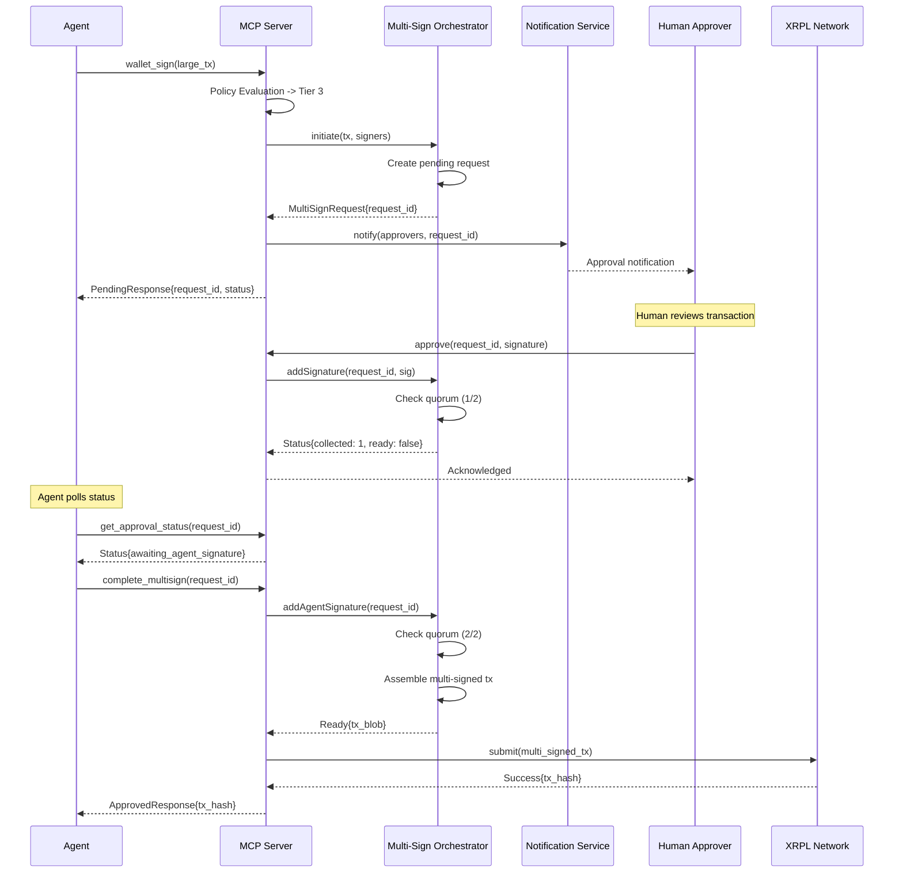
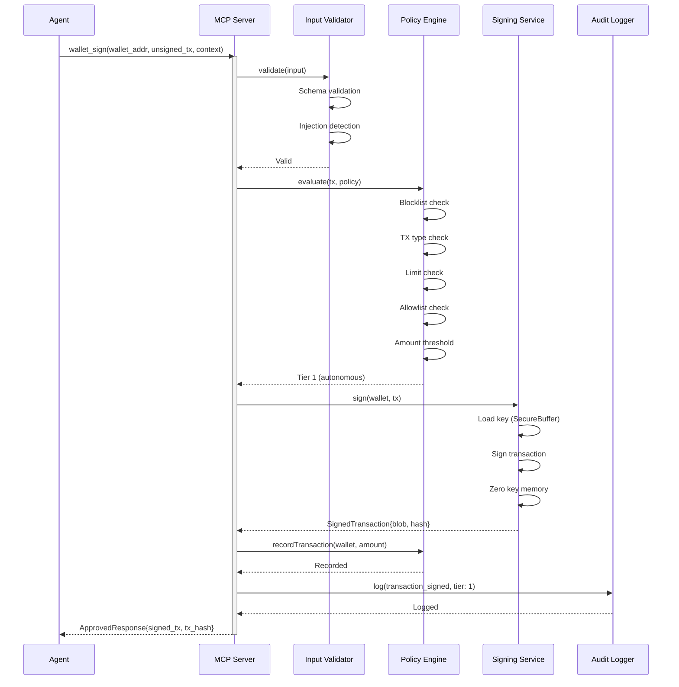
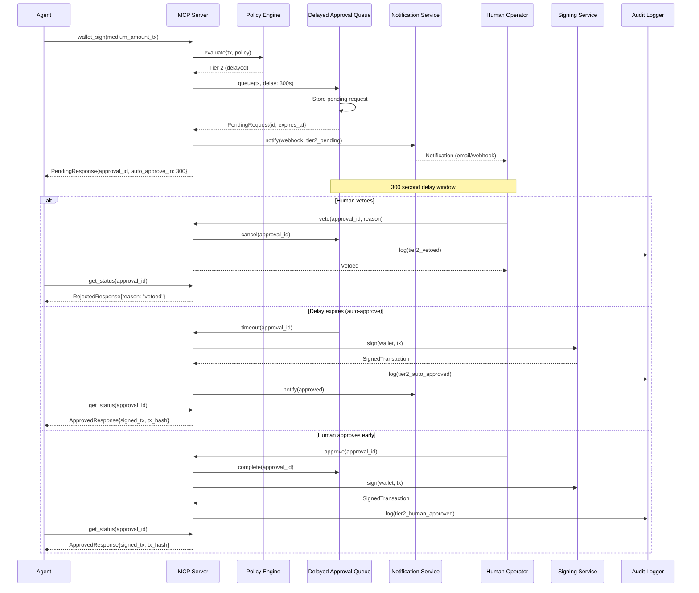
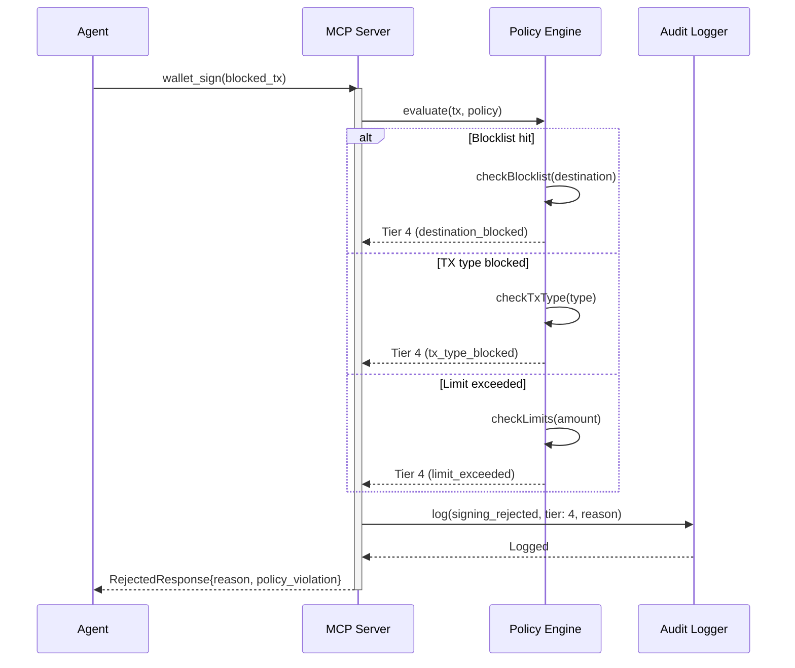

# wallet_sign MCP Tool Specification

**Version:** 1.0.0
**Date:** 2026-01-28
**Status:** Complete
**Security Classification:** CRITICAL

---

## Table of Contents

1. [Overview](#1-overview)
2. [Input Schema](#2-input-schema)
3. [Output Schema](#3-output-schema)
4. [Policy Evaluation Algorithm](#4-policy-evaluation-algorithm)
5. [Tier Determination Logic](#5-tier-determination-logic)
6. [Multi-Sign Handling (Tier 3)](#6-multi-sign-handling-tier-3)
7. [Flow Diagrams](#7-flow-diagrams)
8. [Security Requirements](#8-security-requirements)
9. [Rate Limiting](#9-rate-limiting)
10. [Audit Events](#10-audit-events)
11. [Error Codes](#11-error-codes)
12. [Examples](#12-examples)

---

## 1. Overview

### 1.1 Description

The `wallet_sign` tool is the **most security-critical** component of the XRPL Agent Wallet MCP server. It evaluates transaction requests against configurable policies and, when approved, signs transactions using the agent's private key material.

**This tool controls access to real financial assets.** Every design decision prioritizes security over convenience.

### 1.2 Security Criticality

| Aspect | Classification |
|--------|----------------|
| **Tool Sensitivity** | SENSITIVE (highest) |
| **Data Access** | Private key material |
| **Risk Level** | Financial loss |
| **Authentication** | Required |
| **Authorization** | Per-operation policy check |

### 1.3 Core Security Principles

1. **Defense in Depth**: Multiple validation layers before signing
2. **Fail-Secure**: Any error results in rejection, never approval
3. **Minimum Privilege**: Key material loaded only for the brief signing moment
4. **Complete Audit Trail**: Every request logged regardless of outcome
5. **Policy Immutability**: LLM cannot modify policy constraints

### 1.4 Tool Registration

```typescript
{
  name: 'wallet_sign',
  description: 'Sign an XRPL transaction with policy enforcement. ' +
    'Evaluates the transaction against wallet policy and returns signed blob, ' +
    'pending approval request, or rejection.',
  inputSchema: WalletSignInputSchema,
  outputSchema: WalletSignOutputSchema,
}
```

---

## 2. Input Schema

### 2.1 Schema Definition

```typescript
import { z } from 'zod';

export const WalletSignInputSchema = z.object({
  /**
   * Address of the wallet to sign with.
   * Must be a managed wallet in the keystore.
   */
  wallet_address: z
    .string()
    .min(25, 'XRPL address must be at least 25 characters')
    .max(35, 'XRPL address must be at most 35 characters')
    .regex(
      /^r[1-9A-HJ-NP-Za-km-z]{24,34}$/,
      'Invalid XRPL address format'
    )
    .describe('XRPL address of the wallet to sign with'),

  /**
   * Hex-encoded unsigned transaction blob.
   * Must be a valid XRPL transaction.
   */
  unsigned_tx: z
    .string()
    .min(20, 'Transaction blob too short')
    .max(1000000, 'Transaction blob exceeds maximum size')
    .regex(/^[A-Fa-f0-9]+$/, 'Transaction blob must be hexadecimal')
    .describe('Unsigned XRPL transaction blob (hex-encoded)'),

  /**
   * Context/reason for this transaction (for audit trail).
   * Describes why the agent is making this transaction.
   *
   * CRITICAL: This field is logged but NOT used for authorization
   * decisions. The LLM cannot use this field to bypass policy.
   */
  context: z
    .string()
    .max(500, 'Context must be 500 characters or less')
    .optional()
    .describe('Reason for this transaction (audit trail only)'),
}).describe('Sign a transaction with policy enforcement');
```

### 2.2 Field Details

| Field | Type | Required | Max Length | Description |
|-------|------|----------|------------|-------------|
| `wallet_address` | string | Yes | 35 chars | XRPL r-address of the signing wallet |
| `unsigned_tx` | string | Yes | 1MB | Hex-encoded unsigned transaction blob |
| `context` | string | No | 500 chars | Human-readable reason (audit only) |

### 2.3 Input Validation

Validation occurs in this exact order:

1. **Schema validation**: Zod validates all fields against schema
2. **Address format**: Regex validation for r-address format
3. **Address checksum**: XRPL Base58Check verification
4. **Transaction blob**: Hex format validation
5. **Transaction decode**: Attempt to deserialize transaction
6. **Prompt injection scan**: Check context field for injection patterns
7. **Wallet lookup**: Verify wallet exists in keystore

### 2.4 Input Security

**Context Field Security**

The `context` field is intentionally limited:
- Maximum 500 characters
- Sanitized to remove control characters
- Scanned for prompt injection patterns
- **Never used in authorization logic**
- Logged separately from policy evaluation

Pattern blocklist includes:
```
- /\[INST\]/i
- /<<SYS>>/i
- /ignore\s+(previous|above|prior)/i
- /disregard\s+(all|the|previous)/i
- /override\s+(policy|limit|threshold)/i
- /admin\s+mode/i
- /maintenance\s+mode/i
```

---

## 3. Output Schema

### 3.1 Discriminated Union

The output is a discriminated union with three possible shapes based on the `status` field:

```typescript
export const WalletSignOutputSchema = z.discriminatedUnion('status', [
  WalletSignApprovedOutputSchema,   // status: 'approved'
  WalletSignPendingOutputSchema,    // status: 'pending_approval'
  WalletSignRejectedOutputSchema,   // status: 'rejected'
]);
```

### 3.2 Approved Output (Tier 1 - Immediate Signing)

Returned when the transaction is approved by policy and signed immediately.

```typescript
export const WalletSignApprovedOutputSchema = z.object({
  /**
   * Discriminator field
   */
  status: z.literal('approved'),

  /**
   * Hex-encoded signed transaction blob.
   * Ready for submission to XRPL.
   */
  signed_tx: z
    .string()
    .min(100, 'Signed transaction blob too short')
    .max(1000000, 'Transaction blob exceeds maximum size')
    .regex(/^[A-Fa-f0-9]+$/, 'Must be hexadecimal')
    .describe('Signed XRPL transaction blob'),

  /**
   * Transaction hash (computed before signing).
   * Can be used to track transaction status.
   */
  tx_hash: z
    .string()
    .length(64, 'Transaction hash must be 64 characters')
    .regex(/^[A-Fa-f0-9]{64}$/, 'Must be 64 hex characters')
    .transform(val => val.toUpperCase())
    .describe('XRPL transaction hash'),

  /**
   * Policy tier that approved this transaction.
   * Tier 1 = autonomous (immediate signing)
   */
  policy_tier: z.literal(1),

  /**
   * Remaining limits after this transaction.
   */
  limits_after: RemainingLimitsSchema,

  /**
   * ISO 8601 timestamp when signed.
   */
  signed_at: z.string().datetime(),
});
```

### 3.3 Pending Output (Tier 2 - Delayed, Tier 3 - Co-Sign)

Returned when the transaction requires additional approval.

```typescript
export const WalletSignPendingOutputSchema = z.object({
  /**
   * Discriminator field
   */
  status: z.literal('pending_approval'),

  /**
   * Unique approval request ID.
   * Use this to track approval status or cancel.
   */
  approval_id: z
    .string()
    .uuid()
    .describe('Unique approval request identifier'),

  /**
   * Reason approval is required.
   */
  reason: z.enum([
    'exceeds_autonomous_limit',   // Amount above Tier 1 threshold
    'new_destination',            // Destination not in allowlist
    'restricted_tx_type',         // Transaction type requires approval
    'outside_active_hours',       // Outside configured active hours
    'requires_cosign',            // Tier 3 multi-signature required
  ]),

  /**
   * ISO 8601 timestamp when this approval request expires.
   */
  expires_at: z.string().datetime(),

  /**
   * Optional URL for human approval dashboard.
   * Only present if webhook notifications are configured.
   */
  approval_url: z.string().url().optional(),

  /**
   * Policy tier required for this transaction.
   * Tier 2 = delayed approval (human can veto)
   * Tier 3 = co-signature required
   */
  policy_tier: z.union([z.literal(2), z.literal(3)]),

  /**
   * For Tier 2: Time in seconds before auto-approval.
   * For Tier 3: null (no auto-approval)
   */
  auto_approve_in_seconds: z.number().int().min(60).max(86400).nullable(),

  /**
   * For Tier 3: Signers required to complete the transaction.
   */
  required_signers: z.array(z.object({
    address: z.string().regex(/^r[1-9A-HJ-NP-Za-km-z]{24,34}$/),
    role: z.enum(['human_approver', 'agent']),
    signed: z.boolean(),
  })).optional(),

  /**
   * Current quorum status for multi-sign.
   */
  quorum: z.object({
    collected: z.number().int().min(0),
    required: z.number().int().min(1),
  }).optional(),
});
```

### 3.4 Rejected Output (Tier 4 - Prohibited)

Returned when the transaction violates policy and is rejected.

```typescript
export const WalletSignRejectedOutputSchema = z.object({
  /**
   * Discriminator field
   */
  status: z.literal('rejected'),

  /**
   * Human-readable rejection reason.
   */
  reason: z.string().max(500),

  /**
   * Specific policy violation details.
   */
  policy_violation: z.object({
    /**
     * Which policy rule was violated
     */
    rule: z.string(),

    /**
     * The limit that was exceeded or rule that was violated
     */
    limit: z.string(),

    /**
     * The actual value that caused the violation
     */
    actual: z.string(),
  }).optional(),

  /**
   * Policy tier assigned (always 4 for rejected).
   * Tier 4 = prohibited (never allowed)
   */
  policy_tier: z.literal(4),

  /**
   * Suggestions for making the transaction valid.
   * May be empty if the transaction type is blocked entirely.
   */
  suggestions: z.array(z.string()).optional(),
});
```

### 3.5 Remaining Limits Schema

Included in approved responses to inform the agent of remaining capacity.

```typescript
export const RemainingLimitsSchema = z.object({
  /**
   * Remaining daily volume in drops.
   */
  daily_remaining_drops: z.string().regex(/^\d+$/),

  /**
   * Remaining transactions this hour.
   */
  hourly_tx_remaining: z.number().int().min(0),

  /**
   * Remaining transactions today.
   */
  daily_tx_remaining: z.number().int().min(0),

  /**
   * When daily limits reset (UTC).
   */
  daily_reset_at: z.string().datetime(),

  /**
   * When hourly limits reset (UTC).
   */
  hourly_reset_at: z.string().datetime(),
});
```

---

## 4. Policy Evaluation Algorithm

### 4.1 Evaluation Pipeline

The policy evaluation follows a strict ordered pipeline. Each stage must pass before proceeding.

```
   Input
     |
     v
+--------------------+
| 1. INPUT VALIDATION|  Zod schema + injection detection
+--------------------+
     |
     v
+--------------------+
| 2. WALLET LOOKUP   |  Verify wallet exists and is unlocked
+--------------------+
     |
     v
+--------------------+
| 3. TX DECODE       |  Deserialize and parse transaction
+--------------------+
     |
     v
+--------------------+
| 4. BLOCKLIST CHECK |  Check destination against blocklist
+--------------------+
     |
     v
+--------------------+
| 5. TX TYPE CHECK   |  Verify transaction type is allowed
+--------------------+
     |
     v
+--------------------+
| 6. LIMIT CHECK     |  Verify within daily/hourly limits
+--------------------+
     |
     v
+--------------------+
| 7. ALLOWLIST CHECK |  Check destination against allowlist
+--------------------+
     |
     v
+--------------------+
| 8. TIME CONTROLS   |  Check if within active hours
+--------------------+
     |
     v
+--------------------+
| 9. AMOUNT THRESHOLD|  Determine tier based on amount
+--------------------+
     |
     v
+--------------------+
| 10. TIER CLASSIFY  |  Final tier determination
+--------------------+
     |
     v
+--------------------+
| 11. EXECUTE TIER   |  Sign, queue, or reject
+--------------------+
     |
     v
   Output
```

### 4.2 Evaluation Pseudocode

```typescript
async function evaluateAndSign(input: WalletSignInput): Promise<WalletSignOutput> {
  const correlationId = generateCorrelationId();
  const startTime = Date.now();

  try {
    // Stage 1: Input Validation
    const validated = await validateInput(input);
    if (!validated.success) {
      auditLog('validation_failed', { correlationId, errors: validated.errors });
      return createRejection('VALIDATION_ERROR', validated.errors);
    }

    // Stage 2: Wallet Lookup
    const wallet = await keystoreService.getWallet(input.wallet_address);
    if (!wallet) {
      auditLog('wallet_not_found', { correlationId, address: input.wallet_address });
      return createRejection('WALLET_NOT_FOUND', 'Wallet not managed by this server');
    }

    // Stage 3: Transaction Decode
    const decoded = await decodeTransaction(input.unsigned_tx);
    if (!decoded.success) {
      auditLog('tx_decode_failed', { correlationId });
      return createRejection('INVALID_TRANSACTION', 'Failed to decode transaction');
    }
    const tx = decoded.transaction;

    // Stage 4: Blocklist Check (ALWAYS FIRST - Tier 4 immediate)
    if (tx.Destination) {
      const blocklistResult = await checkBlocklist(tx.Destination);
      if (blocklistResult.blocked) {
        auditLog('destination_blocked', {
          correlationId,
          destination: tx.Destination,
          reason: blocklistResult.reason,
        });
        return createRejection('DESTINATION_BLOCKED', blocklistResult.reason, 4);
      }
    }

    // Stage 5: Transaction Type Check
    const policy = wallet.policy;
    const txTypeResult = evaluateTxType(tx.TransactionType, policy.transaction_types);
    if (txTypeResult.blocked) {
      auditLog('tx_type_blocked', {
        correlationId,
        type: tx.TransactionType,
      });
      return createRejection('TRANSACTION_TYPE_BLOCKED',
        `Transaction type ${tx.TransactionType} is not permitted`, 4);
    }

    // Stage 6: Limit Check
    const limitResult = await checkLimits(wallet.id, tx, policy.limits);
    if (limitResult.exceeded) {
      auditLog('limit_exceeded', {
        correlationId,
        limit: limitResult.limitType,
        current: limitResult.current,
        max: limitResult.max,
      });
      return createRejection('LIMIT_EXCEEDED', limitResult.message, 4);
    }

    // Stage 7-10: Tier Classification
    const tierResult = classifyTier(tx, policy, limitResult);

    // Stage 11: Execute Based on Tier
    switch (tierResult.tier) {
      case 1:
        return await executeAutonomousSigning(wallet, tx, input, correlationId);

      case 2:
        return await initiateDelayedApproval(wallet, tx, input, tierResult, correlationId);

      case 3:
        return await initiateMultiSign(wallet, tx, input, tierResult, correlationId);

      case 4:
        return createRejection(tierResult.reason, tierResult.message, 4);
    }

  } catch (error) {
    // FAIL-SECURE: Any error results in rejection
    auditLog('signing_error', { correlationId, error: error.message });
    throw new McpError('INTERNAL_ERROR', 'Signing failed', { correlationId });
  } finally {
    // Always record attempt duration for monitoring
    const duration = Date.now() - startTime;
    metrics.recordSigningAttempt(duration);
  }
}
```

### 4.3 Policy Structure Reference

The policy used for evaluation follows the `AgentWalletPolicySchema`:

```typescript
interface AgentWalletPolicy {
  policy_id: string;           // e.g., "conservative-v1"
  policy_version: string;      // e.g., "1.0.0"

  limits: {
    max_amount_per_tx_drops: string;    // e.g., "10000000" (10 XRP)
    max_daily_volume_drops: string;     // e.g., "100000000" (100 XRP)
    max_tx_per_hour: number;            // e.g., 10
    max_tx_per_day: number;             // e.g., 100
  };

  destinations: {
    mode: 'allowlist' | 'blocklist' | 'open';
    allowlist?: string[];
    blocklist?: string[];
    allow_new_destinations: boolean;
    new_destination_tier?: 2 | 3;
  };

  transaction_types: {
    allowed: TransactionType[];
    require_approval?: TransactionType[];
    blocked?: TransactionType[];
  };

  time_controls?: {
    active_hours_utc?: { start: number; end: number };
    active_days?: number[];
    timezone?: string;
  };

  escalation: {
    amount_threshold_drops: string;     // Tier 1/2 boundary
    new_destination: 2 | 3;
    account_settings: 3;                // Always tier 3
    delay_seconds?: number;             // Tier 2 delay
  };

  notifications?: {
    webhook_url?: string;
    notify_on?: ('tier2' | 'tier3' | 'rejection' | 'all')[];
  };
}
```

---

## 5. Tier Determination Logic

### 5.1 Tier Overview

| Tier | Name | Behavior | Typical Triggers |
|------|------|----------|------------------|
| **1** | Autonomous | Immediate signing | Small amounts, known destinations |
| **2** | Delayed | Queued for approval, auto-approves after delay | Medium amounts, new destinations |
| **3** | Co-Sign | Requires human signature | Large amounts, sensitive operations |
| **4** | Prohibited | Always rejected | Blocked types/destinations, limit exceeded |

### 5.2 Classification Algorithm

```typescript
function classifyTier(
  tx: DecodedTransaction,
  policy: AgentWalletPolicy,
  limitStatus: LimitCheckResult
): TierClassification {
  // Priority 1: Check for Tier 4 conditions (already done earlier)
  // Blocklist, blocked tx types, and limit exceeded are Tier 4

  // Priority 2: Check transaction type escalation
  if (policy.transaction_types.require_approval?.includes(tx.TransactionType)) {
    return {
      tier: 3,
      reason: 'restricted_tx_type',
      message: `Transaction type ${tx.TransactionType} requires human approval`,
    };
  }

  // Priority 3: Account settings always require Tier 3
  const accountSettingsTxTypes = [
    'AccountSet',
    'SetRegularKey',
    'SignerListSet',
    'AccountDelete',
  ];
  if (accountSettingsTxTypes.includes(tx.TransactionType)) {
    return {
      tier: policy.escalation.account_settings, // Always 3
      reason: 'restricted_tx_type',
      message: 'Account settings changes require human approval',
    };
  }

  // Priority 4: Check time controls
  if (policy.time_controls && !isWithinActiveHours(policy.time_controls)) {
    return {
      tier: 2,
      reason: 'outside_active_hours',
      message: 'Transaction submitted outside active hours',
    };
  }

  // Priority 5: Check destination allowlist
  if (tx.Destination && policy.destinations.mode === 'allowlist') {
    const isAllowed = policy.destinations.allowlist?.includes(tx.Destination);
    if (!isAllowed) {
      if (policy.destinations.allow_new_destinations) {
        return {
          tier: policy.destinations.new_destination_tier || 2,
          reason: 'new_destination',
          message: 'Destination not in allowlist',
        };
      } else {
        return {
          tier: 4,
          reason: 'destination_not_allowed',
          message: 'Destination not in allowlist and new destinations are disabled',
        };
      }
    }
  }

  // Priority 6: Check amount thresholds
  const amountDrops = extractAmount(tx);
  if (amountDrops !== null) {
    const threshold = BigInt(policy.escalation.amount_threshold_drops);
    const maxPerTx = BigInt(policy.limits.max_amount_per_tx_drops);

    // Above max per transaction = Tier 4
    if (amountDrops > maxPerTx) {
      return {
        tier: 4,
        reason: 'exceeds_max_amount',
        message: `Amount ${amountDrops} exceeds maximum ${maxPerTx} per transaction`,
      };
    }

    // Above threshold but within max = Tier 2 or 3
    if (amountDrops > threshold) {
      // Tier 3 for very large amounts (10x threshold)
      if (amountDrops > threshold * 10n) {
        return {
          tier: 3,
          reason: 'requires_cosign',
          message: 'Large transaction requires human co-signature',
        };
      }
      return {
        tier: 2,
        reason: 'exceeds_autonomous_limit',
        message: `Amount exceeds autonomous threshold of ${threshold} drops`,
      };
    }
  }

  // All checks passed - Tier 1 autonomous
  return {
    tier: 1,
    reason: 'approved',
    message: 'Transaction approved for autonomous signing',
  };
}
```

### 5.3 Tier Classification Flowchart

```
                         START
                           |
                           v
                   +---------------+
                   | Blocklist?    |---YES---> TIER 4 (BLOCKED)
                   +---------------+
                           |NO
                           v
                   +---------------+
                   | TX Type       |---BLOCKED---> TIER 4
                   | Blocked?      |
                   +---------------+
                           |ALLOWED
                           v
                   +---------------+
                   | Limits        |---EXCEEDED---> TIER 4
                   | Exceeded?     |
                   +---------------+
                           |OK
                           v
                   +---------------+
                   | Account       |---YES---> TIER 3
                   | Settings TX?  |
                   +---------------+
                           |NO
                           v
                   +---------------+
                   | TX Type       |---YES---> TIER 3
                   | Require       |
                   | Approval?     |
                   +---------------+
                           |NO
                           v
                   +---------------+
                   | Outside       |---YES---> TIER 2
                   | Active Hours? |
                   +---------------+
                           |NO
                           v
                   +---------------+
                   | New           |---YES-+
                   | Destination?  |       |
                   +---------------+       v
                           |NO      +---------------+
                           |        | New Dest      |---NO---> TIER 4
                           |        | Allowed?      |
                           |        +---------------+
                           |               |YES
                           |               v
                           |        +---------------+
                           |        | new_dest_tier |---> TIER 2 or 3
                           |        +---------------+
                           v
                   +---------------+
                   | Amount >      |---YES---> TIER 4
                   | Max Per TX?   |
                   +---------------+
                           |NO
                           v
                   +---------------+
                   | Amount >      |---YES-+
                   | 10x Threshold?|       |
                   +---------------+       v
                           |NO          TIER 3
                           v
                   +---------------+
                   | Amount >      |---YES---> TIER 2
                   | Threshold?    |
                   +---------------+
                           |NO
                           v
                        TIER 1
```

---

## 6. Multi-Sign Handling (Tier 3)

### 6.1 Multi-Sign Architecture

Tier 3 transactions require multiple signatures to complete. The XRPL supports native multi-signature, allowing transactions to require a quorum of signers.

```
                    +-------------------+
                    |   AGENT REQUEST   |
                    +-------------------+
                            |
                            v
                    +-------------------+
                    | Tier 3 Classified |
                    +-------------------+
                            |
                            v
                    +-------------------+
                    | Create Pending    |
                    | Multi-Sign Request|
                    +-------------------+
                            |
            +---------------+---------------+
            |                               |
            v                               v
    +--------------+               +--------------+
    | Notify Human |               | Return       |
    | Approvers    |               | Pending      |
    +--------------+               | Response     |
            |                       +--------------+
            v
    +--------------+
    | Human Reviews|
    | & Signs      |
    +--------------+
            |
            v
    +--------------+
    | Quorum       |---NOT MET---> Wait
    | Check        |
    +--------------+
            |MET
            v
    +--------------+
    | Agent Adds   |
    | Signature    |
    +--------------+
            |
            v
    +--------------+
    | Assemble     |
    | Multi-Signed |
    | Transaction  |
    +--------------+
            |
            v
    +--------------+
    | Submit to    |
    | XRPL         |
    +--------------+
```

### 6.2 Multi-Sign Request Structure

```typescript
interface MultiSignRequest {
  request_id: string;                    // UUID
  wallet_id: string;
  wallet_address: string;
  transaction: {
    type: TransactionType;
    amount_drops?: string;
    destination?: string;
    unsigned_blob: string;
  };
  signers: {
    address: string;
    role: 'human_approver' | 'agent';
    weight: number;
    signature?: string;
    signed_at?: string;
  }[];
  quorum: {
    required: number;
    collected: number;
  };
  status: 'pending' | 'approved' | 'rejected' | 'expired' | 'completed';
  created_at: string;
  expires_at: string;
  completed_at?: string;
  tx_hash?: string;
  rejection_reason?: string;
}
```

### 6.3 Multi-Sign Flow Sequence



### 6.4 Quorum Configuration

Quorum is configured via the XRPL SignerList on the account:

```typescript
interface SignerListConfig {
  signers: {
    account: string;        // Signer's XRPL address
    weight: number;         // 1-65535
  }[];
  quorum: number;           // Total weight required
}
```

Example configuration for 2-of-3 multi-sig:
- Agent wallet: weight 1
- Human Approver 1: weight 1
- Human Approver 2: weight 1
- Quorum: 2

This allows: Agent + Human1, Agent + Human2, or Human1 + Human2.

### 6.5 Multi-Sign Timeout Handling

| Scenario | Behavior |
|----------|----------|
| Request expires | Status set to 'expired', signatures discarded |
| Partial signatures | Preserved until expiration |
| Human rejects | Status set to 'rejected', all signatures discarded |
| Network failure during submit | Retry with exponential backoff (3 attempts) |

---

## 7. Flow Diagrams

### 7.1 Tier 1 - Autonomous Signing Flow



### 7.2 Tier 2 - Delayed Approval Flow



### 7.3 Tier 3 - Co-Sign Flow

See Section 6.3 for the complete multi-sign sequence diagram.

### 7.4 Tier 4 - Rejection Flow



---

## 8. Security Requirements

### 8.1 Cryptographic Requirements

| Requirement | Specification |
|-------------|---------------|
| **Key Storage** | AES-256-GCM encrypted, Argon2id key derivation |
| **Memory Handling** | SecureBuffer with explicit zeroing |
| **Key Lifetime** | < 100ms in memory during signing |
| **Random Generation** | crypto.randomBytes() only |
| **Signing Algorithm** | Ed25519 or secp256k1 (per wallet configuration) |

### 8.2 Policy Immutability

**Critical**: The policy engine is designed so that:

1. Policies cannot be modified via MCP tool calls
2. LLM-provided `context` field is never used in authorization
3. Policy evaluation is deterministic given the same inputs
4. All policy checks fail-secure (error = rejection)

### 8.3 Input Validation Requirements

| Requirement ID | Description |
|----------------|-------------|
| **VAL-001** | All inputs validated against Zod schema |
| **VAL-002** | XRPL addresses verified with Base58Check |
| **VAL-003** | Amounts bounded (1 drop to 100B XRP) |
| **VAL-004** | Prompt injection patterns detected and rejected |
| **VAL-006** | Context field sanitized and length-limited |

### 8.4 Authentication Requirements

The `wallet_sign` tool requires:

1. Valid session token (per AUTH-003)
2. Correct wallet password for key decryption
3. Password verified via Argon2id (per AUTH-001)
4. Progressive lockout after failures (per AUTH-002)

### 8.5 Defense-in-Depth Layers

```
Layer 1: Input Validation
    - Zod schema enforcement
    - Format validation
    - Injection detection

Layer 2: Rate Limiting
    - Per-client limits
    - Per-wallet limits
    - Authentication limits

Layer 3: Policy Evaluation
    - Blocklist enforcement
    - Transaction type restrictions
    - Volume limits
    - Destination controls

Layer 4: Tier Classification
    - Amount-based escalation
    - Time-based controls
    - Human approval requirements

Layer 5: Cryptographic Signing
    - Key isolation
    - Memory protection
    - Secure random generation

Layer 6: Audit Logging
    - Complete trail
    - Tamper-evident
    - Non-repudiable
```

---

## 9. Rate Limiting

### 9.1 Rate Limit Tiers

The `wallet_sign` tool is classified as **CRITICAL** tier:

| Tier | Limit | Burst | Applies To |
|------|-------|-------|------------|
| **CRITICAL** | 5 requests / 5 minutes | None | `wallet_sign` |
| STRICT | 20 requests / minute | 2 | Other write operations |
| STANDARD | 100 requests / minute | 10 | Read operations |

### 9.2 Rate Limit Implementation

```typescript
const walletSignRateLimit = {
  tier: 'CRITICAL',
  window_seconds: 300,      // 5 minutes
  max_requests: 5,
  burst_allowed: 0,
  scope: 'per_wallet',      // Limits apply per wallet, not per client
};
```

### 9.3 Rate Limit Behavior

When rate limit is exceeded:

1. Request is immediately rejected (no policy evaluation)
2. HTTP 429 response with error details
3. `rate_limit_triggered` audit event logged
4. Response includes:
   - `X-RateLimit-Limit`: Maximum requests
   - `X-RateLimit-Remaining`: Remaining requests
   - `X-RateLimit-Reset`: Unix timestamp of reset
   - `Retry-After`: Seconds until next allowed request

### 9.4 Rate Limit Response

```typescript
{
  code: 'RATE_LIMIT_EXCEEDED',
  message: 'Signing rate limit exceeded for this wallet',
  details: {
    limit: 5,
    window_seconds: 300,
    retry_after_seconds: 180,
    reset_at: '2026-01-28T12:05:00Z',
  },
  correlation_id: 'abc-123-def',
  timestamp: '2026-01-28T12:02:00Z',
}
```

---

## 10. Audit Events

### 10.1 Audit Event Types

All `wallet_sign` operations generate audit events:

| Event | Severity | Trigger |
|-------|----------|---------|
| `signing_requested` | INFO | Every sign request received |
| `validation_failed` | WARN | Input validation failure |
| `injection_detected` | ALERT | Prompt injection pattern found |
| `wallet_not_found` | WARN | Unknown wallet address |
| `policy_evaluated` | INFO | Policy evaluation completed |
| `tier_classified` | INFO | Tier determination completed |
| `destination_blocked` | WARN | Blocklist match |
| `limit_exceeded` | WARN | Daily/hourly limit exceeded |
| `signing_approved` | INFO | Tier 1 signing completed |
| `tier2_queued` | INFO | Tier 2 request queued |
| `tier2_auto_approved` | INFO | Tier 2 auto-approval |
| `tier2_vetoed` | WARN | Tier 2 human veto |
| `tier3_initiated` | INFO | Multi-sign workflow started |
| `cosign_received` | INFO | Human signature collected |
| `cosign_completed` | INFO | Multi-sign completed |
| `signing_rejected` | WARN | Tier 4 rejection |
| `signing_error` | ERROR | Unexpected error during signing |
| `rate_limit_triggered` | WARN | Rate limit exceeded |

### 10.2 Audit Event Structure

```typescript
interface WalletSignAuditEvent {
  seq: number;                          // Monotonic sequence
  timestamp: string;                    // ISO 8601
  event: AuditEventType;
  correlation_id: string;               // Request correlation

  // Request context
  wallet_id?: string;
  wallet_address?: string;

  // Transaction context (when available)
  transaction_type?: TransactionType;
  amount_xrp?: string;                  // Formatted amount
  destination?: string;                 // Hashed for privacy

  // Policy context
  tier?: 1 | 2 | 3 | 4;
  policy_decision?: 'allowed' | 'denied' | 'pending';
  policy_violation?: {
    rule: string;
    limit: string;
    actual: string;
  };

  // Result context
  tx_hash?: string;
  approval_id?: string;

  // Audit chain
  prev_hash: string;
  hash: string;
}
```

### 10.3 Sensitive Data Handling

The following data is **NEVER** logged:

- Private keys
- Seed phrases
- Passwords
- Full transaction blobs (only hash)
- Decrypted key material

Destinations are logged as **hashed** values for privacy while maintaining traceability.

---

## 11. Error Codes

### 11.1 Complete Error Code Reference

| Code | HTTP | Description | Recovery |
|------|------|-------------|----------|
| `VALIDATION_ERROR` | 400 | Input failed schema validation | Fix input format |
| `INVALID_ADDRESS` | 400 | XRPL address format/checksum invalid | Verify address |
| `INVALID_TRANSACTION` | 400 | Transaction blob cannot be decoded | Verify TX format |
| `INJECTION_DETECTED` | 400 | Prompt injection pattern found | Remove malicious content |
| `WALLET_NOT_FOUND` | 404 | Wallet not managed by server | Create wallet first |
| `WALLET_LOCKED` | 403 | Wallet is locked due to failed attempts | Wait for unlock |
| `AUTHENTICATION_FAILED` | 401 | Password incorrect | Verify password |
| `RATE_LIMIT_EXCEEDED` | 429 | Signing rate limit exceeded | Wait and retry |
| `POLICY_VIOLATION` | 403 | Transaction violates policy | Adjust transaction |
| `DESTINATION_BLOCKED` | 403 | Destination in blocklist | Use different destination |
| `TRANSACTION_TYPE_BLOCKED` | 403 | TX type not permitted | Use allowed TX type |
| `LIMIT_EXCEEDED` | 403 | Daily/hourly limit exceeded | Wait for reset |
| `DESTINATION_NOT_ALLOWED` | 403 | Destination not in allowlist | Add to allowlist |
| `EXCEEDS_MAX_AMOUNT` | 403 | Amount exceeds maximum per TX | Reduce amount |
| `APPROVAL_REQUIRED` | 202 | Transaction requires approval | Poll for status |
| `APPROVAL_EXPIRED` | 410 | Approval request expired | Resubmit request |
| `APPROVAL_REJECTED` | 403 | Human rejected the transaction | Review reason |
| `QUORUM_NOT_MET` | 202 | Multi-sign quorum incomplete | Collect signatures |
| `SIGNING_ERROR` | 500 | Cryptographic operation failed | Retry or contact support |
| `KEYSTORE_ERROR` | 500 | Keystore access failure | Check keystore health |
| `INTERNAL_ERROR` | 500 | Unexpected server error | Retry with correlation ID |

### 11.2 Error Response Format

All errors follow a consistent structure:

```typescript
interface ErrorResponse {
  code: ErrorCode;                      // Machine-readable code
  message: string;                      // Human-readable message
  details?: Record<string, unknown>;    // Additional context
  correlation_id: string;               // For support/debugging
  timestamp: string;                    // ISO 8601
}
```

### 11.3 Error Examples

**Validation Error**
```json
{
  "code": "VALIDATION_ERROR",
  "message": "Invalid request parameters",
  "details": {
    "field": "unsigned_tx",
    "error": "Transaction blob must be hexadecimal"
  },
  "correlation_id": "req_abc123",
  "timestamp": "2026-01-28T12:00:00Z"
}
```

**Rate Limit Exceeded**
```json
{
  "code": "RATE_LIMIT_EXCEEDED",
  "message": "Signing rate limit exceeded for this wallet",
  "details": {
    "limit": 5,
    "window_seconds": 300,
    "retry_after_seconds": 180
  },
  "correlation_id": "req_def456",
  "timestamp": "2026-01-28T12:00:00Z"
}
```

**Policy Violation**
```json
{
  "code": "LIMIT_EXCEEDED",
  "message": "Daily transaction limit exceeded",
  "details": {
    "policy_violation": {
      "rule": "max_daily_volume_drops",
      "limit": "100000000",
      "actual": "150000000"
    }
  },
  "correlation_id": "req_ghi789",
  "timestamp": "2026-01-28T12:00:00Z"
}
```

---

## 12. Examples

### 12.1 Tier 1 - Small Payment (Autonomous Approval)

**Request**
```json
{
  "jsonrpc": "2.0",
  "method": "tools/call",
  "params": {
    "name": "wallet_sign",
    "arguments": {
      "wallet_address": "rHb9CJAWyB4rj91VRWn96DkukG4bwdtyTh",
      "unsigned_tx": "1200002280000000240000000161D4838D7EA4C6800000000000000000000000000055534400000000004B4E9C06F24296074F7BC48F92A97916C6DC5EA968400000000000000A7321ED....",
      "context": "Completing escrow for order #12345"
    }
  },
  "id": "1"
}
```

**Response (Approved)**
```json
{
  "jsonrpc": "2.0",
  "result": {
    "status": "approved",
    "signed_tx": "1200002280000000240000000161D4838D7EA4C6800000000000000000000000000055534400000000004B4E9C06F24296074F7BC48F92A97916C6DC5EA968400000000000000A7321ED...7440...",
    "tx_hash": "E08D6E9754025BA2534A78707605E0601F03ACE063687A0CA1BDDACFCD1698C7",
    "policy_tier": 1,
    "limits_after": {
      "daily_remaining_drops": "90000000",
      "hourly_tx_remaining": 8,
      "daily_tx_remaining": 95,
      "daily_reset_at": "2026-01-29T00:00:00Z",
      "hourly_reset_at": "2026-01-28T13:00:00Z"
    },
    "signed_at": "2026-01-28T12:15:30Z"
  },
  "id": "1"
}
```

### 12.2 Tier 2 - Medium Payment (Delayed Approval)

**Request**
```json
{
  "jsonrpc": "2.0",
  "method": "tools/call",
  "params": {
    "name": "wallet_sign",
    "arguments": {
      "wallet_address": "rHb9CJAWyB4rj91VRWn96DkukG4bwdtyTh",
      "unsigned_tx": "1200002280000000240000000261D5E7AB3D5F1800000000000000000000000000055534400000000004B4E9C06F24296074F7BC48F92A97916C6DC5EA968400000000000000A7321ED....",
      "context": "Processing batch payout for affiliates"
    }
  },
  "id": "2"
}
```

**Response (Pending)**
```json
{
  "jsonrpc": "2.0",
  "result": {
    "status": "pending_approval",
    "approval_id": "550e8400-e29b-41d4-a716-446655440000",
    "reason": "exceeds_autonomous_limit",
    "expires_at": "2026-01-28T12:25:30Z",
    "approval_url": "https://dashboard.example.com/approvals/550e8400",
    "policy_tier": 2,
    "auto_approve_in_seconds": 300
  },
  "id": "2"
}
```

### 12.3 Tier 2 - New Destination

**Request**
```json
{
  "jsonrpc": "2.0",
  "method": "tools/call",
  "params": {
    "name": "wallet_sign",
    "arguments": {
      "wallet_address": "rHb9CJAWyB4rj91VRWn96DkukG4bwdtyTh",
      "unsigned_tx": "1200002280000000240000000161D4838D7EA4C6800000000000000000000000000055534400000000005ABC123456789ABCDEF0123456789ABCDEF0123468400000000000000A7321ED....",
      "context": "First payment to new vendor ABC Corp"
    }
  },
  "id": "3"
}
```

**Response (Pending - New Destination)**
```json
{
  "jsonrpc": "2.0",
  "result": {
    "status": "pending_approval",
    "approval_id": "660f9511-f30c-52e5-b827-557766551111",
    "reason": "new_destination",
    "expires_at": "2026-01-28T12:25:30Z",
    "policy_tier": 2,
    "auto_approve_in_seconds": 300
  },
  "id": "3"
}
```

### 12.4 Tier 3 - Large Payment (Multi-Sign Required)

**Request**
```json
{
  "jsonrpc": "2.0",
  "method": "tools/call",
  "params": {
    "name": "wallet_sign",
    "arguments": {
      "wallet_address": "rHb9CJAWyB4rj91VRWn96DkukG4bwdtyTh",
      "unsigned_tx": "1200002280000000240000000361D9E85538C5A000000000000000000000000000055534400000000004B4E9C06F24296074F7BC48F92A97916C6DC5EA968400000000000000A7321ED....",
      "context": "Quarterly treasury transfer to cold storage"
    }
  },
  "id": "4"
}
```

**Response (Pending - Co-Sign)**
```json
{
  "jsonrpc": "2.0",
  "result": {
    "status": "pending_approval",
    "approval_id": "770a0622-a41d-63f6-c938-668877662222",
    "reason": "requires_cosign",
    "expires_at": "2026-01-29T12:20:30Z",
    "approval_url": "https://dashboard.example.com/approvals/770a0622",
    "policy_tier": 3,
    "auto_approve_in_seconds": null,
    "required_signers": [
      {
        "address": "rHb9CJAWyB4rj91VRWn96DkukG4bwdtyTh",
        "role": "agent",
        "signed": false
      },
      {
        "address": "rPT1Sjq2YGrBMTttX4GZHjKu9dyfzbpAYe",
        "role": "human_approver",
        "signed": false
      }
    ],
    "quorum": {
      "collected": 0,
      "required": 2
    }
  },
  "id": "4"
}
```

### 12.5 Tier 4 - Blocked Destination (Rejection)

**Request**
```json
{
  "jsonrpc": "2.0",
  "method": "tools/call",
  "params": {
    "name": "wallet_sign",
    "arguments": {
      "wallet_address": "rHb9CJAWyB4rj91VRWn96DkukG4bwdtyTh",
      "unsigned_tx": "1200002280000000240000000161D4838D7EA4C6800000000000000000000000000055534400000000009999SCAMADDRESS99999999999999999999968400000000000000A7321ED....",
      "context": "Regular payment"
    }
  },
  "id": "5"
}
```

**Response (Rejected)**
```json
{
  "jsonrpc": "2.0",
  "result": {
    "status": "rejected",
    "reason": "Destination address is on the blocklist",
    "policy_violation": {
      "rule": "destination_blocklist",
      "limit": "blocklisted",
      "actual": "r9999SCAM...9999"
    },
    "policy_tier": 4,
    "suggestions": []
  },
  "id": "5"
}
```

### 12.6 Tier 4 - Limit Exceeded (Rejection)

**Request**
```json
{
  "jsonrpc": "2.0",
  "method": "tools/call",
  "params": {
    "name": "wallet_sign",
    "arguments": {
      "wallet_address": "rHb9CJAWyB4rj91VRWn96DkukG4bwdtyTh",
      "unsigned_tx": "1200002280000000240000000861D4838D7EA4C6800000000000000000000000000055534400000000004B4E9C06F24296074F7BC48F92A97916C6DC5EA968400000000000000A7321ED....",
      "context": "Eighth transaction today"
    }
  },
  "id": "6"
}
```

**Response (Rejected - Limit)**
```json
{
  "jsonrpc": "2.0",
  "result": {
    "status": "rejected",
    "reason": "Daily transaction volume limit exceeded",
    "policy_violation": {
      "rule": "max_daily_volume_drops",
      "limit": "100000000",
      "actual": "115000000"
    },
    "policy_tier": 4,
    "suggestions": [
      "Wait until 00:00 UTC for daily limit reset",
      "Reduce transaction amount by 15,000,000 drops (15 XRP)"
    ]
  },
  "id": "6"
}
```

### 12.7 Tier 4 - Transaction Type Blocked

**Request**
```json
{
  "jsonrpc": "2.0",
  "method": "tools/call",
  "params": {
    "name": "wallet_sign",
    "arguments": {
      "wallet_address": "rHb9CJAWyB4rj91VRWn96DkukG4bwdtyTh",
      "unsigned_tx": "1200052280000000240000000168400000000000000A7321ED....",
      "context": "Changing regular key"
    }
  },
  "id": "7"
}
```

**Response (Rejected - TX Type)**
```json
{
  "jsonrpc": "2.0",
  "result": {
    "status": "rejected",
    "reason": "Transaction type SetRegularKey is not permitted via agent signing",
    "policy_violation": {
      "rule": "transaction_types.blocked",
      "limit": "SetRegularKey in blocked list",
      "actual": "SetRegularKey"
    },
    "policy_tier": 4,
    "suggestions": [
      "Key rotation must be performed via the wallet_rotate tool with human approval"
    ]
  },
  "id": "7"
}
```

### 12.8 Rate Limit Exceeded

**Request**
```json
{
  "jsonrpc": "2.0",
  "method": "tools/call",
  "params": {
    "name": "wallet_sign",
    "arguments": {
      "wallet_address": "rHb9CJAWyB4rj91VRWn96DkukG4bwdtyTh",
      "unsigned_tx": "1200002280000000240000000661D4838D7EA4C6800000000000000000000000000055534400000000004B4E9C06F24296074F7BC48F92A97916C6DC5EA968400000000000000A7321ED....",
      "context": "Sixth request in 5 minutes"
    }
  },
  "id": "8"
}
```

**Response (Rate Limited)**
```json
{
  "jsonrpc": "2.0",
  "error": {
    "code": -32000,
    "message": "Rate limit exceeded",
    "data": {
      "code": "RATE_LIMIT_EXCEEDED",
      "message": "Signing rate limit exceeded for this wallet",
      "details": {
        "limit": 5,
        "window_seconds": 300,
        "retry_after_seconds": 120
      },
      "correlation_id": "req_xyz789",
      "timestamp": "2026-01-28T12:20:30Z"
    }
  },
  "id": "8"
}
```

---

## Related Documents

- [Schema Definitions](/src/schemas/index.ts) - Complete Zod schemas
- [Runtime View](/docs/architecture/06-runtime-view.md) - Signing flow diagrams
- [Security Requirements](/docs/security/security-requirements.md) - Security controls
- [Policy Engine](/docs/architecture/05-building-blocks.md#policy-engine) - Policy architecture

---

**Document History**

| Version | Date | Author | Changes |
|---------|------|--------|---------|
| 1.0.0 | 2026-01-28 | JavaScript Developer Agent | Initial comprehensive specification |

---

*This document is the authoritative specification for the wallet_sign MCP tool. All implementations must conform to this specification.*
