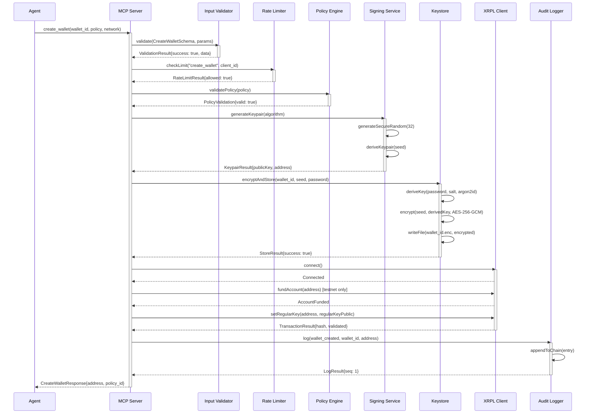
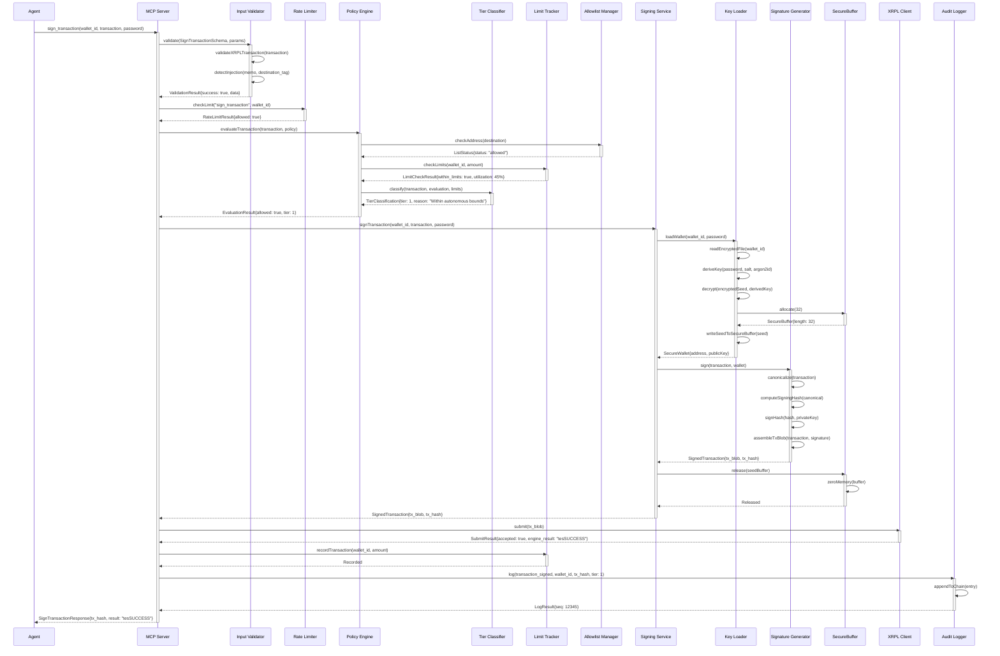
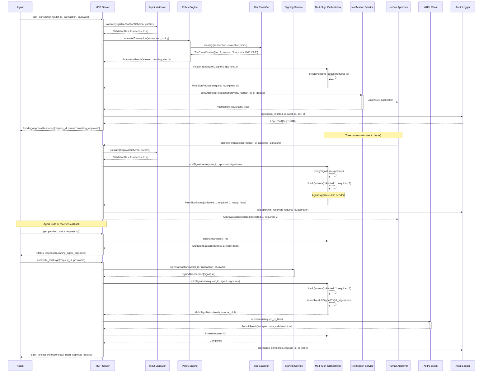
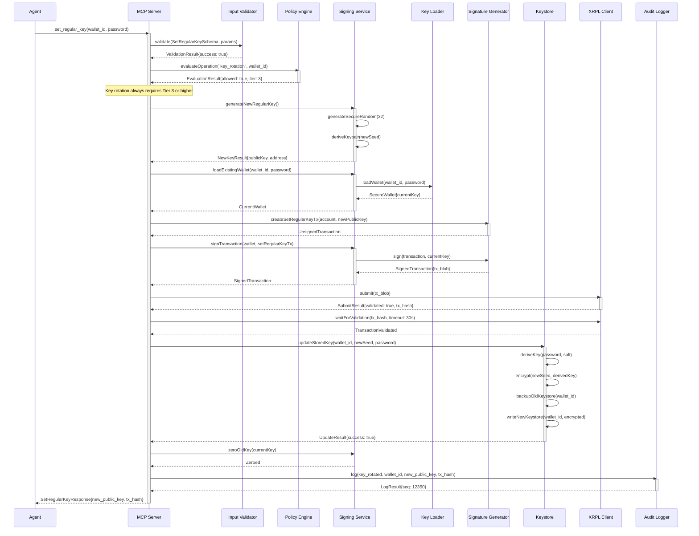
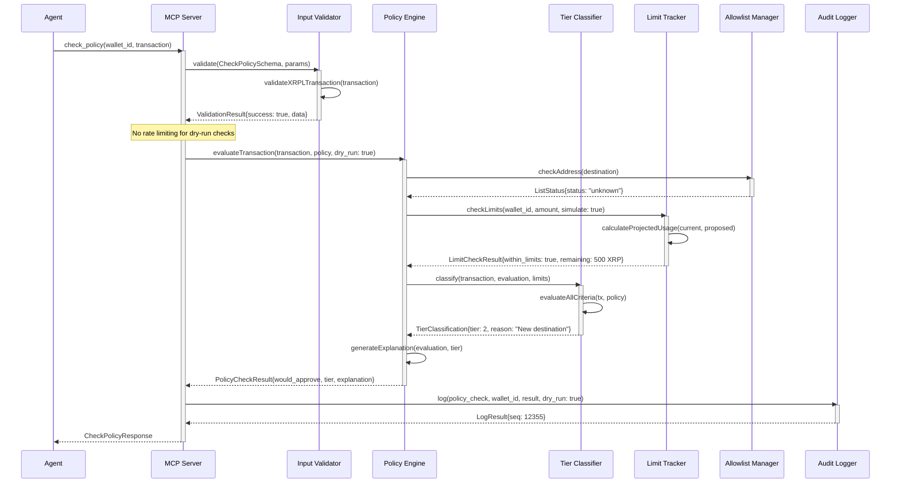
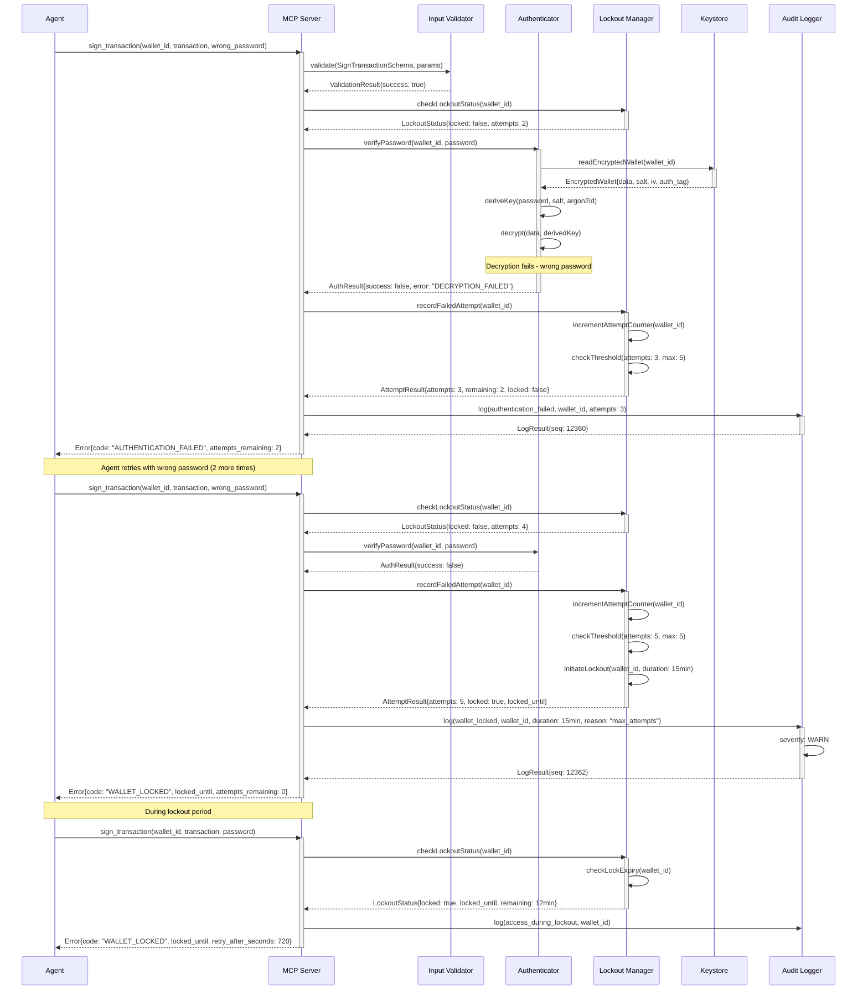

# 06 - Runtime View

**Arc42 Section**: Runtime View
**Version**: 1.0.0
**Date**: 2026-01-28
**Status**: Complete

---

## Table of Contents

1. [Overview](#1-overview)
2. [Scenario 1: Wallet Creation](#2-scenario-1-wallet-creation)
3. [Scenario 2: Transaction Signing (Tier 1 - Autonomous)](#3-scenario-2-transaction-signing-tier-1---autonomous)
4. [Scenario 3: Transaction Signing (Tier 3 - Co-Sign)](#4-scenario-3-transaction-signing-tier-3---co-sign)
5. [Scenario 4: Key Rotation](#5-scenario-4-key-rotation)
6. [Scenario 5: Policy Check (Dry Run)](#6-scenario-5-policy-check-dry-run)
7. [Scenario 6: Authentication Failure / Lockout](#7-scenario-6-authentication-failure--lockout)
8. [Runtime Characteristics](#8-runtime-characteristics)

---

## 1. Overview

This document describes the runtime behavior of the XRPL Agent Wallet MCP server through detailed sequence diagrams and scenario descriptions. Each scenario illustrates how the building blocks (containers and components) interact at runtime to accomplish specific use cases.

### Scope

The runtime view covers:
- Request/response flows through the system
- Component interactions for key operations
- Error handling and recovery paths
- Audit events generated during operations

### Notation

- **Solid arrows**: Synchronous calls
- **Dashed arrows**: Asynchronous notifications
- **Red boxes**: Error conditions
- **Green boxes**: Success paths
- **Yellow boxes**: Warning/audit events

### Component Reference

| Abbreviation | Component | Container |
|--------------|-----------|-----------|
| **Agent** | External AI Agent | External System |
| **MCP** | MCP Server (Tool Router) | MCP Server |
| **IV** | Input Validator | MCP Server |
| **RL** | Rate Limiter | MCP Server |
| **PE** | Policy Engine | Policy Engine |
| **TC** | Tier Classifier | Policy Engine |
| **LT** | Limit Tracker | Policy Engine |
| **AM** | Allowlist Manager | Policy Engine |
| **SS** | Signing Service | Signing Service |
| **KL** | Key Loader | Signing Service |
| **SG** | Signature Generator | Signing Service |
| **SB** | SecureBuffer Manager | Signing Service |
| **MSO** | Multi-Sign Orchestrator | Signing Service |
| **KS** | Keystore | Keystore |
| **AL** | Audit Logger | Audit Logger |
| **XRPL** | XRPL Client | XRPL Client |
| **NS** | Notification Service | External System |

---

## 2. Scenario 1: Wallet Creation

### 2.1 Sequence Diagram



### 2.2 Step-by-Step Description

| Step | Component | Action | Details |
|------|-----------|--------|---------|
| 1 | MCP Server | Receive request | Agent calls `create_wallet` tool with wallet_id, policy configuration, and target network |
| 2 | Input Validator | Validate parameters | Zod schema validates wallet_id format, policy structure, network value |
| 3 | Rate Limiter | Check limits | Verify client hasn't exceeded wallet creation rate (default: 10/hour) |
| 4 | Policy Engine | Validate policy | Ensure policy JSON is well-formed and contains valid tier configurations |
| 5 | Signing Service | Generate keypair | Create cryptographically secure seed, derive Ed25519 or secp256k1 keypair |
| 6 | Keystore | Encrypt and store | Derive encryption key via Argon2id, encrypt seed with AES-256-GCM, save to disk |
| 7 | XRPL Client | Connect | Establish WebSocket connection to appropriate network |
| 8 | XRPL Client | Fund account | [Testnet/Devnet only] Request XRP from faucet for initial reserve |
| 9 | XRPL Client | Set regular key | Configure regular key for agent signing operations |
| 10 | Audit Logger | Log creation | Record wallet creation with hash-chained entry |
| 11 | MCP Server | Return response | Send address and policy_id to agent |

### 2.3 Error Conditions

| Error | Cause | Handling | Audit Event |
|-------|-------|----------|-------------|
| `VALIDATION_ERROR` | Invalid wallet_id, malformed policy | Return error with validation details | `validation_failed` |
| `RATE_LIMIT_EXCEEDED` | Too many create requests | Return error with retry_after | `rate_limit_exceeded` |
| `POLICY_INVALID` | Policy structure validation failed | Return error with specific issues | `policy_validation_failed` |
| `KEYPAIR_GENERATION_FAILED` | Entropy source failure | Fail-secure, return generic error | `keypair_generation_error` |
| `KEYSTORE_WRITE_FAILED` | Disk write failure, permissions | Return error, no wallet created | `keystore_error` |
| `NETWORK_CONNECTION_FAILED` | XRPL node unreachable | Return error, wallet stored but not funded | `network_error` |
| `FUNDING_FAILED` | Faucet unavailable [testnet] | Return error, wallet usable when funded manually | `funding_failed` |

### 2.4 Audit Events

| Event | Severity | Data Captured |
|-------|----------|---------------|
| `wallet_creation_started` | INFO | wallet_id, network, policy_hash |
| `keypair_generated` | INFO | wallet_id, algorithm, public_key (no private data) |
| `keystore_write_success` | INFO | wallet_id, file_path, encryption_params |
| `account_funded` | INFO | wallet_id, address, amount, tx_hash |
| `regular_key_set` | INFO | wallet_id, address, regular_key_public, tx_hash |
| `wallet_created` | INFO | wallet_id, address, policy_id, network |

---

## 3. Scenario 2: Transaction Signing (Tier 1 - Autonomous)

### 3.1 Sequence Diagram



### 3.2 Step-by-Step Description

| Step | Component | Action | Details |
|------|-----------|--------|---------|
| 1 | MCP Server | Receive request | Agent calls `sign_transaction` with wallet_id, transaction object, password |
| 2 | Input Validator | Validate transaction | Zod schema validates all transaction fields, XRPL address checksums |
| 3 | Input Validator | Detect injection | Scan memo fields and destination tags for prompt injection patterns |
| 4 | Rate Limiter | Check limits | Verify wallet hasn't exceeded signing rate (default: 60/minute) |
| 5 | Policy Engine | Evaluate transaction | Begin policy evaluation pipeline |
| 6 | Allowlist Manager | Check destination | Verify destination address against allowlist/blocklist |
| 7 | Limit Tracker | Check limits | Verify transaction amount within daily/hourly limits |
| 8 | Tier Classifier | Determine tier | Classify as Tier 1 (autonomous) based on criteria |
| 9 | Signing Service | Sign transaction | Begin cryptographic signing process |
| 10 | Key Loader | Load wallet | Read encrypted keystore, derive key, decrypt seed |
| 11 | SecureBuffer | Allocate | Create secure memory buffer for sensitive data |
| 12 | Signature Generator | Sign | Canonicalize TX, compute hash, generate signature |
| 13 | SecureBuffer | Release | Zero memory containing private key material |
| 14 | XRPL Client | Submit | Submit signed transaction to XRPL network |
| 15 | Limit Tracker | Record | Update daily/hourly counters |
| 16 | Audit Logger | Log | Record transaction signing with full context |
| 17 | MCP Server | Return response | Send tx_hash and result to agent |

### 3.3 Error Conditions

| Error | Cause | Handling | Audit Event |
|-------|-------|----------|-------------|
| `VALIDATION_ERROR` | Invalid transaction format | Return error, no signing attempt | `validation_failed` |
| `INJECTION_DETECTED` | Prompt injection in memo/tag | Return error, log alert | `injection_detected` |
| `RATE_LIMIT_EXCEEDED` | Too many signing requests | Return error with retry_after | `rate_limit_exceeded` |
| `POLICY_DENIED` | Transaction violates policy | Return error with denial reason | `policy_denied` |
| `LIMIT_EXCEEDED` | Daily/hourly limit reached | Return error with limit status | `limit_exceeded` |
| `DESTINATION_BLOCKED` | Address in blocklist | Return error, blocked reason | `destination_blocked` |
| `DECRYPTION_FAILED` | Wrong password | Return error, increment lockout | `decryption_failed` |
| `SIGNING_FAILED` | Cryptographic operation failed | Fail-secure, return error | `signing_error` |
| `SUBMISSION_FAILED` | XRPL rejected transaction | Return error with engine_result | `submission_failed` |

### 3.4 Audit Events

| Event | Severity | Data Captured |
|-------|----------|---------------|
| `signing_requested` | INFO | wallet_id, tx_type, amount, destination (hashed) |
| `policy_evaluated` | INFO | wallet_id, tier, allowed, reason |
| `wallet_unlocked` | INFO | wallet_id, unlock_duration_ms |
| `transaction_signed` | INFO | wallet_id, tx_hash, tier, amount |
| `transaction_submitted` | INFO | tx_hash, engine_result, validated |
| `limits_updated` | INFO | wallet_id, daily_used, hourly_count |

---

## 4. Scenario 3: Transaction Signing (Tier 3 - Co-Sign)

### 4.1 Sequence Diagram



### 4.2 Step-by-Step Description

| Step | Component | Action | Details |
|------|-----------|--------|---------|
| 1 | MCP Server | Receive request | Agent submits high-value transaction |
| 2 | Input Validator | Validate | Standard validation of transaction parameters |
| 3 | Policy Engine | Evaluate | Policy evaluation identifies Tier 3 requirement |
| 4 | Tier Classifier | Classify | Transaction exceeds autonomous threshold (>1000 XRP) |
| 5 | Multi-Sign Orchestrator | Initiate | Create pending multi-sign request with expiration |
| 6 | Notification Service | Notify | Send approval request to designated human approvers |
| 7 | Audit Logger | Log initiation | Record co-sign workflow started |
| 8 | MCP Server | Return pending | Inform agent that approval is required |
| 9 | Human Approver | Review | Human reviews transaction details via dashboard/email |
| 10 | Human Approver | Approve | Human provides signature using their key |
| 11 | Multi-Sign Orchestrator | Collect | Add human signature, check quorum |
| 12 | Audit Logger | Log approval | Record human approval received |
| 13 | Agent | Check status | Agent polls for approval status |
| 14 | Agent | Complete | Agent provides its signature to complete quorum |
| 15 | Signing Service | Sign | Generate agent's signature |
| 16 | Multi-Sign Orchestrator | Assemble | Combine all signatures into multi-signed TX |
| 17 | XRPL Client | Submit | Submit multi-signed transaction to network |
| 18 | Audit Logger | Log completion | Record successful multi-sign completion |

### 4.3 Error Conditions

| Error | Cause | Handling | Audit Event |
|-------|-------|----------|-------------|
| `APPROVAL_TIMEOUT` | Approver didn't respond in time | Expire request, notify agent | `cosign_expired` |
| `APPROVAL_REJECTED` | Human explicitly rejected | Cancel request, notify agent | `cosign_rejected` |
| `INVALID_SIGNATURE` | Approver signature invalid | Reject signature, request new one | `invalid_approval_signature` |
| `QUORUM_NOT_MET` | Insufficient signatures | Return current status | `quorum_incomplete` |
| `REQUEST_NOT_FOUND` | Invalid request_id | Return error | `request_not_found` |
| `REQUEST_ALREADY_COMPLETED` | Duplicate completion attempt | Return existing result | `duplicate_completion` |

### 4.4 Audit Events

| Event | Severity | Data Captured |
|-------|----------|---------------|
| `cosign_initiated` | INFO | request_id, wallet_id, amount, required_signers |
| `approval_requested` | INFO | request_id, approvers, expires_at |
| `approval_received` | INFO | request_id, approver_id, timestamp |
| `approval_rejected` | WARN | request_id, approver_id, reason |
| `cosign_expired` | WARN | request_id, collected_count, required_count |
| `cosign_completed` | INFO | request_id, tx_hash, all_signers |

---

## 5. Scenario 4: Key Rotation

### 5.1 Sequence Diagram



### 5.2 Step-by-Step Description

| Step | Component | Action | Details |
|------|-----------|--------|---------|
| 1 | MCP Server | Receive request | Agent requests key rotation for wallet |
| 2 | Input Validator | Validate | Validate wallet_id format and password presence |
| 3 | Policy Engine | Evaluate | Verify key rotation is permitted (always Tier 3+) |
| 4 | Signing Service | Generate new key | Create new regular key keypair |
| 5 | Signing Service | Load current key | Decrypt and load current regular key |
| 6 | Signature Generator | Create TX | Build SetRegularKey transaction |
| 7 | Signing Service | Sign TX | Sign with current regular key |
| 8 | XRPL Client | Submit | Submit SetRegularKey transaction |
| 9 | XRPL Client | Wait | Wait for transaction validation on ledger |
| 10 | Keystore | Update | Backup old keystore, write new encrypted key |
| 11 | Signing Service | Zero old key | Securely erase old key from memory |
| 12 | Audit Logger | Log | Record key rotation event |
| 13 | MCP Server | Return response | Send new public key to agent |

### 5.3 Error Conditions

| Error | Cause | Handling | Audit Event |
|-------|-------|----------|-------------|
| `POLICY_DENIED` | Key rotation not permitted | Return error | `key_rotation_denied` |
| `DECRYPTION_FAILED` | Wrong password | Return error, increment lockout | `decryption_failed` |
| `TRANSACTION_FAILED` | SetRegularKey rejected by XRPL | Return error, old key still valid | `key_rotation_tx_failed` |
| `KEYSTORE_UPDATE_FAILED` | Disk write error | CRITICAL: Log and alert, old key still active on ledger | `keystore_update_failed` |
| `VALIDATION_TIMEOUT` | TX not validated in time | Return error, check manually | `validation_timeout` |

### 5.4 Audit Events

| Event | Severity | Data Captured |
|-------|----------|---------------|
| `key_rotation_started` | INFO | wallet_id, reason |
| `new_key_generated` | INFO | wallet_id, new_public_key |
| `setregularkey_submitted` | INFO | wallet_id, tx_hash |
| `keystore_backup_created` | INFO | wallet_id, backup_path |
| `key_rotated` | INFO | wallet_id, old_public_key (partial), new_public_key, tx_hash |

### 5.5 Recovery Procedure

If key rotation partially fails (TX submitted but keystore not updated):

1. **Detect**: Audit log shows `setregularkey_submitted` but no `key_rotated`
2. **Verify**: Check XRPL for SetRegularKey transaction status
3. **Recover**: If TX validated, manually update keystore with new key
4. **Restore**: If TX failed, use backed-up keystore file

---

## 6. Scenario 5: Policy Check (Dry Run)

### 6.1 Sequence Diagram



### 6.2 Response Structure

```typescript
interface CheckPolicyResponse {
  would_approve: boolean;
  tier: 1 | 2 | 3 | 4;
  tier_name: "autonomous" | "delayed" | "cosign" | "prohibited";

  evaluation: {
    destination_status: "allowed" | "blocked" | "unknown";
    amount_classification: "within_autonomous" | "within_delayed" | "requires_cosign" | "exceeds_maximum";
    limit_status: {
      daily_remaining_xrp: number;
      hourly_remaining_count: number;
      utilization_percent: number;
    };
  };

  conditions: string[];  // List of conditions that must be met

  explanation: string;   // Human-readable explanation
}
```

### 6.3 Step-by-Step Description

| Step | Component | Action | Details |
|------|-----------|--------|---------|
| 1 | MCP Server | Receive request | Agent submits transaction for policy evaluation only |
| 2 | Input Validator | Validate | Validate transaction structure (same as signing) |
| 3 | Policy Engine | Evaluate | Full policy evaluation without side effects |
| 4 | Allowlist Manager | Check destination | Determine destination list status |
| 5 | Limit Tracker | Simulate limits | Calculate projected limit usage without recording |
| 6 | Tier Classifier | Classify | Determine tier with full reasoning |
| 7 | Policy Engine | Generate explanation | Create human-readable explanation |
| 8 | Audit Logger | Log check | Record dry-run evaluation (separate from actual attempts) |
| 9 | MCP Server | Return result | Send comprehensive policy evaluation to agent |

### 6.4 Error Conditions

| Error | Cause | Handling | Audit Event |
|-------|-------|----------|-------------|
| `VALIDATION_ERROR` | Invalid transaction format | Return error with validation details | `validation_failed` |
| `WALLET_NOT_FOUND` | Unknown wallet_id | Return error | `wallet_not_found` |
| `POLICY_NOT_FOUND` | No policy configured for wallet | Return error | `policy_not_found` |

### 6.5 Audit Events

| Event | Severity | Data Captured |
|-------|----------|---------------|
| `policy_check_requested` | INFO | wallet_id, tx_type, amount |
| `policy_check_completed` | INFO | wallet_id, would_approve, tier, dry_run: true |

### 6.6 Use Cases

1. **Pre-flight validation**: Agent checks if transaction would be approved before submitting
2. **Limit monitoring**: Agent queries remaining daily/hourly capacity
3. **Destination verification**: Agent verifies destination status before transaction construction
4. **User feedback**: Application shows user what tier their transaction would require

---

## 7. Scenario 6: Authentication Failure / Lockout

### 7.1 Sequence Diagram



### 7.2 Step-by-Step Description

| Step | Component | Action | Details |
|------|-----------|--------|---------|
| 1 | MCP Server | Receive request | Agent attempts signing with incorrect password |
| 2 | Input Validator | Validate | Validate request structure (passes) |
| 3 | Lockout Manager | Check status | Verify wallet is not currently locked |
| 4 | Authenticator | Verify password | Attempt to decrypt keystore |
| 5 | Keystore | Read encrypted data | Load encrypted wallet file |
| 6 | Authenticator | Derive key | Run Argon2id key derivation |
| 7 | Authenticator | Decrypt | Attempt AES-256-GCM decryption (fails) |
| 8 | Lockout Manager | Record failure | Increment failed attempt counter |
| 9 | Audit Logger | Log failure | Record authentication failure |
| 10 | MCP Server | Return error | Send error with remaining attempts |
| 11 | (Repeated failures) | ... | Agent continues with wrong password |
| 12 | Lockout Manager | Initiate lockout | Max attempts reached, lock wallet |
| 13 | Audit Logger | Log lockout | Record wallet lockout (WARN severity) |
| 14 | MCP Server | Return locked | Send locked error with unlock time |
| 15 | (During lockout) | Attempt rejected | All requests return locked error |

### 7.3 Lockout Configuration

```typescript
interface LockoutConfig {
  // Attempt tracking
  max_attempts: number;           // Default: 5
  attempt_window_minutes: number; // Default: 15

  // Lockout escalation
  lockout_durations: {
    first: number;    // 15 minutes
    second: number;   // 60 minutes
    third: number;    // 24 hours
    fourth_plus: number; // 7 days
  };

  // Reset conditions
  successful_auth_resets: boolean; // true
  manual_unlock_allowed: boolean;  // true (requires admin)

  // Alerts
  alert_on_lockout: boolean;       // true
  alert_on_repeated_failures: number; // Alert after N failures in window
}
```

### 7.4 Error Response Structure

```typescript
interface AuthenticationError {
  code: "AUTHENTICATION_FAILED" | "WALLET_LOCKED";
  message: string;

  // For AUTHENTICATION_FAILED
  attempts_remaining?: number;

  // For WALLET_LOCKED
  locked_until?: string;        // ISO timestamp
  retry_after_seconds?: number;
  lockout_count?: number;       // How many times wallet has been locked
}
```

### 7.5 Error Conditions

| Error | Cause | Handling | Audit Event |
|-------|-------|----------|-------------|
| `AUTHENTICATION_FAILED` | Wrong password, within attempt limit | Return error with remaining attempts | `authentication_failed` |
| `WALLET_LOCKED` | Max attempts exceeded | Return locked error with unlock time | `wallet_locked` |
| `ACCESS_DURING_LOCKOUT` | Request while wallet locked | Return locked error, no attempt recorded | `access_during_lockout` |

### 7.6 Audit Events

| Event | Severity | Data Captured |
|-------|----------|---------------|
| `authentication_failed` | WARN | wallet_id, attempt_number, attempts_remaining |
| `wallet_locked` | WARN | wallet_id, duration_minutes, attempt_count, lockout_number |
| `access_during_lockout` | INFO | wallet_id, remaining_seconds |
| `wallet_unlocked` | INFO | wallet_id, unlock_method (timeout/manual/success) |
| `successful_auth_after_failures` | INFO | wallet_id, previous_failures |

### 7.7 Security Considerations

1. **Constant-time comparison**: Password verification uses constant-time comparison to prevent timing attacks
2. **No information leakage**: Error messages don't reveal whether wallet_id exists
3. **Escalating lockouts**: Repeated lockouts increase duration exponentially
4. **Alert integration**: Security team notified on lockouts
5. **Audit completeness**: All failures and lockouts logged for forensics

---

## 8. Runtime Characteristics

### 8.1 Performance Targets

| Operation | Target Latency | P99 Latency |
|-----------|---------------|-------------|
| Tier 1 Signing (autonomous) | < 100ms | < 200ms |
| Policy Check (dry-run) | < 20ms | < 50ms |
| Wallet Creation | < 500ms | < 1s |
| Key Rotation | < 2s | < 5s |
| Balance Query | < 100ms | < 300ms |

### 8.2 Concurrency Model

```
MCP Server (Main Thread)
|
+-- Request Handler Pool
|   |-- Concurrent request processing
|   |-- Rate limiter checks (in-memory)
|   `-- Response formatting
|
+-- Signing Service (Serialized)
|   |-- Key operations serialized per wallet
|   |-- No parallel signing for same wallet
|   `-- Memory zeroing after each operation
|
+-- XRPL Client (Connection Pool)
|   |-- WebSocket connection per network
|   |-- Request queuing
|   `-- Automatic reconnection
|
`-- Audit Logger (Async)
    |-- Non-blocking log writes
    |-- Background flush
    `-- Chain verification periodic
```

### 8.3 State Management

| State | Location | Persistence | Recovery |
|-------|----------|-------------|----------|
| Wallet keys | Keystore (encrypted files) | Durable | Restore from backup |
| Policies | Policy files | Durable | Version control |
| Rate limits | In-memory | Volatile | Reset on restart |
| Lockout state | In-memory + file | Semi-durable | Survives restart |
| Pending multi-sign | File | Durable | Resume on restart |
| Audit logs | Log files | Durable | Append-only |

### 8.4 Failure Modes

| Failure | Impact | Recovery |
|---------|--------|----------|
| Process crash | All in-flight requests lost | Restart, audit log shows last state |
| Disk full | Cannot write keys/logs | Alert, expand storage, no new operations |
| Network disconnect | Cannot submit transactions | Auto-reconnect, queued operations retry |
| Memory exhaustion | Process termination | Restart, investigate cause |
| Key corruption | Wallet inaccessible | Restore from backup, SetRegularKey if master key available |

---

## Related Documents

- [05 - Building Blocks](05-building-blocks.md) - Static structure of components
- [04 - Solution Strategy](04-solution-strategy.md) - Tiered security model details
- [C4 Diagrams](../c4-diagrams/) - Visual architecture diagrams
- [Security Architecture](../security/SECURITY-ARCHITECTURE.md) - Security details

---

**Document History**

| Version | Date | Author | Changes |
|---------|------|--------|---------|
| 1.0.0 | 2026-01-28 | Backend Engineer | Initial version with 6 key scenarios |

---

*Arc42 Template - Section 06: Runtime View*
