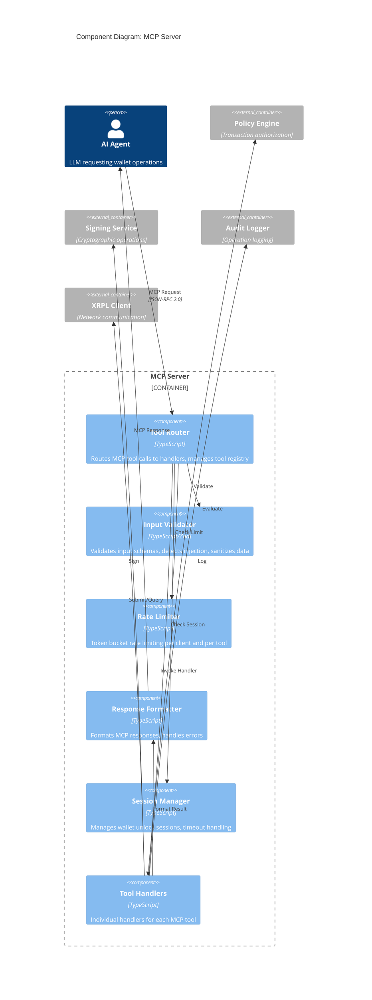
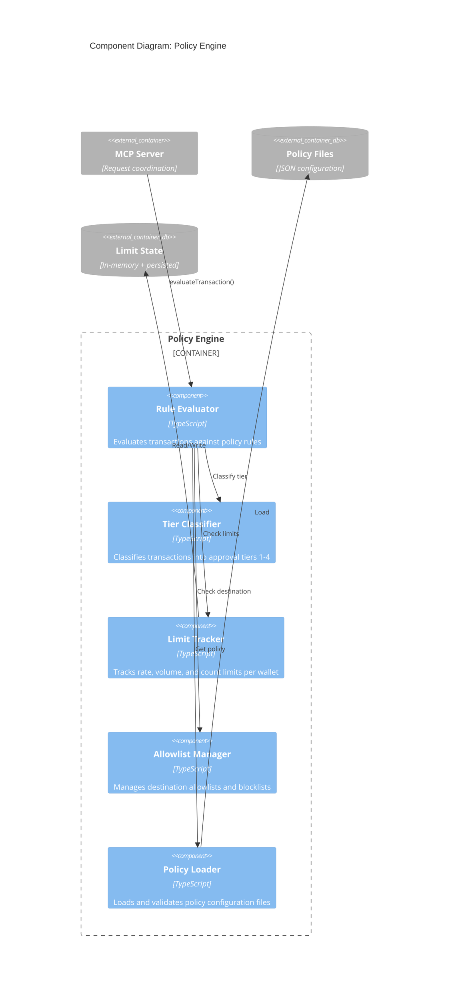
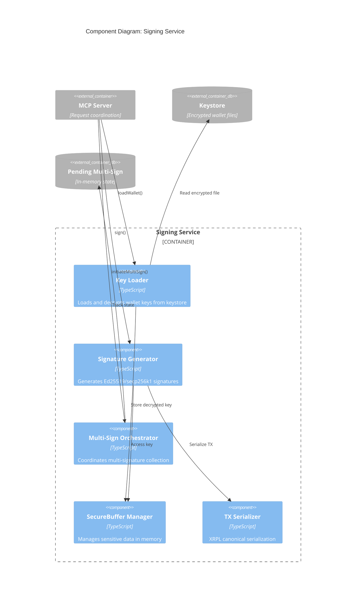

# C4 Level 3: Component Diagrams

**Version:** 1.0.0
**Date:** 2026-01-28
**C4 Level:** 3 - Component

---

## Overview

This document provides C4 Level 3 (Component) diagrams for the key containers within the XRPL Agent Wallet MCP server. Component diagrams show how containers are decomposed into interrelated components.

**Purpose:** Understand the internal structure of each container and how components collaborate.

**Containers Documented:**
1. [MCP Server Components](#1-mcp-server-components)
2. [Policy Engine Components](#2-policy-engine-components)
3. [Signing Service Components](#3-signing-service-components)

---

## 1. MCP Server Components

The MCP Server container handles protocol communication, input validation, and request coordination.

### Component Diagram



### Component Descriptions

#### Tool Router

| Attribute | Value |
|-----------|-------|
| **Purpose** | Route incoming MCP tool calls to appropriate handlers |
| **Technology** | TypeScript |
| **Responsibility** | Parse requests, manage tool registry, coordinate validation |

**Interfaces:**

```typescript
interface ToolRouter {
  // Register a tool with its handler and options
  registerTool(
    name: string,
    schema: ZodSchema,
    handler: ToolHandler,
    options: ToolOptions
  ): void;

  // Route incoming MCP request to handler
  route(request: MCPToolRequest): Promise<MCPToolResponse>;

  // List all available tools (for MCP tools/list)
  listTools(): ToolDefinition[];
}

interface ToolOptions {
  sensitivity: 'low' | 'medium' | 'high' | 'critical';
  rate_limit: { requests: number; window_seconds: number };
  requires_unlock: boolean;
  allowed_tiers: ApprovalTier[];
}
```

**Registered Tools:**

| Tool Name | Handler | Sensitivity | Requires Unlock |
|-----------|---------|-------------|-----------------|
| `create_wallet` | CreateWalletHandler | High | No |
| `import_wallet` | ImportWalletHandler | Critical | No |
| `list_wallets` | ListWalletsHandler | Low | No |
| `get_balance` | GetBalanceHandler | Low | No |
| `sign_transaction` | SignTransactionHandler | Critical | Yes |
| `get_transaction_status` | GetStatusHandler | Low | No |
| `set_regular_key` | SetRegularKeyHandler | High | Yes |
| `setup_multisign` | SetupMultisignHandler | High | Yes |
| `get_policy` | GetPolicyHandler | Medium | No |
| `check_policy` | CheckPolicyHandler | Medium | No |

---

#### Input Validator

| Attribute | Value |
|-----------|-------|
| **Purpose** | Validate and sanitize all incoming data |
| **Technology** | TypeScript, Zod |
| **Responsibility** | Schema validation, type coercion, injection detection |

**Interfaces:**

```typescript
interface InputValidator {
  // Validate data against Zod schema
  validate<T>(
    schema: ZodSchema<T>,
    data: unknown
  ): ValidationResult<T>;

  // Sanitize string input
  sanitizeString(
    value: string,
    options: SanitizeOptions
  ): string;

  // Validate XRPL address format and checksum
  validateXRPLAddress(address: string): boolean;

  // Detect prompt injection patterns
  detectInjection(input: string): InjectionResult;
}

interface ValidationResult<T> {
  success: boolean;
  data?: T;
  errors?: Array<{
    path: string[];
    message: string;
    code: string;
  }>;
}

interface InjectionResult {
  detected: boolean;
  patterns: string[];
  risk_score: number;  // 0.0 - 1.0
  recommendation: 'allow' | 'warn' | 'block';
}
```

**Validation Schemas (Examples):**

```typescript
// XRPL Address validation
const XRPLAddressSchema = z.string()
  .min(25).max(35)
  .regex(/^r[1-9A-HJ-NP-Za-km-z]{24,34}$/)
  .refine(validateChecksum, 'Invalid address checksum');

// Sign transaction request
const SignTransactionSchema = z.object({
  wallet_id: z.string().min(1).max(64),
  transaction: z.object({
    TransactionType: z.string(),
    Account: XRPLAddressSchema,
    Destination: XRPLAddressSchema.optional(),
    Amount: z.union([z.string(), z.object({})]).optional(),
    Fee: z.string().optional(),
    Sequence: z.number().optional(),
  }).passthrough(),
  options: z.object({
    submit: z.boolean().default(false),
    network: z.enum(['mainnet', 'testnet', 'devnet']).default('mainnet'),
  }).optional(),
});
```

**Injection Patterns Detected:**

| Pattern | Risk Score | Action |
|---------|------------|--------|
| `ignore previous instructions` | 0.9 | Block |
| `you are now` | 0.8 | Block |
| `system prompt` | 0.7 | Warn |
| `override` + `policy` | 0.8 | Block |
| Excessive special characters | 0.5 | Warn |
| Unicode control characters | 0.9 | Block |

---

#### Rate Limiter

| Attribute | Value |
|-----------|-------|
| **Purpose** | Enforce request rate limits to prevent abuse |
| **Technology** | TypeScript, Token Bucket Algorithm |
| **Responsibility** | Track request rates, allow controlled bursting |

**Interfaces:**

```typescript
interface RateLimiter {
  // Check if request is allowed
  checkLimit(
    client_id: string,
    resource: string
  ): RateLimitResult;

  // Record a request (call after successful processing)
  recordRequest(
    client_id: string,
    resource: string
  ): void;

  // Get current limit status
  getStatus(client_id: string): RateLimitStatus;

  // Reset limits (admin operation)
  reset(client_id: string): void;
}

interface RateLimitResult {
  allowed: boolean;
  remaining: number;
  reset_at: number;       // Unix timestamp
  retry_after?: number;   // Seconds until retry
}

interface RateLimitStatus {
  buckets: Map<string, {
    tokens: number;
    max_tokens: number;
    refill_rate: number;
    last_refill: number;
  }>;
}
```

**Rate Limit Configuration:**

| Resource | Bucket Size | Refill Rate | Burst Allowed |
|----------|-------------|-------------|---------------|
| `sign_transaction` | 30 | 0.5/sec | 5 |
| `create_wallet` | 10 | 0.003/sec | 2 |
| `get_balance` | 120 | 2/sec | 10 |
| `global` | 300 | 5/sec | 20 |

---

#### Response Formatter

| Attribute | Value |
|-----------|-------|
| **Purpose** | Format handler results into MCP-compliant responses |
| **Technology** | TypeScript |
| **Responsibility** | Consistent response structure, error formatting |

**Interfaces:**

```typescript
interface ResponseFormatter {
  // Format successful response
  success(data: unknown): MCPToolResponse;

  // Format error response
  error(
    code: ErrorCode,
    message: string,
    details?: unknown
  ): MCPToolResponse;

  // Format streaming response
  stream(
    generator: AsyncGenerator<unknown>
  ): MCPStreamResponse;

  // Redact sensitive data from output
  redact(data: unknown, patterns: RedactionPattern[]): unknown;
}

interface MCPToolResponse {
  content: Array<{
    type: 'text' | 'image' | 'resource';
    text?: string;
    data?: string;
    mimeType?: string;
  }>;
  isError?: boolean;
}

type ErrorCode =
  | 'VALIDATION_ERROR'
  | 'RATE_LIMITED'
  | 'POLICY_DENIED'
  | 'WALLET_NOT_FOUND'
  | 'WALLET_LOCKED'
  | 'SIGNING_FAILED'
  | 'NETWORK_ERROR'
  | 'INTERNAL_ERROR';
```

**Response Examples:**

```typescript
// Success response
{
  content: [{
    type: 'text',
    text: JSON.stringify({
      success: true,
      tx_blob: '1200002280000000...',
      tx_hash: 'ABC123...',
      tier: 1,
      submitted: false
    })
  }]
}

// Error response
{
  content: [{
    type: 'text',
    text: JSON.stringify({
      success: false,
      error: {
        code: 'POLICY_DENIED',
        message: 'Transaction exceeds daily limit',
        details: {
          limit: 1000,
          current: 950,
          requested: 100
        }
      }
    })
  }],
  isError: true
}
```

---

#### Session Manager

| Attribute | Value |
|-----------|-------|
| **Purpose** | Manage wallet unlock sessions |
| **Technology** | TypeScript |
| **Responsibility** | Session lifecycle, timeout, unlock verification |

**Interfaces:**

```typescript
interface SessionManager {
  // Unlock wallet with password
  unlock(
    wallet_id: string,
    password: string
  ): Promise<Session>;

  // Check if wallet is unlocked
  isUnlocked(wallet_id: string): boolean;

  // Get active session
  getSession(wallet_id: string): Session | null;

  // Lock wallet (end session)
  lock(wallet_id: string): void;

  // Lock all wallets
  lockAll(): void;
}

interface Session {
  wallet_id: string;
  unlocked_at: Date;
  expires_at: Date;
  last_activity: Date;
  // Note: decrypted key held in SecureBuffer, not exposed
}
```

**Session Configuration:**

| Parameter | Default | Description |
|-----------|---------|-------------|
| `session_timeout` | 300s | Inactivity timeout |
| `max_session_duration` | 3600s | Maximum session length |
| `auto_lock_on_error` | true | Lock on signing error |

---

#### Tool Handlers

| Attribute | Value |
|-----------|-------|
| **Purpose** | Implement individual MCP tool logic |
| **Technology** | TypeScript |
| **Responsibility** | Tool-specific business logic |

**Handler Interface:**

```typescript
interface ToolHandler {
  execute(
    args: ValidatedArgs,
    context: HandlerContext
  ): Promise<HandlerResult>;
}

interface HandlerContext {
  session: Session | null;
  client_id: string;
  request_id: string;
  timestamp: Date;
}

interface HandlerResult {
  success: boolean;
  data?: unknown;
  error?: {
    code: ErrorCode;
    message: string;
    details?: unknown;
  };
  audit_event?: AuditEvent;
}
```

**Handler Examples:**

```typescript
// SignTransactionHandler
class SignTransactionHandler implements ToolHandler {
  async execute(args: SignTransactionArgs, ctx: HandlerContext) {
    // 1. Verify session
    if (!ctx.session) {
      return { success: false, error: { code: 'WALLET_LOCKED', ... } };
    }

    // 2. Evaluate policy
    const policyResult = await this.policyEngine.evaluate(args.transaction);
    if (!policyResult.allowed) {
      return { success: false, error: { code: 'POLICY_DENIED', ... } };
    }

    // 3. Handle tier routing
    if (policyResult.tier === 3) {
      return this.initiateCoSignFlow(args, policyResult);
    }

    // 4. Sign transaction
    const signed = await this.signingService.sign(args.transaction, ctx.session);

    // 5. Optionally submit
    if (args.options?.submit) {
      const result = await this.xrplClient.submit(signed.tx_blob);
      return { success: true, data: { ...signed, submission: result } };
    }

    return { success: true, data: signed };
  }
}
```

---

## 2. Policy Engine Components

The Policy Engine container handles all transaction authorization decisions.

### Component Diagram



### Component Descriptions

#### Rule Evaluator

| Attribute | Value |
|-----------|-------|
| **Purpose** | Main entry point for policy evaluation |
| **Technology** | TypeScript |
| **Responsibility** | Coordinate rule evaluation, aggregate results |

**Interfaces:**

```typescript
interface RuleEvaluator {
  // Main evaluation entry point
  evaluate(
    transaction: XRPLTransaction,
    wallet_id: string
  ): Promise<EvaluationResult>;

  // Dry-run evaluation (no state changes)
  check(
    transaction: XRPLTransaction,
    wallet_id: string
  ): Promise<EvaluationResult>;
}

interface EvaluationResult {
  allowed: boolean;
  tier: 1 | 2 | 3 | 4;
  reason: string;
  matched_rules: string[];
  limit_status: LimitStatus;
  destination_status: DestinationStatus;
  requires_approval?: ApprovalRequirement;
}

interface ApprovalRequirement {
  type: 'delayed' | 'cosign';
  delay_seconds?: number;
  required_signers?: number;
  timeout_hours?: number;
}
```

**Evaluation Flow:**

```
evaluate(transaction, wallet_id)
    |
    v
+------------------+
| Load Policy      |<--- policy_loader.getPolicy()
+------------------+
    |
    v
+------------------+
| Check Blocklist  |<--- allowlist_manager.checkDestination()
+------------------+     Returns: 'blocked' -> Tier 4
    |
    v
+------------------+
| Check Limits     |<--- limit_tracker.checkLimits()
+------------------+     Returns: exceeded -> Tier 4
    |
    v
+------------------+
| Evaluate Rules   |<--- Match transaction against policy rules
+------------------+
    |
    v
+------------------+
| Classify Tier    |<--- tier_classifier.classify()
+------------------+
    |
    v
Return EvaluationResult
```

---

#### Tier Classifier

| Attribute | Value |
|-----------|-------|
| **Purpose** | Determine approval tier for transactions |
| **Technology** | TypeScript |
| **Responsibility** | Apply tier classification rules consistently |

**Interfaces:**

```typescript
interface TierClassifier {
  classify(
    transaction: XRPLTransaction,
    policy: Policy,
    context: ClassificationContext
  ): TierClassification;
}

interface ClassificationContext {
  destination_status: 'allowed' | 'blocked' | 'unknown';
  limit_utilization: number;  // 0.0 - 1.0
  transaction_type: string;
  is_new_destination: boolean;
}

interface TierClassification {
  tier: 1 | 2 | 3 | 4;
  reason: string;
  factors: ClassificationFactor[];
}

interface ClassificationFactor {
  factor: string;
  value: unknown;
  impact: 'increase' | 'decrease' | 'neutral';
  weight: number;
}
```

**Classification Rules:**

| Priority | Condition | Result |
|----------|-----------|--------|
| 1 | Destination blocklisted | Tier 4 |
| 2 | Limits exceeded | Tier 4 |
| 3 | Policy violation | Tier 4 |
| 4 | Amount > cosign_threshold | Tier 3 |
| 5 | New destination + significant amount | Tier 3 |
| 6 | AccountSet/SetRegularKey | Tier 3 |
| 7 | Amount > autonomous_threshold | Tier 2 |
| 8 | Limit utilization > 80% | Tier 2 |
| 9 | All checks pass | Tier 1 |

---

#### Limit Tracker

| Attribute | Value |
|-----------|-------|
| **Purpose** | Track and enforce transaction limits |
| **Technology** | TypeScript |
| **Responsibility** | Maintain limit state, check compliance |

**Interfaces:**

```typescript
interface LimitTracker {
  // Check if transaction would exceed limits
  checkLimits(
    wallet_id: string,
    amount_drops: bigint
  ): LimitCheckResult;

  // Record a completed transaction
  recordTransaction(
    wallet_id: string,
    amount_drops: bigint,
    tx_hash: string
  ): void;

  // Get current limit status
  getStatus(wallet_id: string): LimitStatus;

  // Reset daily limits (called at midnight UTC)
  resetDaily(): void;
}

interface LimitCheckResult {
  within_limits: boolean;
  utilization: number;
  violations: LimitViolation[];
}

interface LimitViolation {
  limit_type: 'daily_volume' | 'hourly_count' | 'single_amount';
  limit: number;
  current: number;
  requested: number;
}

interface LimitStatus {
  daily_volume_drops: bigint;
  daily_limit_drops: bigint;
  hourly_count: number;
  hourly_limit: number;
  single_max_drops: bigint;
  last_transaction: Date | null;
  utilization_percent: number;
}
```

**Limit Types:**

| Limit | Default | Scope | Reset |
|-------|---------|-------|-------|
| `daily_volume` | 1000 XRP | Per wallet | Midnight UTC |
| `hourly_count` | 60 | Per wallet | Rolling 1 hour |
| `single_max` | 100 XRP | Per transaction | N/A |

---

#### Allowlist Manager

| Attribute | Value |
|-----------|-------|
| **Purpose** | Manage destination allow/block lists |
| **Technology** | TypeScript |
| **Responsibility** | Destination validation, list maintenance |

**Interfaces:**

```typescript
interface AllowlistManager {
  // Check destination address
  checkDestination(
    address: string
  ): DestinationStatus;

  // Check memo content
  checkMemo(
    memo: string
  ): MemoStatus;

  // Add address to allowlist
  addToAllowlist(
    address: string,
    options?: AllowlistOptions
  ): void;

  // Add address to blocklist
  addToBlocklist(
    address: string,
    reason: string
  ): void;

  // Get list contents
  getLists(): { allowlist: Address[]; blocklist: Address[] };
}

interface DestinationStatus {
  status: 'allowed' | 'blocked' | 'unknown';
  is_new: boolean;
  previous_transactions?: number;
  trust_score?: number;
  blocklist_reason?: string;
}

interface AllowlistOptions {
  tag?: string;
  expires_at?: Date;
  single_use?: boolean;
  max_amount_drops?: bigint;
}
```

**Trust Scoring:**

| Factor | Points |
|--------|--------|
| In explicit allowlist | +100 |
| Previous successful transaction | +10 (max 50) |
| Known exchange address | +30 |
| In blocklist | -1000 |
| Never seen before | 0 |

---

#### Policy Loader

| Attribute | Value |
|-----------|-------|
| **Purpose** | Load and validate policy configuration |
| **Technology** | TypeScript, Zod |
| **Responsibility** | File loading, schema validation, caching |

**Interfaces:**

```typescript
interface PolicyLoader {
  // Load policy for wallet
  getPolicy(wallet_id: string): Policy;

  // Load default policy
  getDefaultPolicy(): Policy;

  // Reload policies from disk
  reload(): void;

  // Validate policy file
  validate(policy: unknown): ValidationResult<Policy>;
}

interface Policy {
  version: string;
  wallet_id?: string;
  tiers: {
    autonomous: TierConfig;
    delayed: TierConfig;
    cosign: TierConfig;
  };
  blocklist: {
    addresses: string[];
    memo_patterns: string[];
  };
  allowlist: {
    addresses: AllowlistEntry[];
    trusted_tags: string[];
  };
  limits: LimitConfig;
  transaction_types: TransactionTypeConfig;
}
```

---

## 3. Signing Service Components

The Signing Service container handles all cryptographic operations.

### Component Diagram



### Component Descriptions

#### Key Loader

| Attribute | Value |
|-----------|-------|
| **Purpose** | Load and decrypt wallet keys |
| **Technology** | TypeScript, Node.js crypto, Argon2 |
| **Responsibility** | Key decryption, session management |

**Interfaces:**

```typescript
interface KeyLoader {
  // Load and decrypt wallet
  loadWallet(
    wallet_id: string,
    password: string,
    network: Network
  ): Promise<LoadedWallet>;

  // Get loaded wallet (must be unlocked)
  getWallet(wallet_id: string): LoadedWallet | null;

  // Unload wallet from memory
  unloadWallet(wallet_id: string): void;

  // Check if wallet is loaded
  isLoaded(wallet_id: string): boolean;

  // List loaded wallets
  listLoaded(): string[];
}

interface LoadedWallet {
  wallet_id: string;
  address: string;
  algorithm: 'ed25519' | 'secp256k1';
  public_key: string;
  network: Network;
  loaded_at: Date;
  // Private key stored in SecureBuffer, not exposed here
}
```

**Decryption Process:**

```
loadWallet(wallet_id, password, network)
    |
    v
+------------------+
| Read encrypted   |<--- ~/.xrpl-wallet-mcp/{network}/keystore/{id}.enc
| file             |
+------------------+
    |
    v
+------------------+
| Derive key       |<--- Argon2id(password, salt, params)
| from password    |     Takes ~200ms by design
+------------------+
    |
    v
+------------------+
| Decrypt seed     |<--- AES-256-GCM with derived key
| verify auth tag  |     Fails if tampered
+------------------+
    |
    v
+------------------+
| Store in         |<--- SecureBuffer allocation
| SecureBuffer     |     Memory protection enabled
+------------------+
    |
    v
Return LoadedWallet (public info only)
```

---

#### Signature Generator

| Attribute | Value |
|-----------|-------|
| **Purpose** | Generate cryptographic signatures |
| **Technology** | TypeScript, ripple-keypairs |
| **Responsibility** | XRPL-compatible signature generation |

**Interfaces:**

```typescript
interface SignatureGenerator {
  // Sign transaction
  sign(
    transaction: XRPLTransaction,
    wallet: LoadedWallet
  ): SignedTransaction;

  // Get transaction hash (without signing)
  getTransactionHash(
    transaction: XRPLTransaction
  ): string;

  // Verify signature
  verify(
    tx_blob: string,
    public_key: string
  ): boolean;
}

interface SignedTransaction {
  tx_blob: string;        // Signed, serialized transaction
  tx_hash: string;        // Transaction hash
  tx_id: string;          // Same as tx_hash
  signed_at: string;      // ISO timestamp
  signer: string;         // Signing address
}
```

**Signing Process:**

```
sign(transaction, wallet)
    |
    v
+------------------+
| Prepare TX       |<--- Fill in Account, Sequence, Fee if needed
+------------------+
    |
    v
+------------------+
| Serialize TX     |<--- tx_serializer.serialize()
| (canonical)      |     XRPL binary format
+------------------+
    |
    v
+------------------+
| Get private key  |<--- secure_buffer_manager.read()
| from SecureBuffer|
+------------------+
    |
    v
+------------------+
| Generate         |<--- Ed25519 or secp256k1
| signature        |     Deterministic (RFC 6979 for secp)
+------------------+
    |
    v
+------------------+
| Assemble signed  |<--- Attach TxnSignature field
| transaction      |
+------------------+
    |
    v
+------------------+
| Clear private    |<--- Zero the key buffer
| key from memory  |
+------------------+
    |
    v
Return SignedTransaction
```

---

#### Multi-Sign Orchestrator

| Attribute | Value |
|-----------|-------|
| **Purpose** | Coordinate multi-signature collection |
| **Technology** | TypeScript |
| **Responsibility** | Track pending signatures, assemble final TX |

**Interfaces:**

```typescript
interface MultiSignOrchestrator {
  // Initiate multi-sign request
  initiate(
    transaction: XRPLTransaction,
    signer_list: SignerEntry[],
    quorum: number
  ): MultiSignRequest;

  // Add signature to pending request
  addSignature(
    request_id: string,
    signer: string,
    signature: string
  ): MultiSignStatus;

  // Get request status
  getStatus(request_id: string): MultiSignStatus;

  // Finalize (assemble multi-signed TX)
  finalize(request_id: string): SignedTransaction;

  // Cancel pending request
  cancel(request_id: string): void;

  // List pending requests
  listPending(): MultiSignRequest[];
}

interface MultiSignRequest {
  request_id: string;
  transaction: XRPLTransaction;
  tx_hash: string;
  signer_list: SignerEntry[];
  quorum: number;
  collected_signatures: CollectedSignature[];
  status: 'pending' | 'ready' | 'completed' | 'expired' | 'cancelled';
  created_at: Date;
  expires_at: Date;
}

interface CollectedSignature {
  signer: string;
  signature: string;
  weight: number;
  collected_at: Date;
}

interface SignerEntry {
  account: string;
  weight: number;
}
```

**Multi-Sign Flow:**

```
initiate(transaction, signers, quorum)
    |
    v
+------------------+
| Create request   |<--- Generate request_id, set expiry
+------------------+
    |
    v
+------------------+
| Agent signs      |<--- signature_generator.sign()
| (if local key)   |
+------------------+
    |
    v
+------------------+
| Notify approvers |<--- Send approval request
+------------------+
    |
    v
Return MultiSignRequest (status: pending)

... later ...

addSignature(request_id, signer, signature)
    |
    v
+------------------+
| Verify signature |<--- signature_generator.verify()
+------------------+
    |
    v
+------------------+
| Check quorum     |<--- Sum weights >= quorum?
+------------------+
    |
    v
Status: ready (if quorum met)

finalize(request_id)
    |
    v
+------------------+
| Assemble         |<--- Combine all Signers into TX
| multi-signed TX  |
+------------------+
    |
    v
Return SignedTransaction
```

---

#### SecureBuffer Manager

| Attribute | Value |
|-----------|-------|
| **Purpose** | Manage sensitive data securely in memory |
| **Technology** | TypeScript, Node.js Buffer |
| **Responsibility** | Secure allocation, zeroing, access control |

**Interfaces:**

```typescript
interface SecureBufferManager {
  // Allocate secure buffer
  allocate(size: number): SecureBuffer;

  // Create from string (copies then zeros original)
  fromString(
    data: string,
    encoding: BufferEncoding
  ): SecureBuffer;

  // Create from bytes
  fromBytes(data: Uint8Array): SecureBuffer;

  // Release buffer (zeros and frees)
  release(buffer: SecureBuffer): void;

  // Release all buffers
  releaseAll(): void;

  // Get allocation stats
  getStats(): BufferStats;
}

interface SecureBuffer {
  readonly id: string;
  readonly length: number;

  // Read portion of buffer
  read(offset: number, length: number): Uint8Array;

  // Write to buffer
  write(data: Uint8Array, offset: number): void;

  // Clear all contents
  clear(): void;

  // Check if released
  isReleased(): boolean;

  // NO toString() - prevents accidental exposure
  // NO toJSON() - prevents serialization
}

interface BufferStats {
  allocated_count: number;
  total_bytes: number;
  peak_bytes: number;
}
```

**Security Features:**

| Feature | Implementation |
|---------|----------------|
| Memory zeroing | `buffer.fill(0)` on release |
| No serialization | toString/toJSON throw errors |
| Access tracking | Log all read/write operations |
| Auto-release | Timeout-based cleanup |
| No swapping | `mlock()` where supported |

---

#### TX Serializer

| Attribute | Value |
|-----------|-------|
| **Purpose** | Serialize transactions to XRPL binary format |
| **Technology** | TypeScript, xrpl.js |
| **Responsibility** | Canonical serialization for signing |

**Interfaces:**

```typescript
interface TXSerializer {
  // Serialize for signing (no signature field)
  serializeForSigning(
    transaction: XRPLTransaction
  ): Uint8Array;

  // Serialize complete transaction
  serialize(
    transaction: XRPLTransaction
  ): string;  // Hex string

  // Deserialize transaction blob
  deserialize(
    tx_blob: string
  ): XRPLTransaction;

  // Get signing hash
  getSigningHash(
    transaction: XRPLTransaction
  ): string;
}
```

---

## Component Interaction Summary

### Request Flow: Sign Transaction

```
AI Agent
    |
    | MCP: sign_transaction
    v
+------------------+
| Tool Router      |
+------------------+
    |
    v
+------------------+
| Input Validator  |---> Validation failed? Return error
+------------------+
    |
    v
+------------------+
| Rate Limiter     |---> Rate limited? Return 429
+------------------+
    |
    v
+------------------+
| Session Manager  |---> Not unlocked? Return error
+------------------+
    |
    v
+------------------+
| Sign Handler     |
+------------------+
    |
    v
+------------------+        +------------------+
| Rule Evaluator   |------->| Limit Tracker    |
+------------------+        +------------------+
    |                             |
    v                             v
+------------------+        +------------------+
| Tier Classifier  |        | Allowlist Mgr    |
+------------------+        +------------------+
    |
    | Tier 1: Continue
    | Tier 2/3: Approval flow
    | Tier 4: Return denied
    v
+------------------+
| Key Loader       |---> Load from keystore
+------------------+
    |
    v
+------------------+        +------------------+
| Signature Gen    |<------>| SecureBuffer Mgr |
+------------------+        +------------------+
    |
    v
+------------------+
| Response Format  |
+------------------+
    |
    v
AI Agent (signed TX)
```

---

## Related Documents

- [C4 Context Diagram](context.md) - Level 1 system context
- [C4 Container Diagram](containers.md) - Level 2 containers
- [05 - Building Blocks](../architecture/05-building-blocks.md) - Full documentation
- [04 - Solution Strategy](../architecture/04-solution-strategy.md) - Architecture approach
- [Security Architecture](../security/SECURITY-ARCHITECTURE.md) - Security details

---

*Document generated: 2026-01-28*
*C4 Model Level: 3 - Component*
*Notation: C4 with Mermaid*
