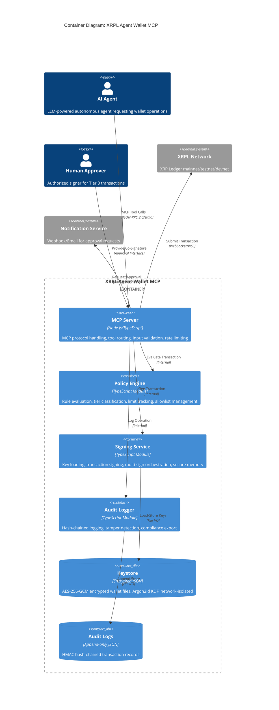

# C4 Level 2: Container Diagram

**Version:** 1.0.0
**Date:** 2026-01-28
**C4 Level:** 2 - Container

---

## Overview

This document provides the C4 Level 2 (Container) diagram for the XRPL Agent Wallet MCP server. The container diagram shows the high-level shape of the software architecture and how responsibilities are distributed across containers.

**Purpose:** Understand the major building blocks of the system and their interactions.

**Scope:** All containers within the XRPL Agent Wallet MCP system boundary.

---

## Container Diagram



---

## Container Descriptions

### MCP Server

| Attribute | Value |
|-----------|-------|
| **Type** | Application Container |
| **Technology** | Node.js 20+ LTS, TypeScript 5.x, MCP SDK |
| **Primary Responsibility** | MCP protocol handling, tool routing, request coordination |

**Description:**

The MCP Server is the main entry point for AI agent interactions. It implements the Model Context Protocol specification, exposing 10 wallet operation tools via JSON-RPC 2.0 over stdio or SSE transport.

**Key Responsibilities:**
- Accept and parse MCP tool invocations
- Validate input using Zod schemas
- Route requests to appropriate handlers
- Coordinate between Policy Engine and Signing Service
- Manage rate limiting per tool and per client
- Format responses according to MCP specification
- Detect and log prompt injection attempts

**Interfaces:**

| Interface | Direction | Protocol | Description |
|-----------|-----------|----------|-------------|
| MCP Tools | Inbound | JSON-RPC 2.0 | Tool invocations from AI agents |
| Policy Evaluation | Outbound | Internal | Transaction authorization requests |
| Signing Requests | Outbound | Internal | Sign transaction requests |
| Audit Events | Outbound | Internal | Operation logging |
| XRPL Submission | Outbound | WebSocket | Transaction submission |
| Approvals | Outbound | HTTPS | Tier 2/3 notification requests |

**Exposed MCP Tools:**

| Tool | Description | Sensitivity | Rate Limit |
|------|-------------|-------------|------------|
| `create_wallet` | Generate new XRPL wallet | High | 10/hour |
| `import_wallet` | Import existing seed | Critical | 5/hour |
| `list_wallets` | List wallet addresses | Low | 60/min |
| `get_balance` | Query wallet balance | Low | 120/min |
| `sign_transaction` | Sign transaction | Critical | 30/min |
| `get_transaction_status` | Check TX result | Low | 120/min |
| `set_regular_key` | Configure regular key | High | 5/hour |
| `setup_multisign` | Configure multi-sig | High | 5/hour |
| `get_policy` | Get current policy | Medium | 30/min |
| `check_policy` | Policy dry-run | Medium | 60/min |

---

### Policy Engine

| Attribute | Value |
|-----------|-------|
| **Type** | Module Container |
| **Technology** | TypeScript, JSON policy files |
| **Primary Responsibility** | Transaction authorization, tier classification |

**Description:**

The Policy Engine evaluates every transaction request against declarative JSON policies. It determines whether a transaction should be allowed, denied, or require additional approval. The engine is intentionally isolated with no external dependencies to ensure deterministic, auditable decisions.

**Key Responsibilities:**
- Load and validate policy configuration
- Evaluate transactions against policy rules
- Classify transactions into approval tiers (1-4)
- Track transaction limits (rate, volume, count)
- Manage destination allowlists and blocklists
- Provide complete decision audit trail

**Interfaces:**

| Interface | Direction | Type | Description |
|-----------|-----------|------|-------------|
| `evaluateTransaction()` | Inbound | Function | Main evaluation entry point |
| `checkLimits()` | Inbound | Function | Verify limit compliance |
| `getTierClassification()` | Inbound | Function | Get approval tier |
| Policy Files | Inbound | File I/O | Load policy configuration |

**Policy Evaluation Flow:**

```
Transaction Request
       |
       v
+------------------+
| Blocklist Check  |---> Blocked? --> Tier 4 (Reject)
+------------------+
       |
       v
+------------------+
| Allowlist Check  |---> Allowed? --> Continue evaluation
+------------------+
       |
       v
+------------------+
| Amount Check     |---> > cosign_threshold? --> Tier 3
+------------------+     > auto_threshold?   --> Tier 2
       |
       v
+------------------+
| Limit Check      |---> Exceeded? --> Tier 4 (Reject)
+------------------+     Near limit? --> Tier 2
       |
       v
+------------------+
| Final Decision   |---> Tier 1 (Autonomous)
+------------------+
```

---

### Signing Service

| Attribute | Value |
|-----------|-------|
| **Type** | Module Container |
| **Technology** | TypeScript, Node.js crypto, ripple-keypairs |
| **Primary Responsibility** | Cryptographic key management and signing |

**Description:**

The Signing Service handles all cryptographic operations. It loads encrypted keys from the Keystore, generates XRPL-compatible signatures, and orchestrates multi-signature workflows. Private keys never leave this container unencrypted.

**Key Responsibilities:**
- Load and decrypt wallet keys on demand
- Generate Ed25519/secp256k1 signatures
- Serialize transactions to XRPL canonical format
- Orchestrate multi-signature collection
- Manage secure memory for key material
- Zero memory immediately after use

**Interfaces:**

| Interface | Direction | Type | Description |
|-----------|-----------|------|-------------|
| `signTransaction()` | Inbound | Function | Sign a single transaction |
| `loadWallet()` | Inbound | Function | Load encrypted wallet |
| `initiateMultiSign()` | Inbound | Function | Start multi-sig flow |
| Keystore Access | Outbound | File I/O | Read encrypted wallet files |

**Signing Flow:**

```
Sign Request
     |
     v
+------------------+
| Load Wallet      |---> Decrypt keys into SecureBuffer
+------------------+
     |
     v
+------------------+
| Canonicalize TX  |---> XRPL binary serialization
+------------------+
     |
     v
+------------------+
| Generate Sig     |---> Ed25519 or secp256k1
+------------------+
     |
     v
+------------------+
| Assemble TX Blob |---> Signed transaction ready
+------------------+
     |
     v
+------------------+
| Clear Memory     |---> Zero SecureBuffer
+------------------+
```

---

### Audit Logger

| Attribute | Value |
|-----------|-------|
| **Type** | Module Container |
| **Technology** | TypeScript, HMAC-SHA256, JSON Lines |
| **Primary Responsibility** | Tamper-evident operation logging |

**Description:**

The Audit Logger records every significant operation with a cryptographic hash chain. Each log entry includes the hash of the previous entry, making any tampering or deletion detectable. The logger supports compliance exports for SOC 2 and MiCA requirements.

**Key Responsibilities:**
- Log all wallet operations (success and failure)
- Maintain HMAC hash chain integrity
- Rotate log files daily
- Verify chain integrity on startup
- Export logs in compliance formats
- Never log sensitive data (keys, full TX details)

**Interfaces:**

| Interface | Direction | Type | Description |
|-----------|-----------|------|-------------|
| `log()` | Inbound | Function | Record audit event |
| `verifyChain()` | Inbound | Function | Verify hash chain |
| `export()` | Inbound | Function | Export for compliance |
| Log Files | Outbound | File I/O | Append log entries |

**Log Entry Structure:**

```json
{
  "seq": 12345,
  "timestamp": "2026-01-28T14:30:00.123Z",
  "event": "transaction_signed",
  "wallet_id": "agent-wallet-001",
  "details": {
    "transaction_type": "Payment",
    "amount_xrp": "50",
    "destination_masked": "r...ABC",
    "tier": 1,
    "policy_decision": "allowed"
  },
  "prev_hash": "abc123...",
  "hash": "def456..."
}
```

---

### Keystore

| Attribute | Value |
|-----------|-------|
| **Type** | Data Store Container |
| **Technology** | AES-256-GCM encryption, Argon2id KDF, JSON files |
| **Primary Responsibility** | Secure persistence of wallet keys |

**Description:**

The Keystore provides encrypted, network-isolated storage for XRPL wallet keys. Each network (mainnet, testnet, devnet) has a completely separate keystore directory, preventing any cross-network key usage.

**Key Characteristics:**
- AES-256-GCM authenticated encryption
- Argon2id key derivation (memory-hard)
- Per-wallet unique salt
- Network isolation (separate directories)
- Strict file permissions (0600/0700)

**Directory Structure:**

```
~/.xrpl-wallet-mcp/
|-- mainnet/
|   |-- keystore/
|   |   |-- agent-wallet-001.enc
|   |   `-- agent-wallet-002.enc
|   `-- policies/
|       `-- default.json
|-- testnet/
|   `-- keystore/
|       `-- test-wallet-001.enc
`-- devnet/
    `-- keystore/
```

**Encrypted File Format:**

```json
{
  "version": 1,
  "wallet_id": "agent-wallet-001",
  "address": "rWalletAddress...",
  "algorithm": "ed25519",
  "encrypted_seed": "<base64-encrypted>",
  "iv": "<base64-iv>",
  "auth_tag": "<base64-tag>",
  "kdf": {
    "algorithm": "argon2id",
    "memory_cost": 65536,
    "time_cost": 3,
    "parallelism": 4,
    "salt": "<base64-salt>"
  },
  "created_at": "2026-01-28T00:00:00Z",
  "network": "mainnet"
}
```

---

### Audit Logs

| Attribute | Value |
|-----------|-------|
| **Type** | Data Store Container |
| **Technology** | Append-only JSON Lines, HMAC integrity |
| **Primary Responsibility** | Immutable operation history |

**Description:**

The Audit Logs store provides append-only persistence for audit records. Files are rotated daily with hash chain continuity maintained across rotations. The HMAC key is stored separately from log files to prevent tampering.

**Key Characteristics:**
- JSON Lines format (one entry per line)
- HMAC-SHA256 hash chain
- Daily rotation with chain continuation
- Separate HMAC key storage
- Compliance export capability

**File Structure:**

```
~/.xrpl-wallet-mcp/
`-- audit/
    |-- 2026-01-28.jsonl       # Daily log file
    |-- 2026-01-27.jsonl       # Previous day
    |-- chain.json             # Hash chain metadata
    `-- .hmac_key              # HMAC key (0600 permissions)
```

---

## Container Interactions

### Primary Flow: Sign Transaction

```
AI Agent                MCP Server       Policy Engine    Signing Service    Keystore
   |                        |                 |                 |               |
   |-- sign_transaction --->|                 |                 |               |
   |                        |                 |                 |               |
   |                        |-- evaluate ---->|                 |               |
   |                        |<-- tier 1 ------|                 |               |
   |                        |                 |                 |               |
   |                        |-- sign -------->|                 |               |
   |                        |                 |-- load -------->|               |
   |                        |                 |<-- encrypted ---|               |
   |                        |                 |-- decrypt ----->|               |
   |                        |                 |-- generate sig->|               |
   |                        |<-- signed_tx ---|                 |               |
   |                        |                 |                 |               |
   |<-- tx_blob ------------|                 |                 |               |
```

### Secondary Flow: Tier 3 Approval

```
AI Agent      MCP Server      Policy Engine     Notification     Human Approver
   |               |                |                 |                |
   |-- sign ------>|                |                 |                |
   |               |-- evaluate --->|                 |                |
   |               |<-- tier 3 -----|                 |                |
   |               |                |                 |                |
   |               |-- notify ----->|---------------->|                |
   |               |                |                 |-- review ----->|
   |<-- pending ---|                |                 |                |
   |               |                |                 |                |
   .               .                .                 .                .
   .               .                .                 .                .
   |               |                |                 |<-- approve ----|
   |               |<---------------|-----------------|                |
   |               |-- sign (with approval) -------->|                |
   |<-- tx_blob ---|                |                 |                |
```

---

## Security Boundaries

The container diagram identifies three key security boundaries:

### 1. External Boundary

**Location:** Between AI Agent and MCP Server

**Controls:**
- Input validation (Zod schemas)
- Rate limiting (token bucket)
- Prompt injection detection
- Request size limits

### 2. Policy Boundary

**Location:** Between MCP Server and Signing Service

**Controls:**
- Policy Engine must approve all signing requests
- No bypass mechanism
- Complete decision audit trail
- Fail-secure on errors

### 3. Cryptographic Boundary

**Location:** Around Signing Service and Keystore

**Controls:**
- Keys encrypted at rest
- Keys decrypted only in secure memory
- Memory zeroed after use
- Keys never cross boundary unencrypted

```
+----------------------------------------------------------------+
|                    External Boundary                            |
|  +----------------------------------------------------------+  |
|  |  AI Agent (untrusted)                                    |  |
|  +---------------------------+------------------------------+  |
+--------------------------------|-------------------------------+
                                 | Input validation, rate limiting
                                 v
+----------------------------------------------------------------+
|                    Policy Boundary                              |
|  +---------------------------+------------------------------+  |
|  |  MCP Server               |    Policy Engine             |  |
|  |                           |                              |  |
|  |  - Tool routing           |    - Rule evaluation         |  |
|  |  - Response formatting    |    - Tier classification     |  |
|  +---------------------------+------------------------------+  |
+--------------------------------|-------------------------------+
                                 | Policy approved only
                                 v
+----------------------------------------------------------------+
|                    Cryptographic Boundary                       |
|  +---------------------------+------------------------------+  |
|  |  Signing Service          |    Keystore                  |  |
|  |                           |                              |  |
|  |  - Key decryption         |    - Encrypted storage       |  |
|  |  - Signature generation   |    - Network isolation       |  |
|  +---------------------------+------------------------------+  |
+----------------------------------------------------------------+
```

---

## Technology Stack Summary

| Container | Runtime | Primary Libraries |
|-----------|---------|-------------------|
| MCP Server | Node.js 20+ | @modelcontextprotocol/sdk, zod, pino |
| Policy Engine | TypeScript | (no external dependencies) |
| Signing Service | TypeScript | ripple-keypairs, node:crypto |
| Audit Logger | TypeScript | node:crypto (HMAC) |
| Keystore | File System | AES-256-GCM, Argon2 |
| Audit Logs | File System | JSON Lines |

---

## Alternative Diagram (PlantUML)

```plantuml
@startuml
!include https://raw.githubusercontent.com/plantuml-stdlib/C4-PlantUML/master/C4_Container.puml

title Container Diagram: XRPL Agent Wallet MCP

Person(ai_agent, "AI Agent", "LLM-powered autonomous agent")
Person(human_approver, "Human Approver", "Tier 3 transaction approver")

System_Boundary(wallet_mcp, "XRPL Agent Wallet MCP") {
    Container(mcp_server, "MCP Server", "Node.js", "Protocol handling, tool routing")
    Container(policy_engine, "Policy Engine", "TypeScript", "Rule evaluation, tier classification")
    Container(signing_service, "Signing Service", "TypeScript", "Key management, signing")
    Container(audit_logger, "Audit Logger", "TypeScript", "Hash-chained logging")
    ContainerDb(keystore, "Keystore", "Encrypted JSON", "Wallet key storage")
    ContainerDb(audit_logs, "Audit Logs", "JSON Lines", "Operation records")
}

System_Ext(xrpl_network, "XRPL Network", "XRP Ledger")
System_Ext(notifications, "Notification Service", "Webhook/Email")

Rel(ai_agent, mcp_server, "MCP Tools", "JSON-RPC")
Rel(mcp_server, policy_engine, "Evaluate")
Rel(mcp_server, signing_service, "Sign")
Rel(mcp_server, audit_logger, "Log")
Rel(signing_service, keystore, "Load/Store")
Rel(audit_logger, audit_logs, "Write")
Rel(mcp_server, xrpl_network, "Submit", "WebSocket")
Rel(mcp_server, notifications, "Notify", "HTTPS")
Rel(human_approver, mcp_server, "Approve")

@enduml
```

---

## Related Documents

- [C4 Context Diagram](context.md) - Level 1 system context
- [C4 Component Diagram](components.md) - Level 3 components
- [05 - Building Blocks](../architecture/05-building-blocks.md) - Full documentation
- [04 - Solution Strategy](../architecture/04-solution-strategy.md) - Architecture approach
- [Security Architecture](../security/SECURITY-ARCHITECTURE.md) - Security details

---

*Document generated: 2026-01-28*
*C4 Model Level: 2 - Container*
*Notation: C4 with Mermaid/PlantUML*
