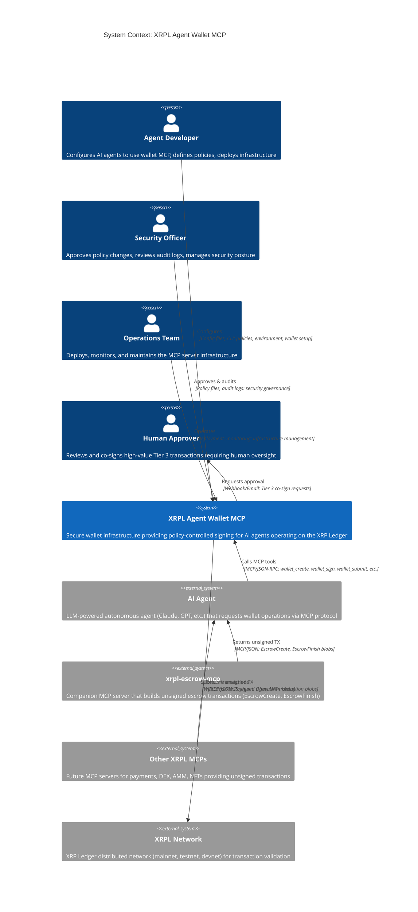

# C4 Level 1: System Context Diagram

**Version:** 1.0.0
**Date:** 2026-01-28
**C4 Level:** 1 - System Context

---

## Overview

This document provides the C4 Level 1 (System Context) diagram for the XRPL Agent Wallet MCP server. The system context diagram shows the XRPL Agent Wallet MCP as a black box, surrounded by its users (human actors) and the other systems it interacts with.

**Purpose:** Understand the system's boundaries and external relationships at the highest level of abstraction.

---

## System Context Diagram



---

## Diagram Elements

### People (Human Actors)

#### Agent Developer
| Attribute | Value |
|-----------|-------|
| **Type** | Person |
| **Description** | Configures AI agents to use wallet MCP, defines policies, deploys infrastructure |
| **Interaction** | Configuration files, CLI tools, environment variables |
| **Frequency** | High during setup, low during operations |

**Responsibilities:**
- Install and configure the MCP server
- Define wallet policies (transaction limits, allowlists)
- Set up agent integration
- Troubleshoot issues

#### Security Officer
| Attribute | Value |
|-----------|-------|
| **Type** | Person |
| **Description** | Approves policy changes, reviews audit logs, manages security posture |
| **Interaction** | Policy approval workflows, audit dashboards |
| **Frequency** | Periodic reviews, incident response |

**Responsibilities:**
- Approve policy modifications
- Review audit logs for anomalies
- Assess compliance status
- Respond to security incidents

#### Operations Team
| Attribute | Value |
|-----------|-------|
| **Type** | Person |
| **Description** | Deploys, monitors, and maintains the MCP server infrastructure |
| **Interaction** | Deployment pipelines, monitoring dashboards, alerting systems |
| **Frequency** | Continuous monitoring |

**Responsibilities:**
- Deploy MCP server instances
- Monitor health and performance
- Execute backup procedures
- Apply security patches

#### Human Approver
| Attribute | Value |
|-----------|-------|
| **Type** | Person |
| **Description** | Reviews and co-signs high-value Tier 3 transactions requiring human oversight |
| **Interaction** | Webhook notifications, email alerts, approval interface |
| **Frequency** | On-demand based on transaction volume |

**Responsibilities:**
- Review approval requests
- Verify transaction legitimacy
- Provide cryptographic co-signature
- Escalate anomalies

---

### Systems

#### XRPL Agent Wallet MCP (Core System)
| Attribute | Value |
|-----------|-------|
| **Type** | System (in scope) |
| **Description** | Secure wallet infrastructure providing policy-controlled signing for AI agents operating on the XRP Ledger |
| **Technology** | Node.js/TypeScript MCP server |

**Core Capabilities:**
- Wallet creation and management
- Policy-based transaction authorization
- Cryptographic signing (Ed25519/secp256k1)
- XRPL transaction submission
- Audit logging with tamper detection

#### AI Agent
| Attribute | Value |
|-----------|-------|
| **Type** | External System |
| **Description** | LLM-powered autonomous agent (Claude, GPT, etc.) that requests wallet operations via MCP protocol |
| **Trust Level** | Untrusted - all input validated |

**Interaction Pattern:**
```
AI Agent --[MCP tools]--> XRPL Agent Wallet MCP
```

**Available Tools:**
- `wallet_create` - Create new agent wallet
- `wallet_list` - List available wallets
- `wallet_get_balance` - Query XRP balance
- `wallet_sign` - Sign transactions (policy-controlled)
- `wallet_submit` - Submit to XRPL network
- `wallet_get_status` - Check transaction status

#### xrpl-escrow-mcp
| Attribute | Value |
|-----------|-------|
| **Type** | External System (Companion MCP) |
| **Description** | Companion MCP server that builds unsigned escrow transactions |
| **Relationship** | Upstream transaction provider |

**Transaction Types Provided:**
- `EscrowCreate` - Time-locked/conditional escrow creation
- `EscrowFinish` - Escrow completion
- `EscrowCancel` - Escrow cancellation

**Integration Flow:**
```
AI Agent --> xrpl-escrow-mcp --> Unsigned TX
AI Agent --> xrpl-wallet-mcp --> Sign(Unsigned TX) --> Submit
```

#### Other XRPL MCPs
| Attribute | Value |
|-----------|-------|
| **Type** | External System (Future) |
| **Description** | Future MCP servers for payments, DEX, AMM, NFTs providing unsigned transactions |
| **Relationship** | Upstream transaction providers |

**Anticipated MCPs:**
- Payment MCP - Basic payment transactions
- DEX MCP - Order book operations
- AMM MCP - Automated Market Maker operations
- NFT MCP - NFT minting and management
- Hooks MCP - Smart contract deployment (when available)

#### XRPL Network
| Attribute | Value |
|-----------|-------|
| **Type** | External System (Infrastructure) |
| **Description** | XRP Ledger distributed network for transaction validation |
| **Trust Level** | Trusted infrastructure |

**Networks:**
| Network | Purpose | Endpoint |
|---------|---------|----------|
| Mainnet | Production | `wss://xrplcluster.com/` |
| Testnet | Integration testing | `wss://s.altnet.rippletest.net/` |
| Devnet | Development | `wss://s.devnet.rippletest.net/` |

---

### Relationships

#### AI Agent --> XRPL Agent Wallet MCP
| Attribute | Value |
|-----------|-------|
| **Description** | Calls MCP tools |
| **Protocol** | MCP/JSON-RPC 2.0 over stdio or SSE |
| **Data Flow** | Tool invocation requests, responses |
| **Security** | Input validation, rate limiting, policy enforcement |

**Example Interaction:**
```json
// Request
{"jsonrpc": "2.0", "method": "tools/call", "params": {"name": "wallet_sign", "arguments": {...}}, "id": 1}

// Response
{"jsonrpc": "2.0", "result": {"content": [{"type": "text", "text": "{\"signed_tx_blob\": \"...\"}"}]}, "id": 1}
```

#### xrpl-escrow-mcp --> AI Agent
| Attribute | Value |
|-----------|-------|
| **Description** | Returns unsigned TX |
| **Protocol** | MCP/JSON |
| **Data Flow** | Unsigned transaction blobs |
| **Security** | Transaction validated by wallet MCP before signing |

#### XRPL Agent Wallet MCP --> XRPL Network
| Attribute | Value |
|-----------|-------|
| **Description** | Submits transactions |
| **Protocol** | WebSocket (WSS) |
| **Data Flow** | Signed transaction blobs, query requests |
| **Security** | TLS encryption, endpoint validation |

**Commands Used:**
- `submit` - Submit signed transaction
- `account_info` - Query account state
- `tx` - Get transaction status
- `fee` - Get current fee estimates

#### Agent Developer --> XRPL Agent Wallet MCP
| Attribute | Value |
|-----------|-------|
| **Description** | Configures |
| **Mechanism** | Configuration files, CLI commands |
| **Data Flow** | Policy definitions, environment settings |

**Configuration Artifacts:**
- `server.json` - Server configuration
- `policies/*.json` - Transaction policies
- Environment variables - Secrets, endpoints

#### Security Officer --> XRPL Agent Wallet MCP
| Attribute | Value |
|-----------|-------|
| **Description** | Approves & audits |
| **Mechanism** | Policy files, audit log access |
| **Data Flow** | Policy approvals, audit queries |

#### Operations Team --> XRPL Agent Wallet MCP
| Attribute | Value |
|-----------|-------|
| **Description** | Operates |
| **Mechanism** | Deployment pipelines, monitoring |
| **Data Flow** | Deployments, metrics collection |

#### XRPL Agent Wallet MCP --> Human Approver
| Attribute | Value |
|-----------|-------|
| **Description** | Requests approval |
| **Protocol** | Webhook (HTTPS), Email (SMTP) |
| **Data Flow** | Approval requests for Tier 2/3 transactions |
| **Security** | Authenticated webhooks, encrypted email |

**Notification Payload:**
```json
{
  "event": "approval_required",
  "tier": 3,
  "wallet_id": "agent-wallet-001",
  "transaction": {
    "type": "Payment",
    "amount_xrp": "5000"
  },
  "approval_url": "https://..."
}
```

---

## Alternative Diagram (PlantUML)

For environments that don't support Mermaid C4, here's an equivalent PlantUML version:

```plantuml
@startuml
!include https://raw.githubusercontent.com/plantuml-stdlib/C4-PlantUML/master/C4_Context.puml

title System Context: XRPL Agent Wallet MCP

Person(agent_dev, "Agent Developer", "Configures AI agents, defines policies")
Person(security_officer, "Security Officer", "Approves policies, reviews audits")
Person(ops_team, "Operations Team", "Deploys and monitors infrastructure")
Person(human_approver, "Human Approver", "Co-signs Tier 3 transactions")

System(wallet_mcp, "XRPL Agent Wallet MCP", "Secure wallet infrastructure for AI agents on XRP Ledger")

System_Ext(ai_agent, "AI Agent", "LLM-powered agent (Claude, GPT)")
System_Ext(escrow_mcp, "xrpl-escrow-mcp", "Escrow transaction builder")
System_Ext(other_mcps, "Other XRPL MCPs", "Future transaction builders")
System_Ext(xrpl_network, "XRPL Network", "XRP Ledger (mainnet/testnet)")

Rel(ai_agent, wallet_mcp, "MCP Tools", "wallet_sign, wallet_submit")
Rel(escrow_mcp, ai_agent, "Unsigned TX", "EscrowCreate/Finish")
Rel(other_mcps, ai_agent, "Unsigned TX", "Payment, Offer, NFT")
Rel(wallet_mcp, xrpl_network, "WebSocket", "Submit transactions")
Rel(agent_dev, wallet_mcp, "Configure", "Policies, environment")
Rel(security_officer, wallet_mcp, "Approve", "Policy changes")
Rel(ops_team, wallet_mcp, "Operate", "Deploy, monitor")
Rel(wallet_mcp, human_approver, "Request", "Tier 3 approvals")

@enduml
```

---

## Context Boundaries Summary

### Inside the System Boundary
- MCP protocol handler
- Wallet management
- Policy engine
- Cryptographic signing
- XRPL client
- Audit logging

### Outside the System Boundary
- AI agents (untrusted consumers)
- Transaction builders (upstream MCPs)
- XRPL network (infrastructure)
- Human actors (governance)

---

## Key Design Decisions

### 1. AI Agents as Untrusted Input
All agent requests are treated as potentially compromised (prompt injection). Every request undergoes:
- Schema validation
- Input sanitization
- Policy evaluation
- Rate limiting

### 2. Separation of Transaction Building and Signing
Transaction building (escrow-mcp, etc.) is separated from signing (wallet-mcp):
- **Benefit:** Clear security boundary
- **Benefit:** Specialized MCPs for different transaction types
- **Benefit:** Wallet MCP can apply consistent policy to all transaction types

### 3. Tiered Human Oversight
Human involvement scaled by risk:
- **Tier 1:** Automated (low value)
- **Tier 2:** Single approval (medium value)
- **Tier 3:** Multi-signature with human (high value)

### 4. Direct XRPL Communication
Wallet MCP communicates directly with XRPL network:
- No proxy or intermediary
- Direct WebSocket connection
- Transaction status tracking

---

## Related Documents

- [Arc42 03 - Context](../architecture/03-context.md) - Full context documentation
- [C4 Container Diagram](containers.md) - Level 2 decomposition
- [Security Architecture](../security/SECURITY-ARCHITECTURE.md) - Security details

---

*Document generated: 2026-01-28*
*C4 Model Level: 1 - System Context*
*Notation: C4 with Mermaid/PlantUML*
